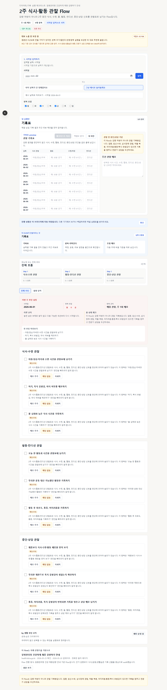
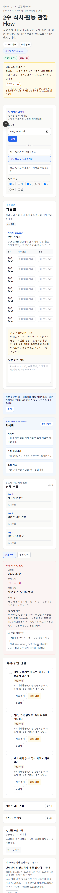
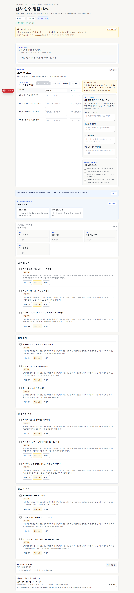
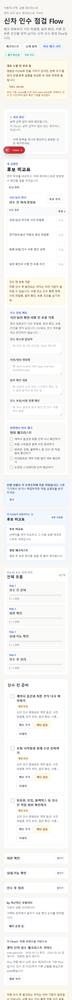

# Representative UX Content Review

Date: 2026-05-25

## Decision

The next UX/content review pass starts with the three current candidate routes:

| Route | Current status after review | User-run decision |
|---|---|---|
| `computer-skills-d30-study` | Representative-eligible, not validated | Ready for observed export-first session |
| `diet-habit-2week` | Public MVP candidate with guardrails, not validated | Guardrail copy rewritten; needs mobile re-check and observed session |
| `new-car-delivery-check` | Public MVP candidate with guardrails, not validated | Evidence copy rewritten; needs mobile handover simulation |

No route is validated by this review.

## Simulated User Runs

### `computer-skills-d30-study`

- First action: enter exam date, review source-derived rows, export D-30 calendar plus study sheet.
- Natural output: calendar milestones plus spreadsheet rows for chapter scope, target date, status, weak-area memo, mock score, wrong-answer type, and retry date.
- Current UX gap: verify in an observed session whether the user understands the source-derived rows are prefilled and only execution fields are editable.
- Mobile risk: medium-low; the progress table can still feel dense.
- Next small fix: run one observed session and record whether the user can explain the exported calendar and sheet.

### `diet-habit-2week`

- First action: enter start date and begin the two-week observation sheet.
- Natural output: daily observation sheet with meals, activity, sleep, optional measurement, condition, stop/consult condition, and weekly observation memo.
- Current UX gap: the route now opens as an observation sheet with stop/consult copy, but it still needs a mobile re-check to confirm warning/table/memo density.
- Mobile risk: medium; warning/source/observation/review sections can stack.
- Next small fix: capture the rewritten mobile first screen and verify that the warning, table, and weekly memo do not compete.

### `new-car-delivery-check`

- First action: enter vehicle/dealer context and fill the defect evidence sheet before treating checklist completion as progress.
- Natural output: evidence sheet with defect row, photo filename, option/document status, dealer confirmation, follow-up owner, and personal hold/signing memo.
- Current UX gap: the first artifact now names photo filenames, dealer confirmation, and signing hold conditions, but the route still needs observed handover simulation.
- Mobile risk: medium; evidence rows, hold memo, inspection sections, documents, and payment checks are long.
- Next small fix: run a mobile handover simulation and check whether users fill the evidence table before treating checklist completion as progress.

## Follow-Up Queue

1. Mobile first-screen re-check for rewritten `diet-habit-2week`.
2. Mobile handover simulation for rewritten `new-car-delivery-check`.
3. Observed export-first session for `computer-skills-d30-study`.
4. After the two guardrail rewrites, re-check mobile first screens before public MVP framing.

## Screenshot

## Diet Guardrail Rewrite Screenshots

## New-Car Guardrail Rewrite Screenshots

