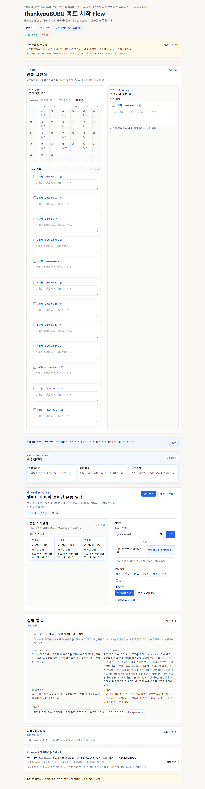
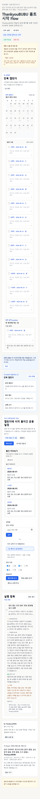
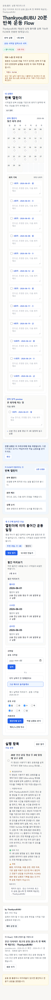

# ThankyouBUBU Exact Video Reshape

Date: 2026-05-25

## Decision

The first P1 cleanup batch reshaped the two former broad-source ThankyouBUBU routes after exact YouTube sources were attached.

The routes now behave like exact follow-along workout videos:

- one calendar-first action,
- one detail panel,
- summary before detail,
- original YouTube video as movement authority,
- post-workout record fields,
- explicit stop/consult condition.

This is still not validation. Both routes remain below representative and public-MVP framing until real users show they can export, open the video, execute, record condition, and repeat.

## Routes

| Route | Source | Previous problem | Current first-pass shape |
| --- | --- | --- | --- |
| `real-thankyou-bubu-home-workout-starter` | `https://www.youtube.com/watch?v=pcyrlkHXAdE` | Five setup/planning actions made one follow-along video feel like a user-designed workout plan. | One action: schedule the no-jump full-body video, open the original, execute at tolerable intensity, record condition. |
| `real-thankyou-bubu-20min-routine` | `https://www.youtube.com/watch?v=gSz5n4sLENI` | Five routine-management actions hid the natural artifact: a recurring calendar event with a condition memo. | One action: schedule the 20-minute video three times a week, open the original, record completion/difficulty/next adjustment. |

## Simulated Natural Artifacts

### Starter Video

- Calendar event: `점프 없는 전신 홈트 영상`
- Link: original YouTube URL
- Record row: `done / intensity / pain or dizziness / next-session adjustment`
- Stop signal: pain, dizziness, breathing difficulty, known condition worsening

### 20-Minute Routine

- Calendar event: `20분 전신 운동 영상`
- Repeat: user-selected weekly days
- Link: original YouTube URL
- Record row: `complete / half complete / stopped`, difficulty 1-5, condition, next-session intensity
- Stop signal: pain, dizziness, breathing difficulty, excessive fatigue, known condition worsening

## UX Note

The user no longer has to infer which exercise to do from generic steps. FLOW says what belongs in the external tools and leaves movement details in the original video.

Remaining UX risks:

- Mobile density still needs screenshot review for these two routes.
- The route family remains in the broader exact-workout backlog because other exact videos still need route-by-route review.
- No route should be called validated without observed user behavior.

## Screenshots

Desktop starter route:

Mobile starter route:

Mobile 20-minute route:

