# FlowMe P35-R7 screenshot index

- ? ??: `71`
- ?? ?? ???: `0`
- ?? ??? ??? acceptance screenshot? ?? ??? ??? ???.

## A. ?? R7 ??? final gate (`current_package_screenshot`)

?? ?? ??? ?? ? ??, export preflight, ?? ? workspace? 60? Flow ??? ????.

### calendar ? public_preview ? 390x844

?? ??: 실제 24개 일정, 이사일 입력, row 수정, primary action

[?? ??](./screenshots/p35-r7-calendar-session1-preview-390.png)

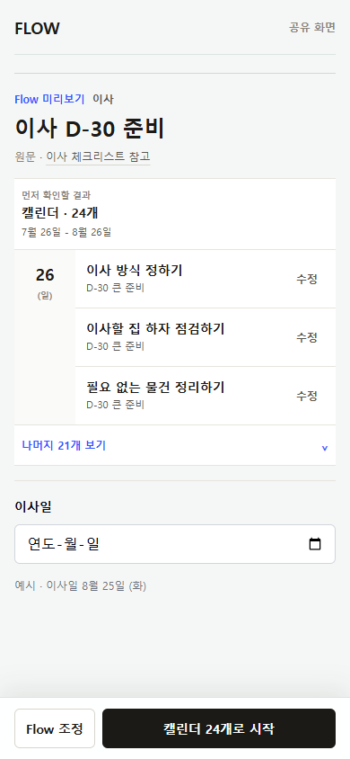

### calendar ? export_preflight ? 1024x768

?? ??: 24-event scope, format, output prediction

[?? ??](./screenshots/p35-r7-calendar-session2-preflight-1024.png)

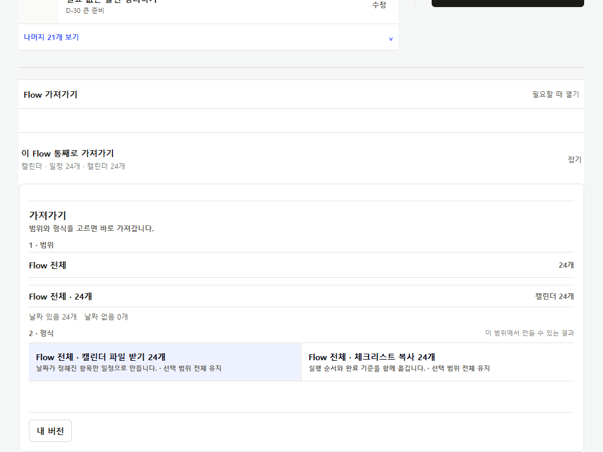

### calendar ? personal_workspace ? 390x844

?? ??: 같은 날짜 묶음, checkbox 위치, 전체 계획과 중복

[?? ??](./screenshots/p35-r7-calendar-session3-workspace-390.png)

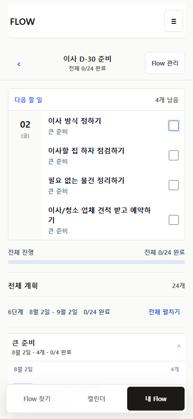

### checklist ? public_preview ? 390x844

?? ??: 날짜 없는 10개 항목의 결과-first 구성

[?? ??](./screenshots/p35-r7-checklist-session1-preview-390.png)

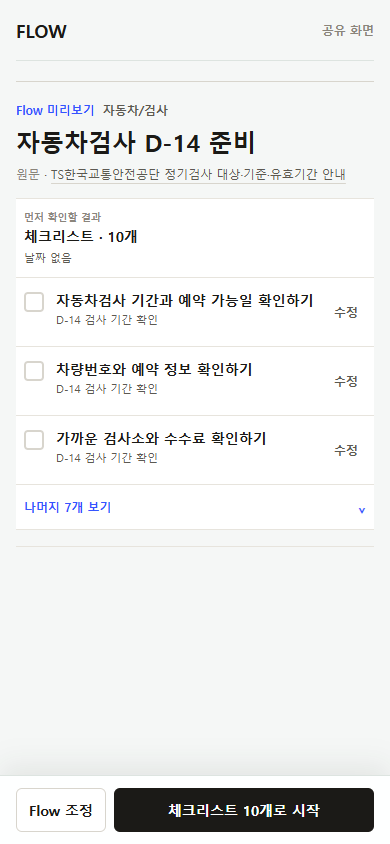

### checklist ? export_preflight ? 1024x768

?? ??: Checklist primary와 secondary artifact

[?? ??](./screenshots/p35-r7-checklist-session2-preflight-1024.png)

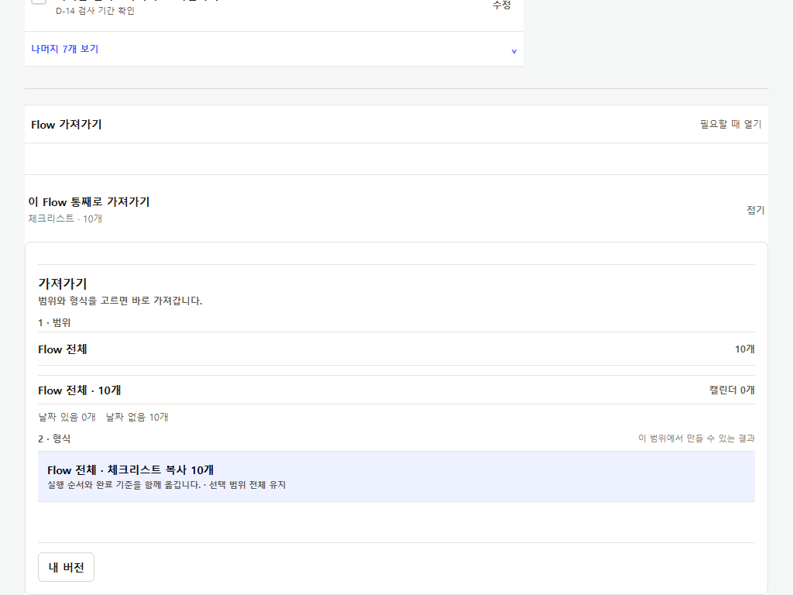

### checklist ? personal_workspace ? 390x844

?? ??: 다음 미완료 항목과 전체 목록 위계

[?? ??](./screenshots/p35-r7-checklist-session3-workspace-390.png)

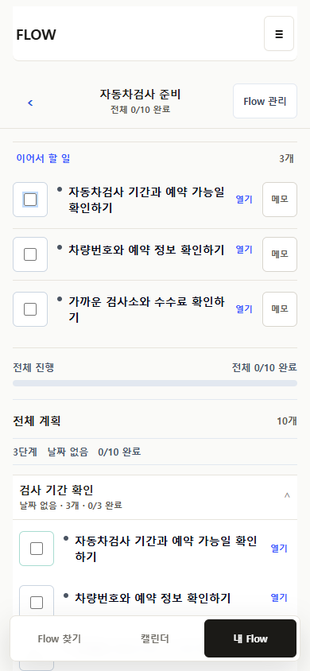

### routine ? public_preview ? 390x844

?? ??: series summary와 반복 설정 밀도

[?? ??](./screenshots/p35-r7-routine-session1-preview-390.png)

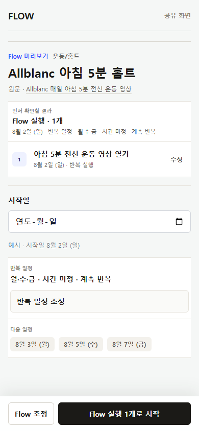

### routine ? export_preflight ? 1024x768

?? ??: series event preflight와 실제 count

[?? ??](./screenshots/p35-r7-routine-session2-preflight-1024.png)

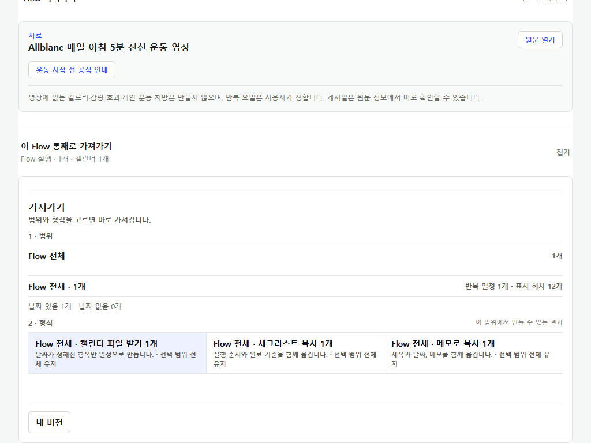

### routine ? personal_workspace ? 390x844

?? ??: 현재 회차, 전체 계획, 반복 설정의 역할

[?? ??](./screenshots/p35-r7-routine-session3-workspace-390.png)

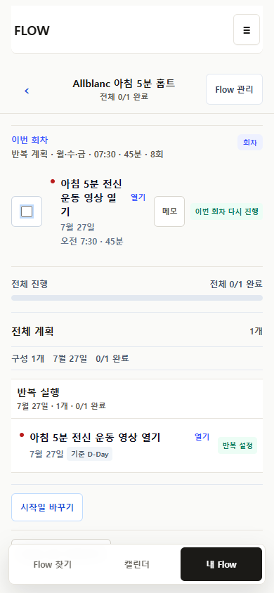

### sheet ? public_preview ? 390x844

?? ??: 순서형 행과 source-backed preview

[?? ??](./screenshots/p35-r7-sheet-session1-preview-390.png)

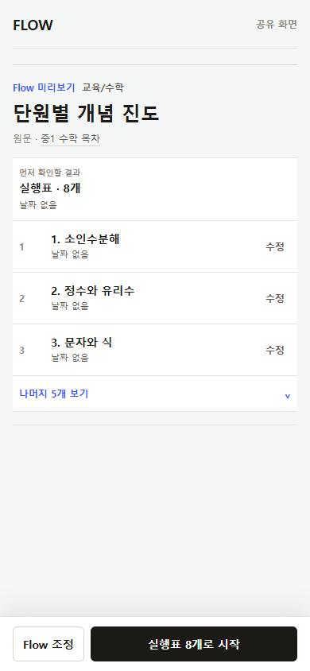

### sheet ? export_preflight ? 1024x768

?? ??: 8-row sheet와 checklist secondary

[?? ??](./screenshots/p35-r7-sheet-session2-preflight-1024.png)

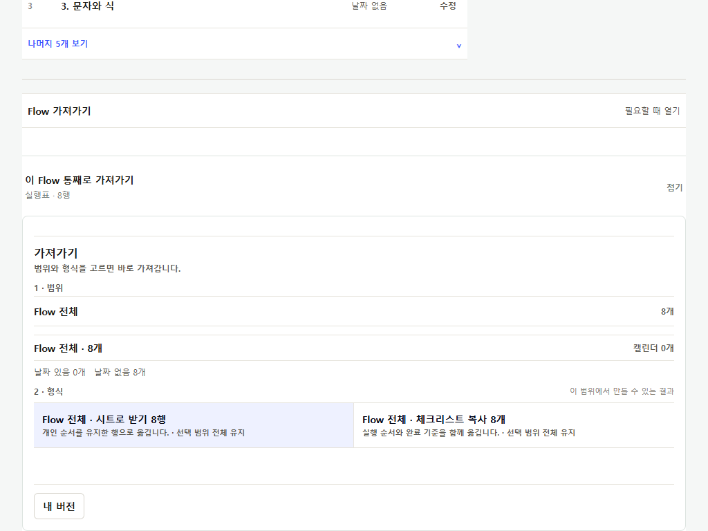

### sheet ? personal_workspace ? 390x844

?? ??: 현재 행과 다음 행의 실행 문법

[?? ??](./screenshots/p35-r7-sheet-session3-workspace-390.png)

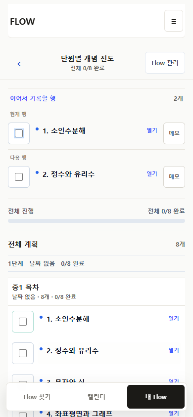

### memo ? public_preview ? 390x844

?? ??: 4개 기록과 합성 action 제거

[?? ??](./screenshots/p35-r7-memo-session1-preview-390.png)

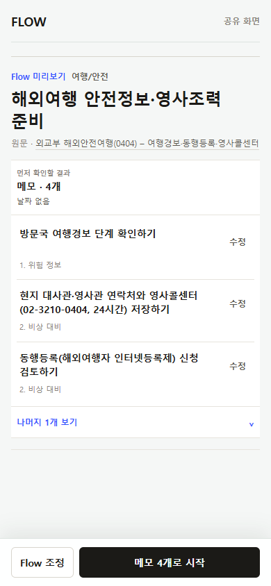

### memo ? export_preflight ? 1024x768

?? ??: memo result scope와 record count

[?? ??](./screenshots/p35-r7-memo-session2-preflight-1024.png)

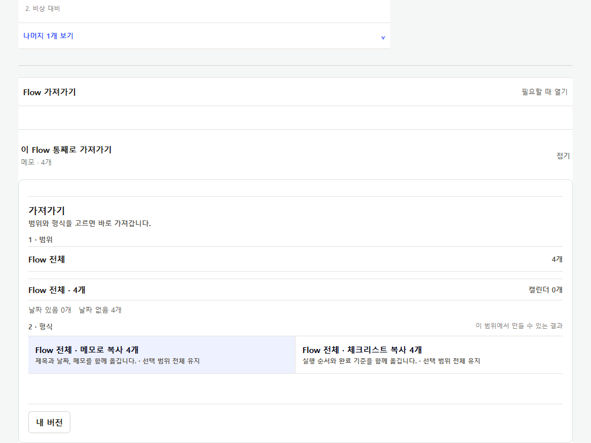

### memo ? personal_workspace ? 390x844

?? ??: 가짜 next unit 없는 기록 workspace

[?? ??](./screenshots/p35-r7-memo-session3-workspace-390.png)

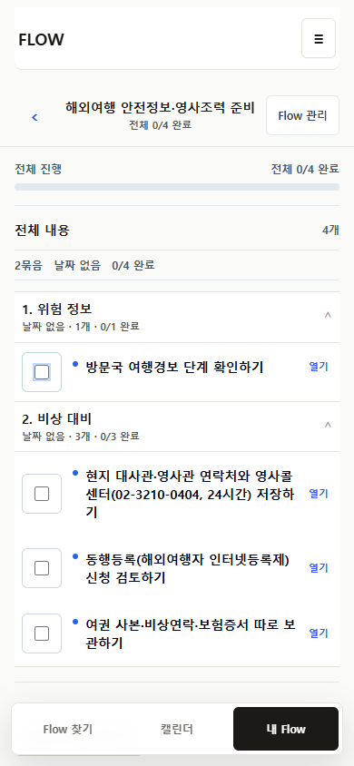

### scale ? library_workspace ? 1440x900

?? ??: 60개 Flow 검색, rail, selected workspace

[?? ??](./screenshots/p35-r7-library-60-1440.png)

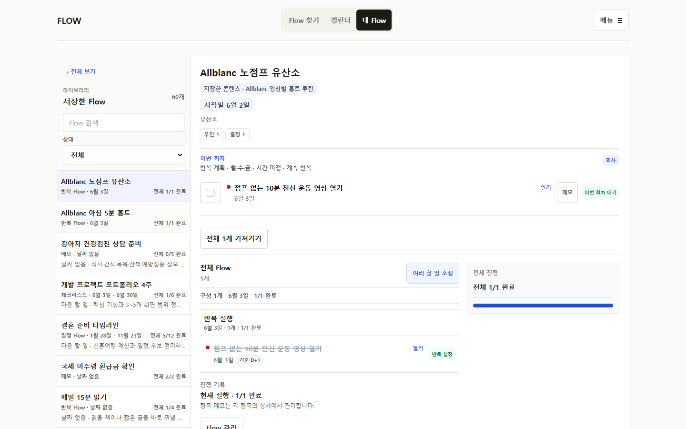

## B. ?? R7 ?? ??? ?? (`current_local_browser_capture`)

?? current local production build?? ??? ???? ????. `preview-manifest.json`? route, state, ???? ?? ??.

### 이사 Flow 저장 전 전체 결과 ? 390x844

- route: `/f/moving-d30-basic`
- state: `public_result_ready`
- ?? ??: 전체 결과가 먼저 읽히는가 / 저장과 외부 가져가기의 차이가 보이는가
- overflow 0, unnamed 0, broken image 0, console/page error 0

[?? ??](./current-journeys/screenshots/01-moving-result-390.png)

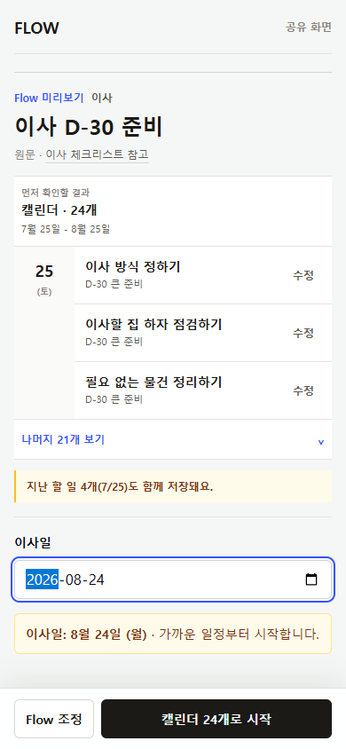

### 포함 항목 조정 ? 390x844

- route: `/f/moving-d30-basic`
- state: `public_adjust_items`
- ?? ??: 항목 제목·상세·날짜 편집이 필요한가 / 한 종류 조정 원칙이 유지되는가
- overflow 0, unnamed 0, broken image 0, console/page error 0

[?? ??](./current-journeys/screenshots/02-moving-adjust-items-390.png)

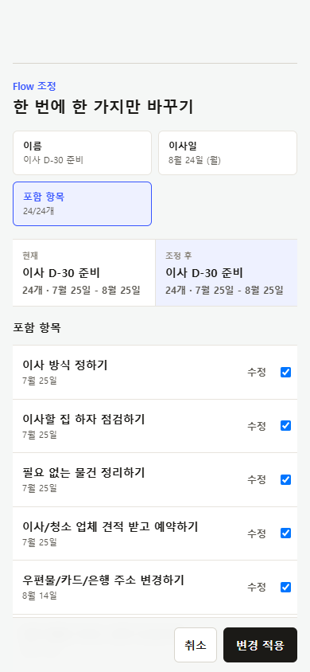

### 저장 전 보조 가져가기 ? 390x844

- route: `/f/moving-d30-basic`
- state: `public_secondary_export`
- ?? ??: 가져가기가 public preview에 있어야 하는가 / 형식보다 destination이 먼저인가
- overflow 0, unnamed 0, broken image 0, console/page error 0

[?? ??](./current-journeys/screenshots/03-moving-public-export-390.png)

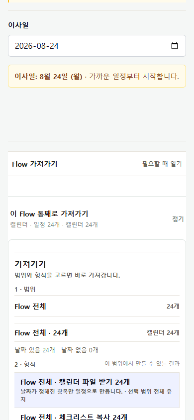

### 저장 완료 ? 390x844

- route: `/f/moving-d30-basic`
- state: `saved_receipt`
- ?? ??: 오늘 할 일보다 전체 저장 검증이 먼저인가 / 다음 primary action이 자연스러운가
- overflow 0, unnamed 0, broken image 0, console/page error 0

[?? ??](./current-journeys/screenshots/04-moving-saved-receipt-390.png)

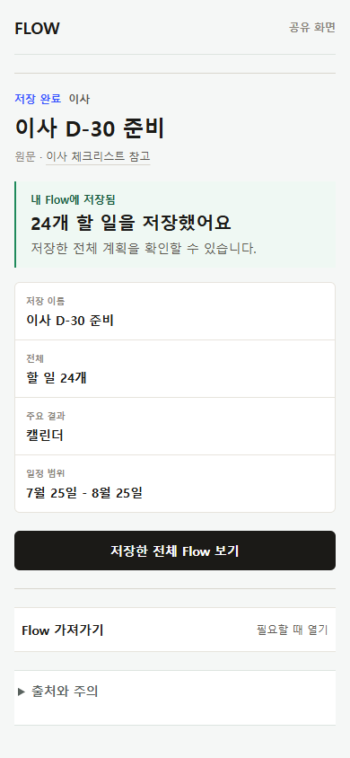

### 날짜 없는 차량 점검 결과 ? 390x844

- route: `/f/vehicle-inspection-prep`
- state: `undated_checklist_result`
- ?? ??: 날짜 없는 Flow를 어떻게 실행하는가 / Checklist와 Todo 추천이 명확한가
- overflow 0, unnamed 0, broken image 0, console/page error 0

[?? ??](./current-journeys/screenshots/05-vehicle-result-390.png)

### 날짜 없는 Checklist 포함 항목 조정 ? 390x844

- route: `/f/vehicle-inspection-prep`
- state: `undated_checklist_adjustment`
- ?? ??: 개별 날짜·상세 편집이 어디에 있어야 하는가
- overflow 0, unnamed 0, broken image 0, console/page error 0

[?? ??](./current-journeys/screenshots/06-vehicle-adjust-items-390.png)

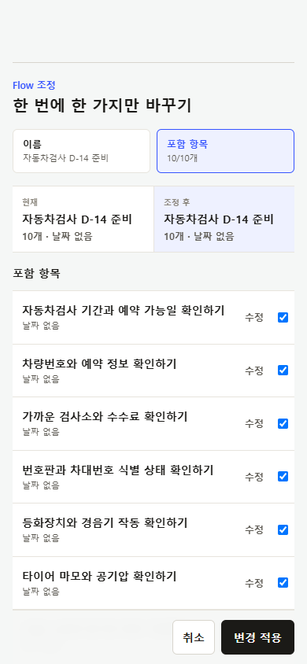

### 홈트 반복 Flow 결과 ? 390x844

- route: `/f/curated-allblanc-morning-workout`
- state: `routine_result`
- ?? ??: series와 occurrence가 구분되는가 / resource가 실행 Item과 구분되는가
- overflow 0, unnamed 0, broken image 0, console/page error 0

[?? ??](./current-journeys/screenshots/07-workout-result-390.png)

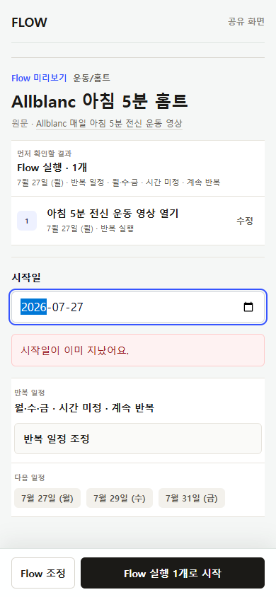

### 홈트 반복 설정 ? 390x844

- route: `/f/curated-allblanc-morning-workout`
- state: `routine_adjustment`
- ?? ??: 초기 설정이 과밀한가 / compact summary와 progressive disclosure가 필요한가
- overflow 0, unnamed 0, broken image 0, console/page error 0

[?? ??](./current-journeys/screenshots/08-workout-routine-adjust-390.png)

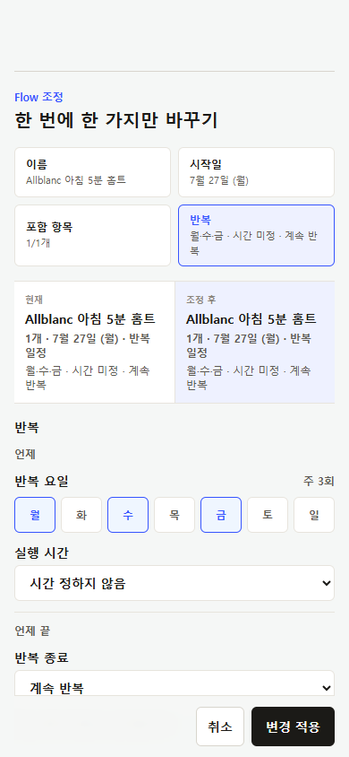

### 내 Flow 다음 행동 ? 390x844

- route: `/my?view=flows`
- state: `my_flow_next_action`
- ?? ??: 다음 행동 탭의 정체성이 명확한가 / 같은 날짜 묶음이 필요한가
- overflow 0, unnamed 0, broken image 0, console/page error 0

[?? ??](./current-journeys/screenshots/09-my-flow-next-action-390.png)

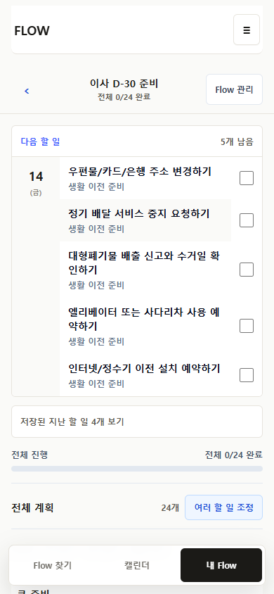

### 항목 상세 ? 390x844

- route: `/my?view=flows`
- state: `my_flow_item_detail`
- ?? ??: 상세와 완료가 같은 문맥에 있는가 / 저장 전 편집과 연결 가능한 구조인가
- overflow 0, unnamed 0, broken image 0, console/page error 0

[?? ??](./current-journeys/screenshots/10-my-flow-item-detail-390.png)

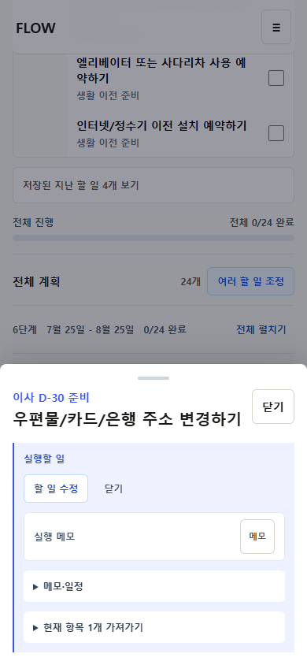

### 항목 제목·날짜·메모 편집 ? 390x844

- route: `/my?view=flows`
- state: `my_flow_item_edit`
- ?? ??: 현재 기능을 저장 전 contextual edit에 재사용할 수 있는가
- overflow 0, unnamed 0, broken image 0, console/page error 0

[?? ??](./current-journeys/screenshots/11-my-flow-item-edit-390.png)

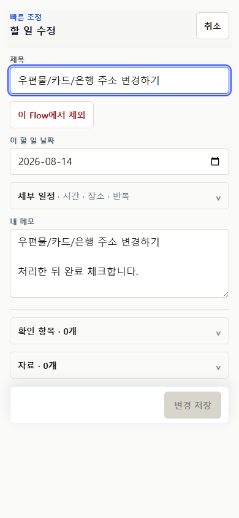

### 내 Flow 전체 계획 ? 390x844

- route: `/my?view=flows`
- state: `my_flow_full_plan`
- ?? ??: 전체 저장 결과를 확인하기 쉬운가 / 다음 행동과 전체 계획이 과도하게 분리되는가
- overflow 0, unnamed 0, broken image 0, console/page error 0

[?? ??](./current-journeys/screenshots/12-my-flow-full-plan-390.png)

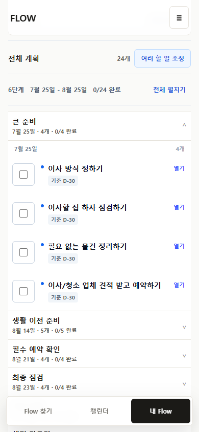

### 완료 후 즉시 되돌리기 ? 390x844

- route: `/my?view=flows`
- state: `my_flow_completion_undo`
- ?? ??: 행이 사라질 때만 undo가 필요한가 / 직접 다시 열기와 snackbar가 중복되는가
- overflow 0, unnamed 0, broken image 0, console/page error 0

[?? ??](./current-journeys/screenshots/14-my-flow-completion-undo-390.png)

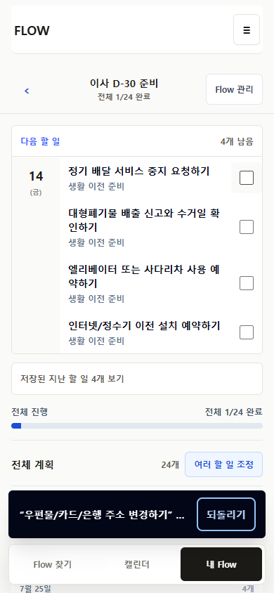

### 내 Flow 기록 ? 390x844

- route: `/my?view=flows`
- state: `my_flow_record`
- ?? ??: 기록 영역의 정체성이 명확한가 / history·회고·재사용이 섞이는가
- overflow 0, unnamed 0, broken image 0, console/page error 0

[?? ??](./current-journeys/screenshots/13-my-flow-record-390.png)

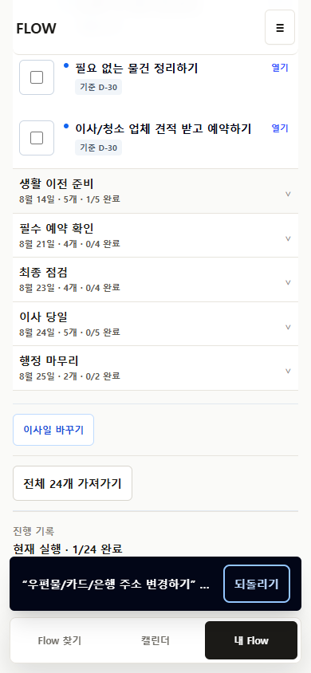

### 내 Flow wide library와 workspace ? 1024x768

- route: `/my?demo=ux20&view=flows`
- state: `my_flow_wide_workspace`
- ?? ??: rail과 canvas 역할이 명확한가 / 모바일 탭과 wide hierarchy가 일치하는가
- overflow 0, unnamed 0, broken image 0, console/page error 0

[?? ??](./current-journeys/screenshots/15-my-flow-workspace-1024.png)

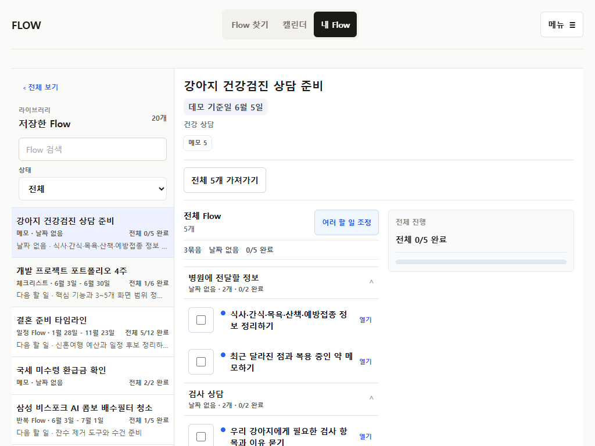

### 캘린더 월간 화면 ? 390x844

- route: `/calendar?demo=ux20`
- state: `calendar_month`
- ?? ??: Calendar가 date lens로 읽히는가
- overflow 0, unnamed 0, broken image 0, console/page error 0

[?? ??](./current-journeys/screenshots/16-calendar-month-390.png)

### 모바일 선택일 agenda ? 390x844

- route: `/calendar?demo=ux20`
- state: `calendar_selected_day`
- ?? ??: 같은 날짜 항목과 Flow 구분이 충분한가 / detail을 sheet로 열어야 하는가
- overflow 0, unnamed 0, broken image 0, console/page error 0

[?? ??](./current-journeys/screenshots/17-calendar-selected-day-390.png)

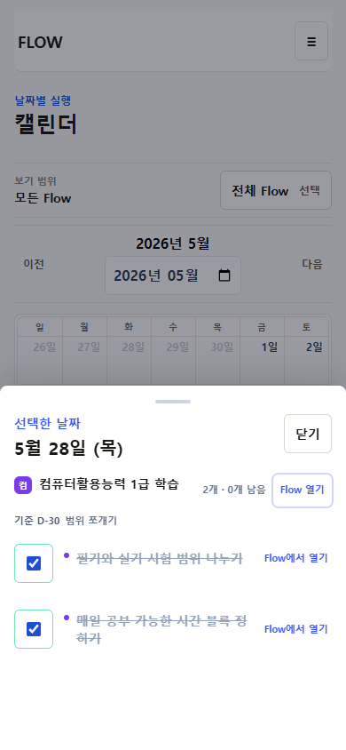

### 와이드 선택일 agenda ? 1024x768

- route: `/calendar?demo=ux20`
- state: `calendar_selected_day_wide`
- ?? ??: 날짜 묶음이 My Flow와 같은 실행 단위를 쓰는가
- overflow 0, unnamed 0, broken image 0, console/page error 0

[?? ??](./current-journeys/screenshots/18-calendar-selected-day-1024.png)

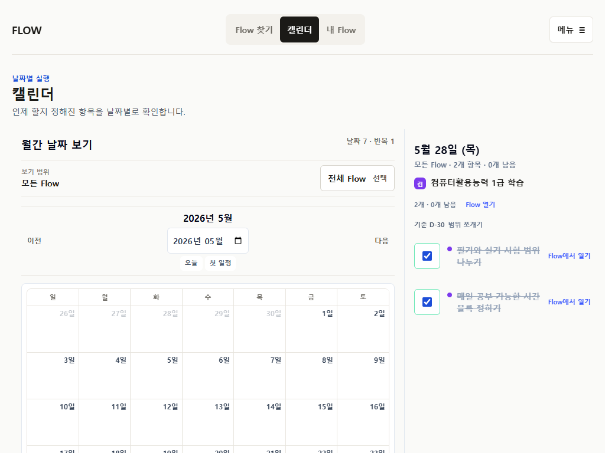

## C. P35 ??? ?? ?? (`prior_p35_slice_screenshot`)

?? ??? P35-01~P35-08 ? slice? acceptance ???. ?? R7 ?? UI? ???? ???? ??, ?? ??? ???? ? ??? ???? ?? ???? ????.

### P35-01 전역 진입과 3탭

#### p35-01-entry-empty-390.png

[?? ??](./slice-reference-screenshots/2026-07-26-p35-01-entry-router-evidence/p35-01-entry-empty-390.png)

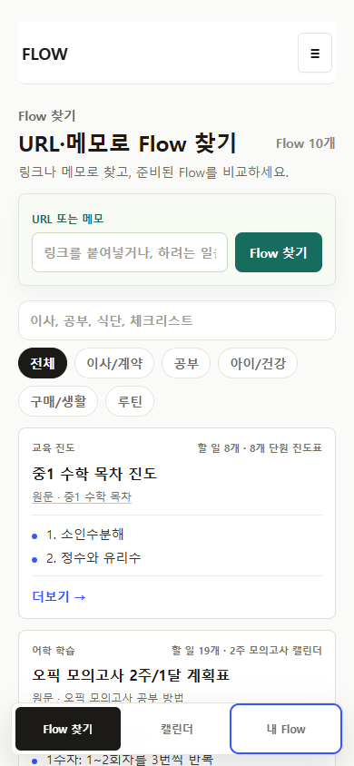

#### p35-01-entry-saved-390.png

[?? ??](./slice-reference-screenshots/2026-07-26-p35-01-entry-router-evidence/p35-01-entry-saved-390.png)

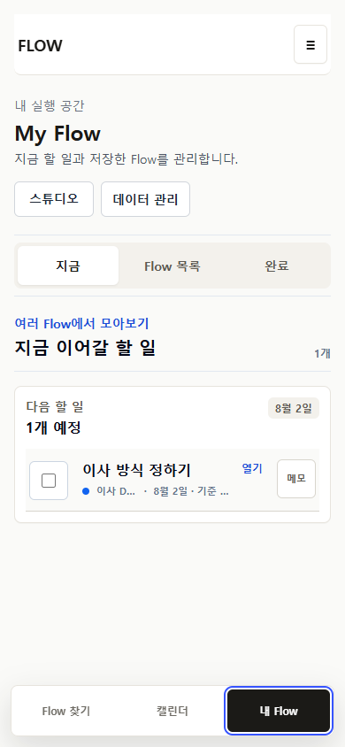

#### p35-01-nav-1024.png

[?? ??](./slice-reference-screenshots/2026-07-26-p35-01-entry-router-evidence/p35-01-nav-1024.png)

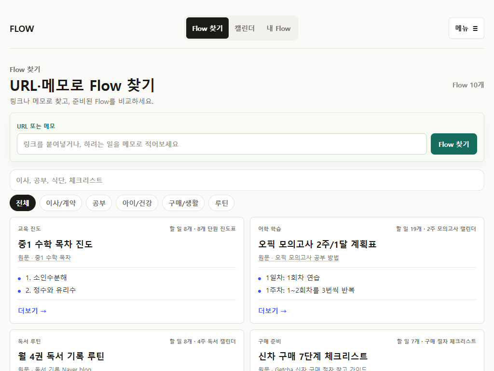

#### p35-01-nav-1440.png

[?? ??](./slice-reference-screenshots/2026-07-26-p35-01-entry-router-evidence/p35-01-nav-1440.png)

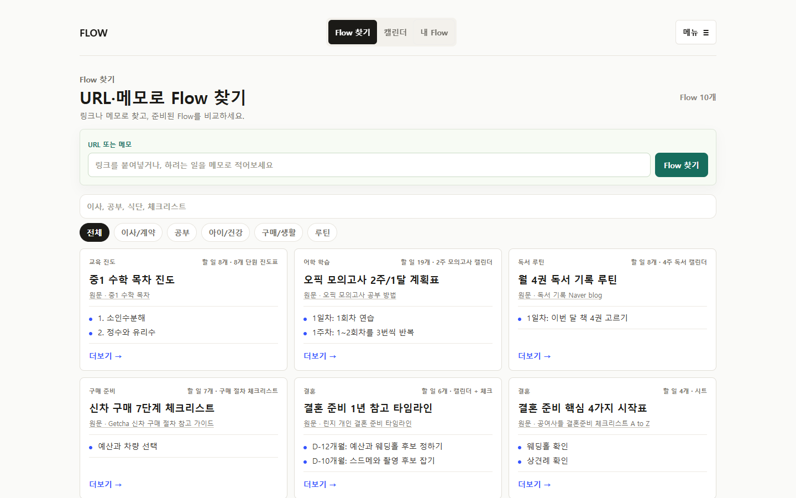

### P35-02 저장 전 결과 우선

#### p35-02-learning-save-before-1440.png

[?? ??](./slice-reference-screenshots/2026-07-26-p35-02-public-result-first-evidence/p35-02-learning-save-before-1440.png)

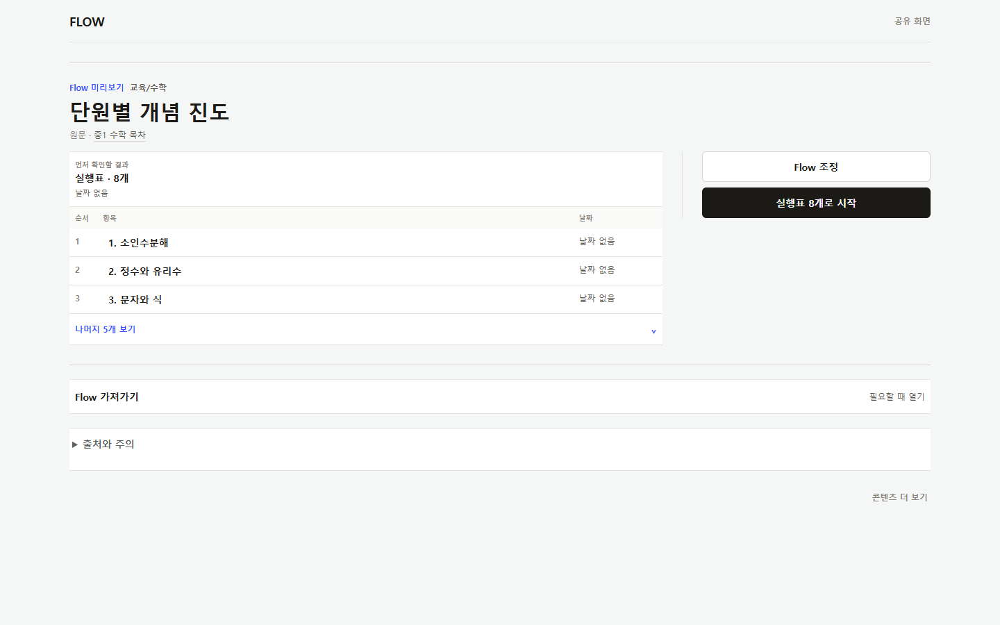

#### p35-02-moving-receipt-390.png

[?? ??](./slice-reference-screenshots/2026-07-26-p35-02-public-result-first-evidence/p35-02-moving-receipt-390.png)

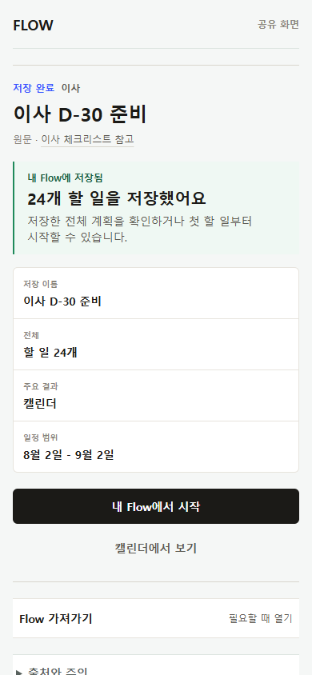

#### p35-02-moving-save-before-390.png

[?? ??](./slice-reference-screenshots/2026-07-26-p35-02-public-result-first-evidence/p35-02-moving-save-before-390.png)

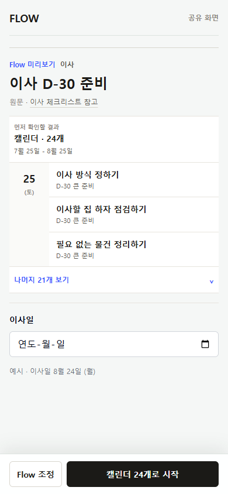

#### p35-02-routine-save-before-1024.png

[?? ??](./slice-reference-screenshots/2026-07-26-p35-02-public-result-first-evidence/p35-02-routine-save-before-1024.png)

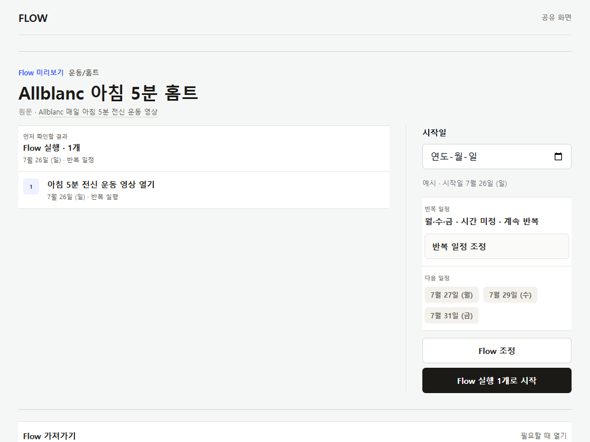

#### p35-02-undated-save-before-390.png

[?? ??](./slice-reference-screenshots/2026-07-26-p35-02-public-result-first-evidence/p35-02-undated-save-before-390.png)

### P35-03 한 번에 한 종류 조정

#### p35-03-adjust-anchor-390.png

[?? ??](./slice-reference-screenshots/2026-07-26-p35-03-adjust-one-kind-evidence/p35-03-adjust-anchor-390.png)

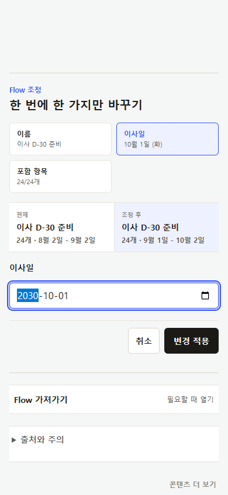

#### p35-03-adjust-items-1024.png

[?? ??](./slice-reference-screenshots/2026-07-26-p35-03-adjust-one-kind-evidence/p35-03-adjust-items-1024.png)

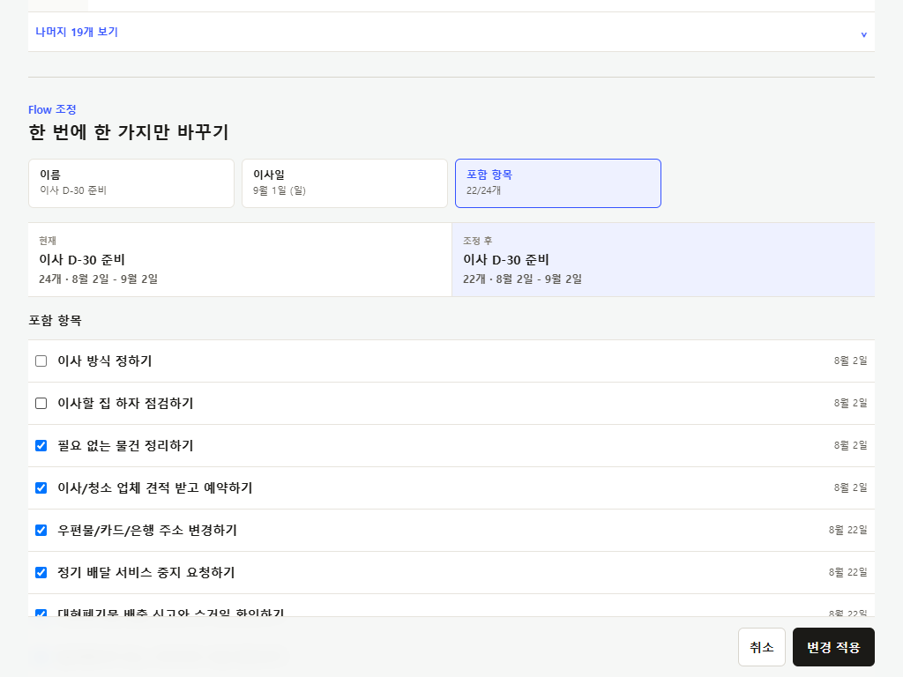

#### p35-03-adjust-name-390.png

[?? ??](./slice-reference-screenshots/2026-07-26-p35-03-adjust-one-kind-evidence/p35-03-adjust-name-390.png)

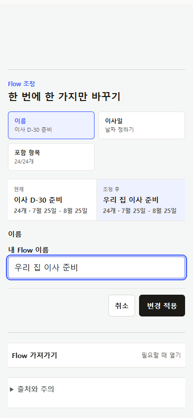

#### p35-03-adjust-routine-1440.png

[?? ??](./slice-reference-screenshots/2026-07-26-p35-03-adjust-one-kind-evidence/p35-03-adjust-routine-1440.png)

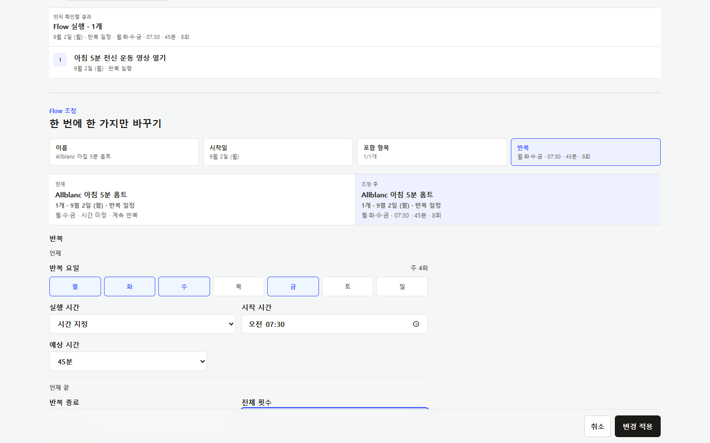

### P35-04 My Flow와 Calendar 역할 분리

#### p35-04-calendar-1024.png

[?? ??](./slice-reference-screenshots/2026-07-26-p35-04-my-flow-safe-split-evidence/p35-04-calendar-1024.png)

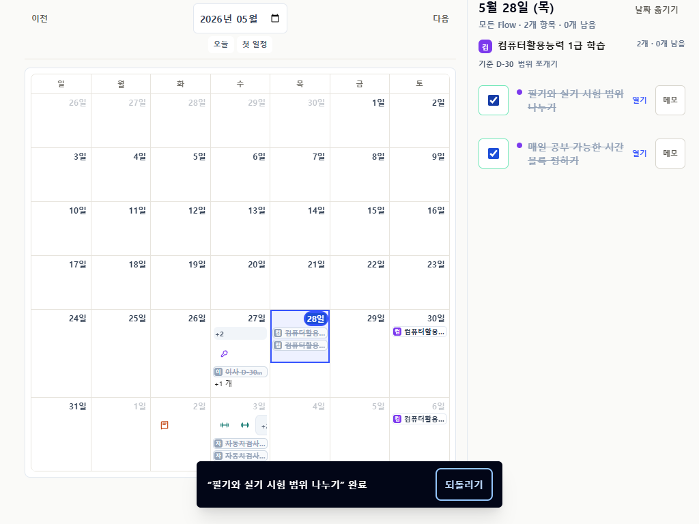

#### p35-04-my-390.png

[?? ??](./slice-reference-screenshots/2026-07-26-p35-04-my-flow-safe-split-evidence/p35-04-my-390.png)

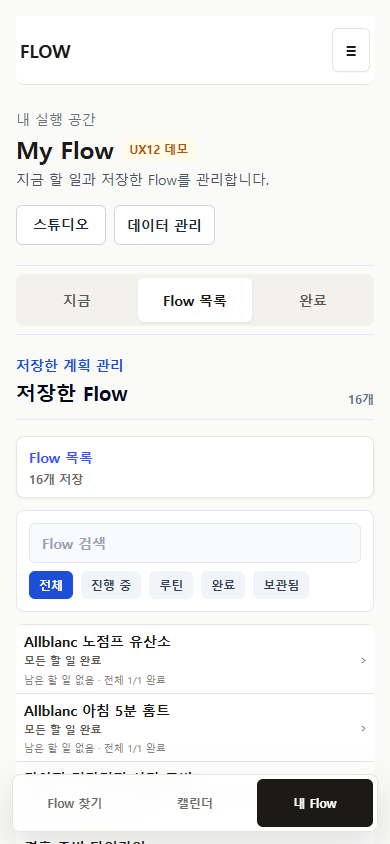

### P35-05 My Flow 목록과 집중 workspace

#### p35-05-my-library-1-390.png

[?? ??](./slice-reference-screenshots/2026-07-26-p35-05-my-flow-library-workspace-evidence/p35-05-my-library-1-390.png)

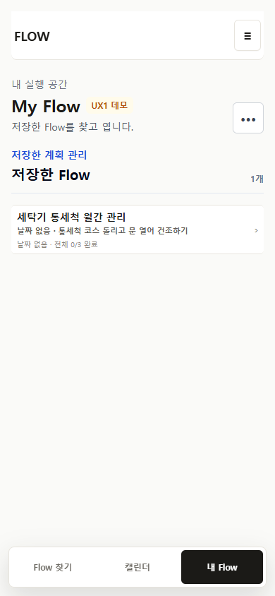

#### p35-05-my-library-20-390.png

[?? ??](./slice-reference-screenshots/2026-07-26-p35-05-my-flow-library-workspace-evidence/p35-05-my-library-20-390.png)

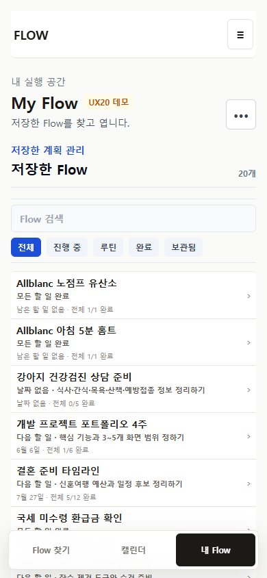

#### p35-05-my-library-60-1440.png

[?? ??](./slice-reference-screenshots/2026-07-26-p35-05-my-flow-library-workspace-evidence/p35-05-my-library-60-1440.png)

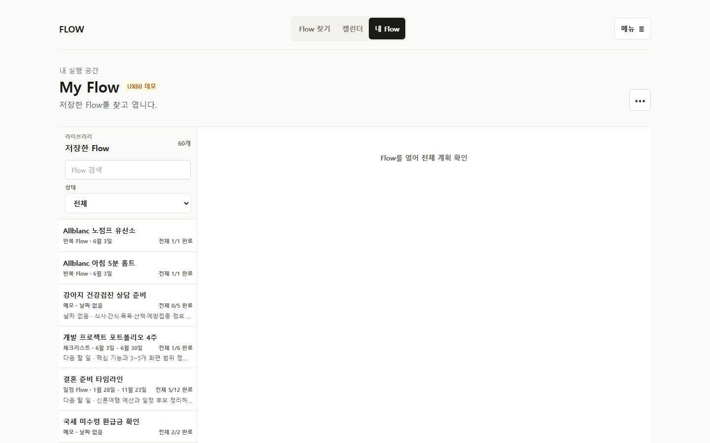

#### p35-05-my-library-workspace-1024.png

[?? ??](./slice-reference-screenshots/2026-07-26-p35-05-my-flow-library-workspace-evidence/p35-05-my-library-workspace-1024.png)

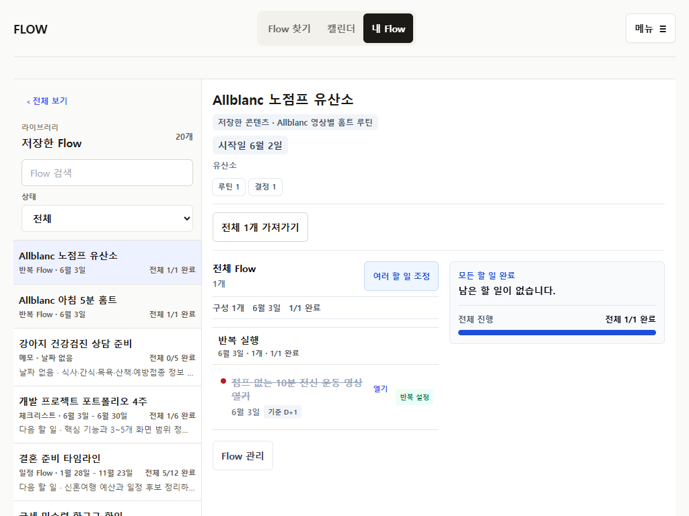

#### p35-05-personal-flow-390.png

[?? ??](./slice-reference-screenshots/2026-07-26-p35-05-my-flow-library-workspace-evidence/p35-05-personal-flow-390.png)

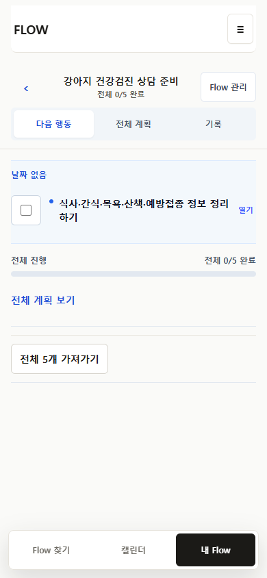

### P35-06 날짜 lens Calendar

#### p35-06-calendar-60-flow-1440.png

[?? ??](./slice-reference-screenshots/2026-07-26-p35-06-calendar-lens-evidence/p35-06-calendar-60-flow-1440.png)

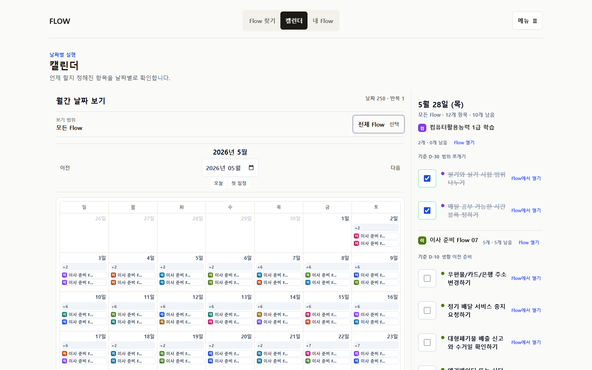

#### p35-06-calendar-agenda-390.png

[?? ??](./slice-reference-screenshots/2026-07-26-p35-06-calendar-lens-evidence/p35-06-calendar-agenda-390.png)

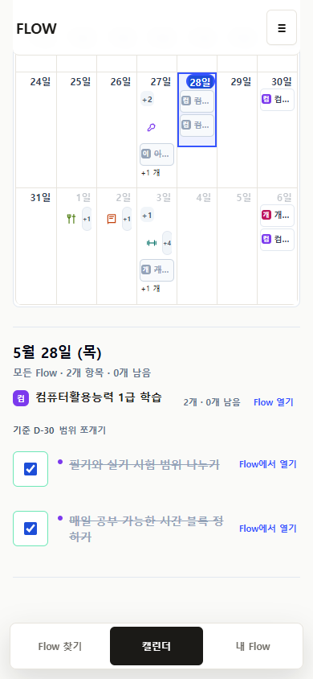

#### p35-06-calendar-month-390.png

[?? ??](./slice-reference-screenshots/2026-07-26-p35-06-calendar-lens-evidence/p35-06-calendar-month-390.png)

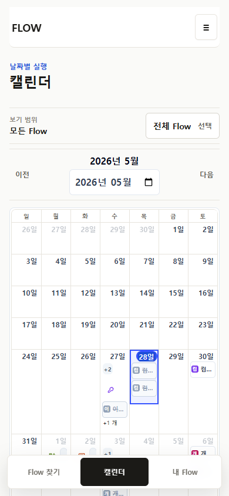

#### p35-06-calendar-multi-flow-1024.png

[?? ??](./slice-reference-screenshots/2026-07-26-p35-06-calendar-lens-evidence/p35-06-calendar-multi-flow-1024.png)

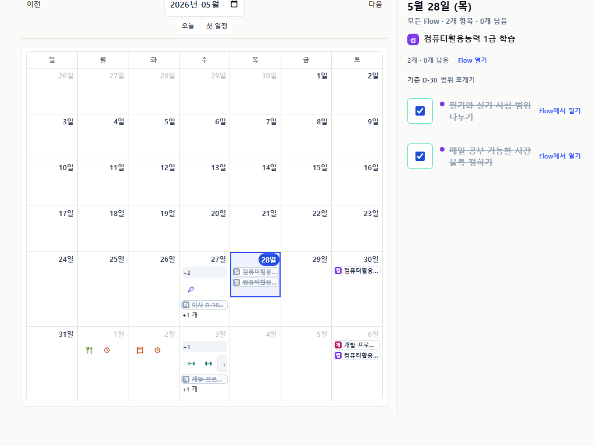

### P35-07 범위 우선 가져가기

#### p35-07-export-current-1024.png

[?? ??](./slice-reference-screenshots/2026-07-26-p35-07-export-scope-first-evidence/p35-07-export-current-1024.png)

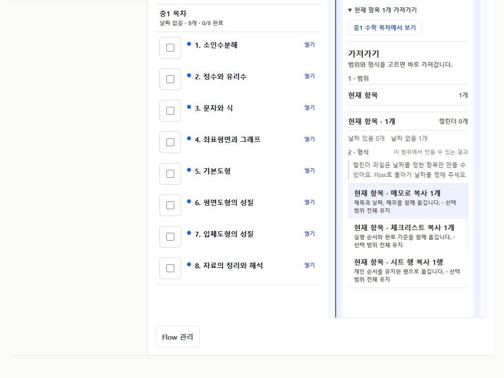

#### p35-07-export-receipt-1440.png

[?? ??](./slice-reference-screenshots/2026-07-26-p35-07-export-scope-first-evidence/p35-07-export-receipt-1440.png)

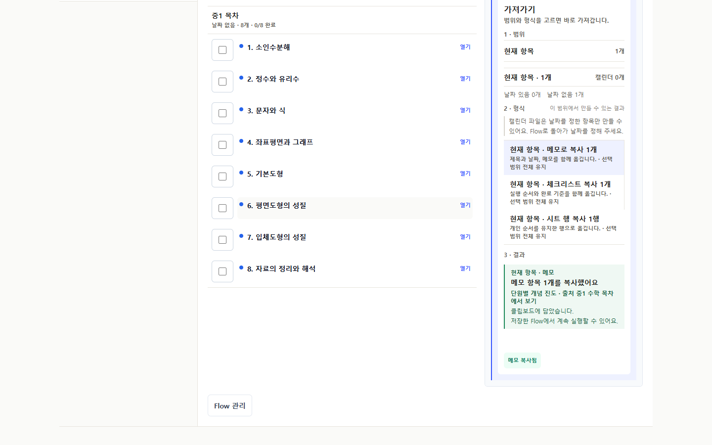

#### p35-07-export-selected-390.png

[?? ??](./slice-reference-screenshots/2026-07-26-p35-07-export-scope-first-evidence/p35-07-export-selected-390.png)

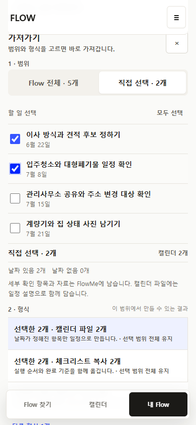

#### p35-07-export-whole-390.png

[?? ??](./slice-reference-screenshots/2026-07-26-p35-07-export-scope-first-evidence/p35-07-export-whole-390.png)

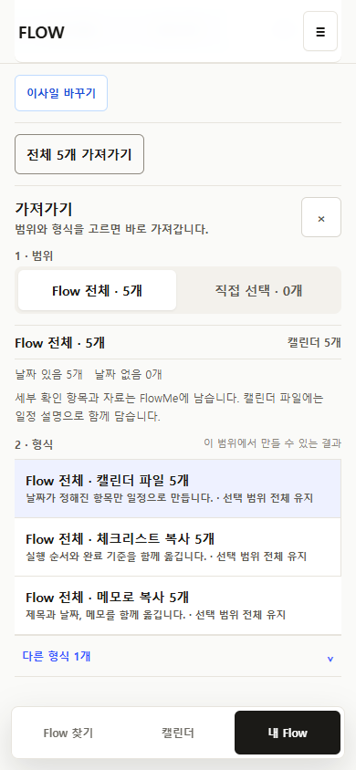

### P35-08 최종 화면 gate

#### p35-08-calendar-selected-day-1024.png

[?? ??](./slice-reference-screenshots/2026-07-26-p35-08-final-mece-gate/p35-08-calendar-selected-day-1024.png)

#### p35-08-memo-result-390.png

[?? ??](./slice-reference-screenshots/2026-07-26-p35-08-final-mece-gate/p35-08-memo-result-390.png)

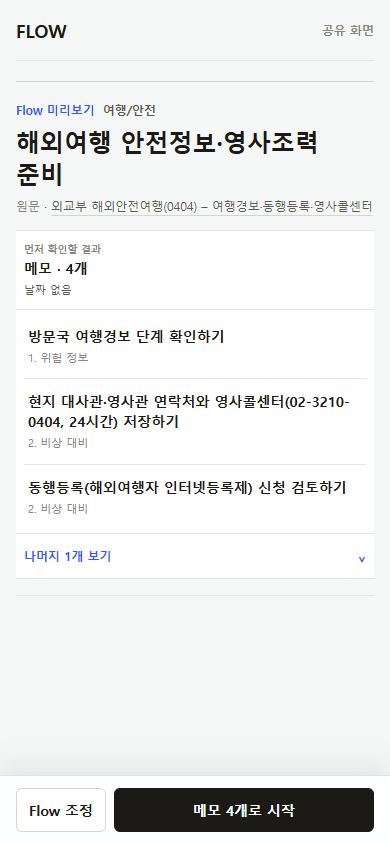

#### p35-08-moving-result-390.png

[?? ??](./slice-reference-screenshots/2026-07-26-p35-08-final-mece-gate/p35-08-moving-result-390.png)

#### p35-08-my-flow-focused-390.png

[?? ??](./slice-reference-screenshots/2026-07-26-p35-08-final-mece-gate/p35-08-my-flow-focused-390.png)

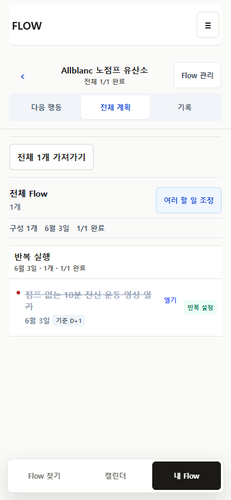

#### p35-08-my-flow-library-20-390.png

[?? ??](./slice-reference-screenshots/2026-07-26-p35-08-final-mece-gate/p35-08-my-flow-library-20-390.png)

#### p35-08-my-flow-library-60-1440.png

[?? ??](./slice-reference-screenshots/2026-07-26-p35-08-final-mece-gate/p35-08-my-flow-library-60-1440.png)

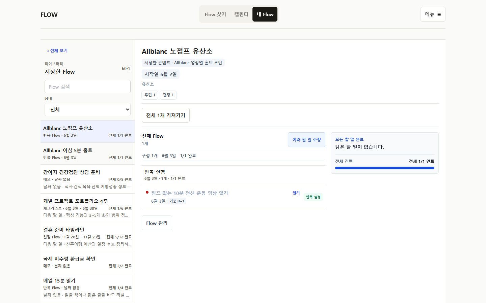

#### p35-08-study-result-390.png

[?? ??](./slice-reference-screenshots/2026-07-26-p35-08-final-mece-gate/p35-08-study-result-390.png)

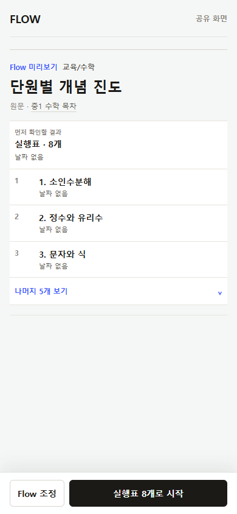

#### p35-08-vehicle-result-390.png

[?? ??](./slice-reference-screenshots/2026-07-26-p35-08-final-mece-gate/p35-08-vehicle-result-390.png)

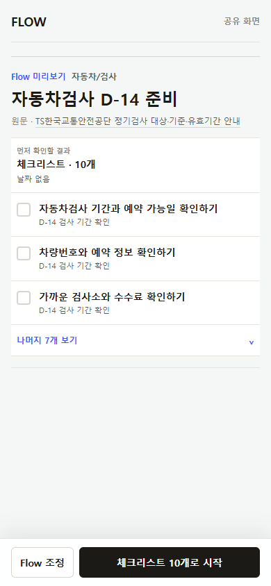

#### p35-08-workout-result-390.png

[?? ??](./slice-reference-screenshots/2026-07-26-p35-08-final-mece-gate/p35-08-workout-result-390.png)

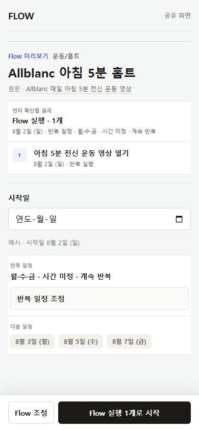
