# Production 모바일 화면 증거

## 캡처 조건

- Production: <https://flowme2605.vercel.app>
- 캡처일: 2026-07-31
- 화면 폭: 390px
- 기준 코드: `c09f859b30b854f6f897b8ec1eb781fd774fbeca`
- E02부터 E09까지는 같은 브라우저 세션에서 `이사 D-30 준비`를 확인하고 저장한 흐름입니다.

스크린샷은 보이는 화면과 상태 전환을 증명합니다. 코드가 공통인지, 화면 차이가 의도된 것인지, 사용자가 실제로 혼란을 느끼는지는 스크린샷만으로 판정하지 않습니다.

## 비교 1. 저장 전 기본 화면과 Flow 조정

| 저장 전 기본 | Flow 조정 열림 |
| --- | --- |
| [E02 원본](./screenshots/E02-moving-public-initial.png) | [E03 원본](./screenshots/E03-moving-flow-adjustment-inline.png) |
| 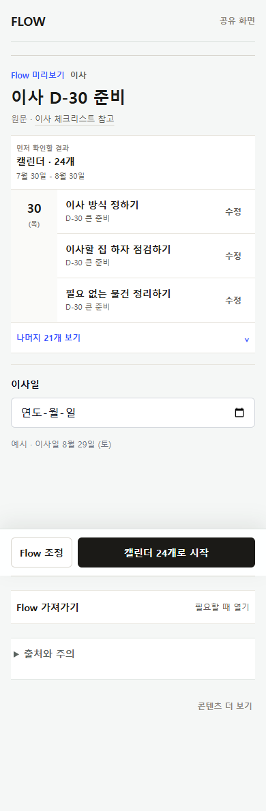 | 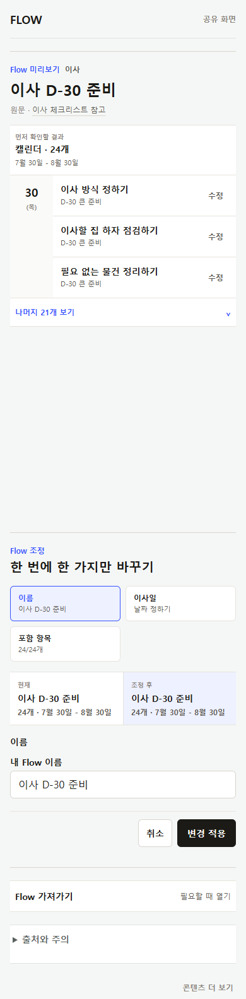 |

### E02 — 날짜형 Flow 저장 전

- URL: <https://flowme2605.vercel.app/f/moving-d30-basic>
- 상태: 저장 전, 조정과 가져가기 모두 닫힘
- 확인되는 것: `Flow 미리보기`, 캘린더 결과 24개, 개별 Item 수정, `Flow 조정`, `캘린더 24개로 시작`, 접힌 `Flow 가져가기`, 접힌 `출처와 주의`
- 확인되지 않는 것: 다른 Flow의 동일성, 저장 후 동작, 실제 캘린더 파일 내용

### E03 — 날짜형 Flow 조정

- 직전 행동: `Flow 조정` 선택
- 확인되는 것: 기존 화면이 유지된 채 그 아래에 조정 영역이 이어지고, 이름·이사일·포함 항목을 탭으로 바꾸는 방식
- 확인되지 않는 것: 인라인 방식이 최선인지, 다른 Flow도 같은 항목을 제공해야 하는지

## 비교 2. Flow 전체 조정과 Item 개별 수정

| Flow 전체 조정 | Item 개별 수정 |
| --- | --- |
| [E03 원본](./screenshots/E03-moving-flow-adjustment-inline.png) | [E04 원본](./screenshots/E04-moving-item-edit-sheet.png) |
|  | 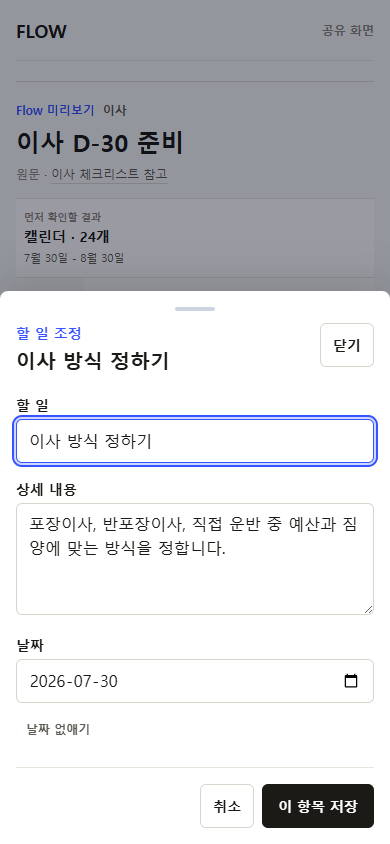 |

### E04 — Item 개별 수정

- 직전 행동: 첫 Item의 `수정` 선택
- 확인되는 것: 배경을 가린 바텀시트, `할 일`, `상세 내용`, `날짜` 필드
- 확인되지 않는 것: 화면에 보이는 `D-30 큰 준비` 같은 Step·그룹 이름을 다른 곳에서 수정할 수 있는지

## 비교 3. 저장 전 가져가기와 저장 완료

| 저장 전 가져가기 펼침 | 저장 완료 뒤 |
| --- | --- |
| [E05 원본](./screenshots/E05-moving-export-inline.png) | [E06 원본](./screenshots/E06-moving-saved-receipt.png) |
| 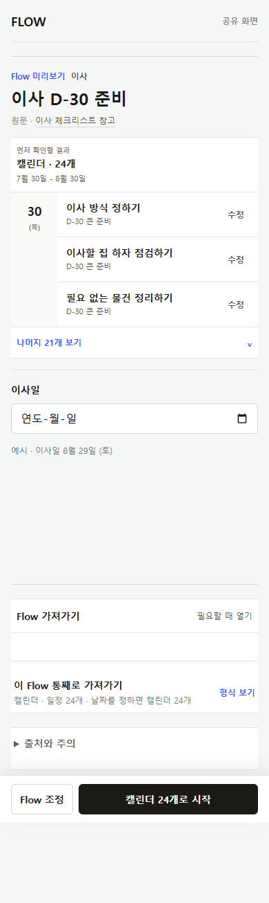 | 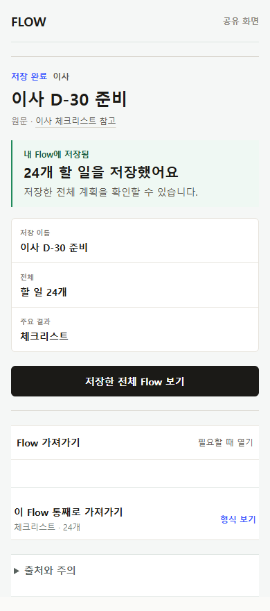 |

### E05 — 저장 전 Flow 가져가기

- 직전 행동: `Flow 가져가기` 펼침
- 확인되는 것: 현재 화면 아래에 `이 Flow 통째로 가져가기`, 형식, 수량, `형식 보기`가 나타남
- 확인되지 않는 것: 형식 보기 이후의 선택·미리보기·다운로드 과정

### E06 — 저장 완료

- 직전 행동: `캘린더 24개로 시작` 선택
- 확인되는 것: 저장 완료 영수증과 `저장한 전체 Flow 보기`가 생기고, `Flow 가져가기`는 같은 화면에 남아 있음
- 확인되지 않는 것: 두 행동이 의도된 연속 작업인지 불필요한 중복인지

## 비교 4. My Flow의 세 가지 상태

| Flow 작업 공간 | Item 상세 | 할 일 보기 |
| --- | --- | --- |
| [E07 원본](./screenshots/E07-my-flow-workspace-first-open.png) | [E08 원본](./screenshots/E08-my-flow-item-detail.png) | [E09 원본](./screenshots/E09-my-flow-todo-view.png) |
| 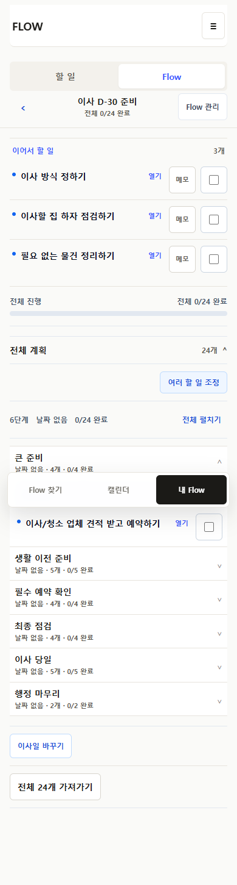 | 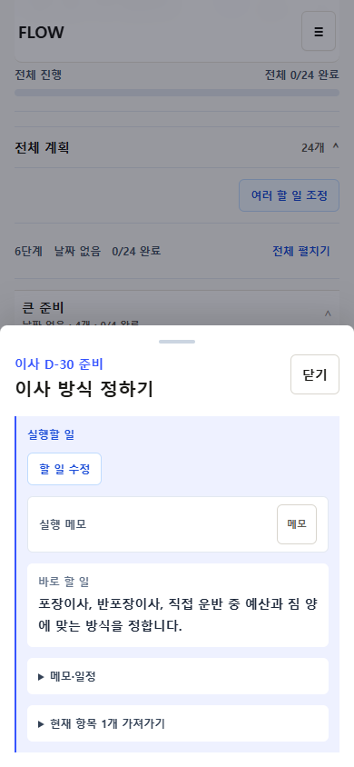 | 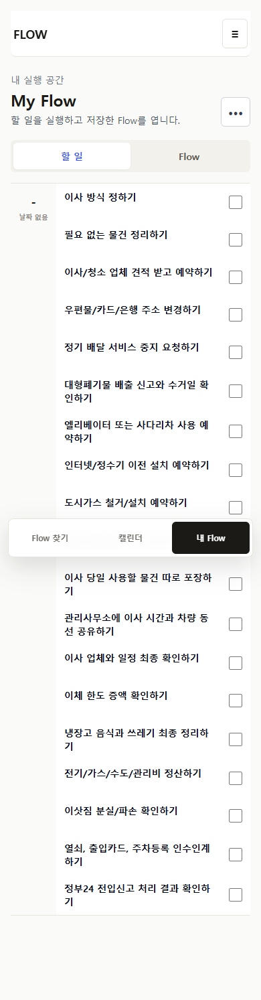 |

### E07 — 저장 직후 Flow 작업 공간

- URL: <https://flowme2605.vercel.app/my?view=flows&flow=moving-d30-basic>
- 확인되는 것: `할 일 / Flow` 탭, 이어서 할 일 3개, 각 행의 `열기·메모·완료`, 전체 진행, 전체 계획, 단계 목록, 여러 할 일 조정, 이사일 변경, 전체 가져가기
- 확인되지 않는 것: 다시 들어왔을 때 접힘 상태, 두 번째 Flow가 있을 때의 밀도

### E08 — 저장된 Item 상세

- 직전 행동: 첫 Item의 `열기` 선택
- 확인되는 것: 별도 바텀시트 안에 `할 일 수정`, `실행 메모`, `바로 할 일`, `메모·일정`, `현재 항목 1개 가져가기`가 함께 있음
- 확인되지 않는 것: 접힌 영역의 내부 화면과 저장 뒤 결과

### E09 — My Flow의 할 일 보기

- 직전 행동: `할 일` 탭 선택
- 확인되는 것: 여러 Flow의 실행 항목을 모으는 보기와 `할 일 / Flow` 구분
- 확인되지 않는 것: 사용자가 두 보기의 역할을 설명 없이 이해하는지

`이 사본 사용` 화면은 재현 조건이 필요한 중복 사본 정리 상태라 이번 캡처 묶음에는 없습니다. 해당 기능의 목적과 위치는 [구조 사실 문서](./03-architecture-facts-ko.md)에 코드 근거로만 기록했습니다.

## 비교 5. 콘텐츠 결과 모양과 조정 항목

| 날짜형 | 체크리스트형 | 루틴형 |
| --- | --- | --- |
| [E02 원본](./screenshots/E02-moving-public-initial.png) | [E10 원본](./screenshots/E10-checklist-public-initial.png) | [E11 원본](./screenshots/E11-routine-public-initial.png) |
|  | 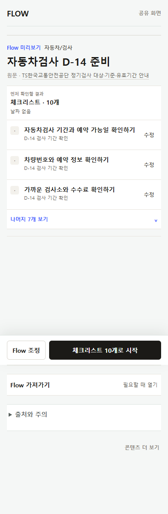 | 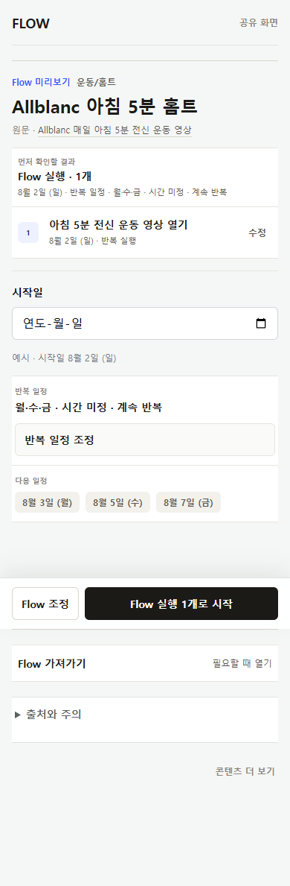 |

### E10 — 체크리스트형 Flow

- URL: <https://flowme2605.vercel.app/f/vehicle-inspection-prep>
- 확인되는 것: 같은 공개 Flow 틀 안에서 결과가 체크리스트로 바뀌고, `체크리스트 10개로 시작` 문구를 사용함

### E11 — 루틴형 Flow

- URL: <https://flowme2605.vercel.app/f/curated-allblanc-morning-workout>
- 확인되는 것: 같은 공개 Flow 틀 안에 시작일과 반복 일정 정보가 추가되고, `Flow 실행 1개로 시작` 문구를 사용함

| 날짜형 조정 | 체크리스트형 조정 |
| --- | --- |
| [E03 원본](./screenshots/E03-moving-flow-adjustment-inline.png) | [E13 원본](./screenshots/E13-checklist-flow-adjustment-inline.png) |
|  | 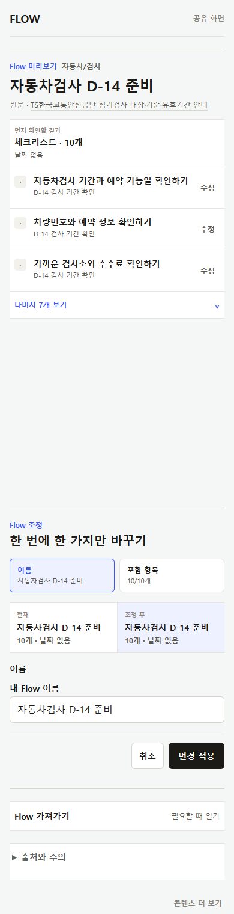 |

### E13 — 체크리스트형 Flow 조정

- 확인되는 것: 같은 인라인 조정 틀을 쓰지만 날짜형의 `이사일` 항목은 없고 이름·포함 항목만 제공함
- 검토 질문: 이 차이가 콘텐츠 특성에 맞는 변형인지, 사용자가 예측할 수 없는 예외인지

## 비교 6. 별도 공개 경로

[E12 원본 열기](./screenshots/E12-legacy-flow-map-public.png)

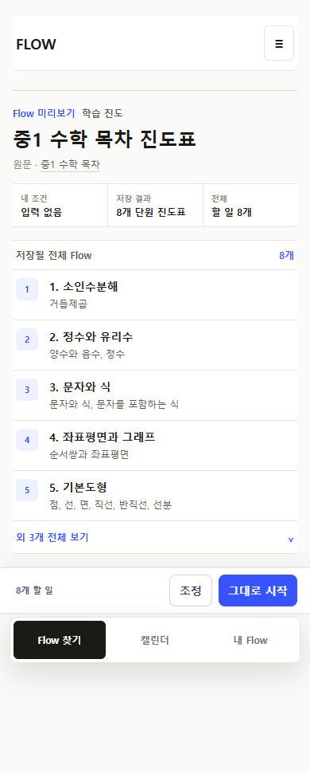

### E12 — `/flow-maps` 공개 화면

- URL: <https://flowme2605.vercel.app/flow-maps/middle-school-math-1>
- 확인되는 것: `/f`와 다른 화면 틀, `내 조건 / 저장 결과 / 전체`, `조정 / 그대로 시작`, 저장될 전체 Flow 목록
- 확인되지 않는 것: 코드에 있는 `전체 내용과 원문` 영역은 이 Production 캡처에서 나타나지 않아 화면 증거로 사용하지 않음

## 부록. Flow 찾기 목록

[E01 원본 열기](./screenshots/E01-flows-catalog.png)

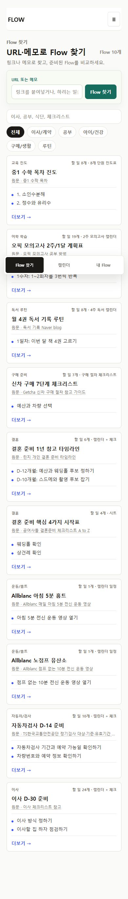

- URL: <https://flowme2605.vercel.app/flows>
- 확인되는 것: 서로 다른 결과 유형을 한 카드 형식으로 요약하는 현재 목록
- 확인되지 않는 것: 상세 화면과 My Flow의 시각 계약
