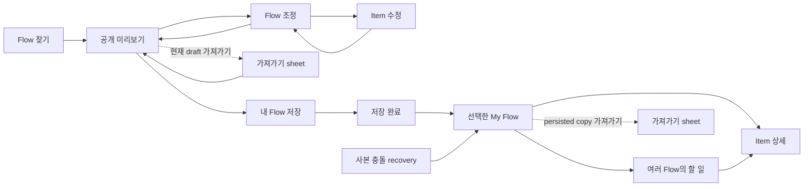

# P35 모바일 UX·아키텍처 로컬 검토

- 작성일: 2026-07-31
- 범위: 기획 검토와 제안만 포함, 제품 코드 수정 없음
- 코드 기준: `main` / `c09f859b30b854f6f897b8ec1eb781fd774fbeca`
- Production: <https://flowme2605.vercel.app>
- 우선 viewport: `390 × 844`
- 검토 프롬프트: [08-codex-local-review-prompt-ko.md](https://github.com/knhbae/flowme2605/blob/965eb54ee85fb06d8beee3bc7fa0060771c33fbc/docs/content-audit/2026-07-31-p35-mobile-planning-handoff/08-codex-local-review-prompt-ko.md)
- 결과 성격: 코드·Production·고정 캡처 기반 내부 결정 자료. 외부 사용자 관찰 결과가 아님

## 결론 먼저

| 결정 항목 | 판정 |
|---|---|
| 현재 구조 | **혼합 구조** — 공통 projection·shape renderer·조정 패널 위에 두 공개 composition, 별도 controller, slug 예외, My Flow 명령 누적이 공존 |
| 가장 먼저 막아야 할 문제 | 기본 예시 캘린더를 보여주고 `캘린더 24개로 시작`이라 안내한 뒤 날짜 없는 체크리스트로 저장하는 결과 불일치 |
| 두 번째 결과 계약 문제 | 공개 Item에서 수정한 제목·상세·날짜를 preview는 반영하지만 저장 전·후 공개 가져가기의 text/XLSX/ICS 생성 경로는 반영하지 않음 |
| 권고 구조 | **대안 A: 순차 상태 shell을 중심으로 한 제한적 구조 개편** |
| 전면 재작성 | **권고하지 않음.** canonical data, stable identity, projection, 5개 shape renderer, 저장·반복·내보내기 엔진은 유지 |
| 실제 개편 범위 | 공개/My Flow의 화면 composition, 상태 전환, 편집 transaction, 가져가기 소유 상태, 초기 정보 밀도, variant 정책 |
| Step·그룹명 편집 | P0 아님. source 원문을 보존하는 개인 group overlay가 필요한 P1 후보 |
| 사용자 검증 | 외부 사용자 관찰 0회. 코드·화면 QA와 선호·이해도 검증을 구분해야 함 |

핵심 판단은 “전체를 다시 만들 것인가”가 아니라 “이미 있는 공통 코어를 하나의 유효 결과와 상태 계약 아래 다시 연결할 것인가”입니다. 현재 가장 큰 문제는 renderer 부재가 아니라 preview, save, receipt, My Flow, export가 같은 유효 결과를 단일 진실로 공유하지 않는다는 점입니다.

## 1. 검토 기준과 독립성

### 1.1 저장소 기준선

세션 시작 시 확인한 기준은 다음과 같습니다.

| 항목 | 값 |
|---|---|
| 작업 저장소 | `D:\flowme2605\flow-mvp` |
| branch | `main` |
| HEAD | `c09f859b30b854f6f897b8ec1eb781fd774fbeca` |
| upstream | `origin/main` |
| ahead / behind | `0 / 0` |
| 기존 worktree | modified 22개, untracked 25개 |
| 기존 변경 중 관련 문서 | `docs/STATUS.md`, `docs/flow-rules/ux-copy.md` 등 — 이번 작업에서 수정하지 않음 |
| 이번 작업 소유 경로 | 이 보고서 폴더만 |

`npm.cmd run workflow:session-start`를 실행하고 `AGENTS.md`, `agent.md`, `docs/STATUS.md`, `docs/SERVICE_STRUCTURE.md`, 관련 flow rules와 고정 작업 패키지를 확인했습니다.

### 1.2 독립 진단 절차와 한계

원래 절차는 1차 진단 뒤 `06-owner-feedback-normalized-ko.md`를 읽는 것입니다. 다만 이 세션은 먼저 09번 기획 세션을 준비하다 08번 검토로 전환되어, 주 검토자가 06번 문서를 이미 열어본 상태였습니다. 이를 숨기고 완전한 blind review라고 주장하지 않습니다.

대신 다음과 같이 보완했습니다.

- 06번 문서를 전달하지 않은 독립 코드·화면 진단을 별도로 수행했습니다.
- 06번 문서를 전달하지 않은 아키텍처 계약 검토와 구조 대안 검토를 각각 분리했습니다.
- 아래 A절은 그 독립 결과와 주 검토자의 실제 Production 재현 결과를 먼저 합쳤습니다.
- B절에서만 06번의 O·F·M 항목과 대조했습니다.

따라서 A절은 오너 피드백의 표현을 그대로 재진술한 결과가 아니지만, 주 검토자 개인의 완전한 blind review도 아닙니다.

### 1.3 증거 경계

- 2026-07-31 Production을 실제 브라우저로 `390 × 844`에서 확인했습니다.
- 고정 커밋 `965eb54`의 [E01–E13 Production 증거 인덱스](https://github.com/knhbae/flowme2605/blob/965eb54ee85fb06d8beee3bc7fa0060771c33fbc/docs/content-audit/2026-07-31-p35-mobile-planning-handoff/02-production-evidence-index-ko.md)와 원본 캡처를 모두 시각 확인했습니다. 아래 표의 E 번호는 이 인덱스를 가리킵니다.
- 필수 7개 파일과 관련 projection, date intent, persistence, export 코드를 읽었습니다.
- 별도 Production 재현 세션에서 console error를 관찰하지 않았지만 로그를 제출물에 보존하지 않았으므로 품질 판정 근거로 쓰지 않았습니다. 대표 조정 화면에서는 `innerWidth = bodyScrollWidth = 390`을 확인했으며, 이를 전체 경로의 overflow 부재로 일반화하지 않습니다.
- 이번 리뷰에서 전체 자동화 suite를 재실행하지 않았습니다.
- 스크린샷, 브라우저 재현, 코드 판정은 QA·구조 증거이지 실제 사용자가 성공했다는 증거가 아닙니다.

## A. 독립 코드·화면 진단

### A-1. Production 경로별 확인 결과

| 경로·상태 | 직접 확인한 사실 | 판정에 쓰인 의미 |
|---|---|---|
| `/flows` · E01 | URL·메모 입력, 검색, 필터, 10개 Flow 카드, 하단 3개 내비게이션이 한 화면에 존재 | 발견 화면은 공통 카탈로그이나 모바일 첫 화면의 밀도는 높음 |
| `/f/moving-d30-basic` 초기 · E02 | 날짜 입력은 비어 있고 예시라고 표시되지만 `캘린더 · 24개`, 예시 날짜 범위, `캘린더 24개로 시작`을 표시 | preview와 저장될 결과를 사용자가 같은 것으로 이해하기 쉬움 |
| 같은 Flow 조정 · E03 | artifact-first frame 다음에 일반 section으로 붙고 자동 스크롤됨 | 명시적 화면 전환 없이 두 번째 화면처럼 동작 |
| 같은 Flow Item 수정 · E04 | Flow 조정이 열린 상태에서 Item 바텀시트가 그 위에 열림 | transaction 소유자와 back/cancel 범위가 불명확 |
| 같은 Flow 가져가기 · E05 | `Flow 가져가기`를 연 뒤 다시 `이 Flow 통째로 가져가기`를 열어야 범위·형식이 나타남 | 두 disclosure가 한 작업 진입을 중첩 |
| 같은 Flow 저장 완료 · E06 | `내 Flow에 저장됨`, `24개 할 일을 저장했어요`, `주요 결과 체크리스트`로 변함 | 방금 본 캘린더 결과가 저장 경계에서 체크리스트로 바뀜 |
| 저장 직후 첫 My Flow 진입 · E07 | `실행할 할 일 19개`, `전체 0/24`, 이어서 할 일 3개, 진행률, 일회성으로 자동 확장된 전체 계획, 관리·조정·가져가기가 함께 노출 | 일반 재진입의 전체 계획은 기본 닫힘이지만, 첫 post-save 전환에서는 실행과 전체 관리가 동시 우선 |
| My Flow Item 상세 · E08 | 실행 메모, 바로 할 일, 메모·일정, 현재 항목 가져가기가 있지만 완료 행동은 없음 | 상세에서 실행을 확인한 뒤 완료하려면 닫고 원래 행을 다시 찾아야 함 |
| My Flow 할 일 · E09 | 날짜 없는 실행 가능 Item이 긴 단일 rail로 나열됨 | cross-Flow 실행 관점은 있으나 undated 대량 Flow를 압축하지 못함 |
| `/f/vehicle-inspection-prep` · E10/E13 | 같은 artifact-first shell과 공통 2버튼 행동 영역, checklist renderer 사용 | `/f` 내부는 콘텐츠별 전체 JSX가 아니라 공통 데이터 경로임 |
| `/f/curated-allblanc-morning-workout` · E11 | 같은 shell 안에서 routine setup과 반복 editor를 data 조건으로 표시 | 필요한 콘텐츠 variant의 사례 |
| `/flow-maps/middle-school-math-1` · E12 | PlatformNav, 3개 요약값, legacy 목록, `조정/그대로 시작`을 사용 | 같은 “Flow 미리보기”라도 별도 route·composition 문법이 남음 |

### A-2. 구조 판정

**공통 코어와 예외가 함께 있는 혼합 구조**, 확신 `0.97`입니다.

공통 코어로 확인된 것은 다음과 같습니다.

- `FlowBundle`과 source-backed bundle merge
- `buildFlowExperienceProjection`
- calendar, checklist, sheet, memo, flow execution의 5개 shape
- `FlowArtifactDataPreview`의 shape별 공통 renderer
- `FlowSaveBeforeFrame`
- `/f`의 공통 `PublicFlowAdjustmentPanel`
- stable item identity와 공개 Item personalization의 My Flow promotion
- scope-aware export, recurrence, persistence 엔진
- 데이터 손실을 피하는 canonical duplicate reconciliation

혼합 구조로 판정한 이유는 다음과 같습니다.

- `/f`와 `/flow-maps`가 다른 controller와 composition을 사용합니다.
- projection이 `/f` hero preview에는 적용되지만 save/export 전체의 단일 진실은 아닙니다.
- public controller에 exact slug·category 조건이 누적돼 있습니다.
- Flow 전체 조정, 공개 Item 수정, My Flow Item 상세·수정이 다른 interaction grammar를 사용합니다.
- My Flow 한 화면이 실행, 기록, 계획, 구조 편집, 관리, export를 동시에 소유합니다.

### A-3. 심각도별 발견

#### Blocking

| ID | 관찰 | 원인 가설·코드 근거 | 확신 |
|---|---|---|---:|
| A-B01 | 초기 moving 화면은 빈 날짜 입력과 함께 예시 캘린더 24개 및 `캘린더 24개로 시작`을 보여주지만, 바로 저장하면 영수증이 `체크리스트 24개`, My Flow가 날짜 없음으로 바뀜 | `example`은 `previewAnchor`만 만들고 실제 저장은 `persistedMode: undated`, `calendarEligible: false`, `previewOnly: true`로 둠. 저장 시 preview-only를 undated로 전환함. `lib/flow/public-date-intent.ts:29-82`, `AppClient.tsx:18253-18262`, `18337-18354`, `18828-18846` | 0.99 |
| A-B02 | 공개 Item의 제목·상세·날짜를 수정하면 preview에는 반영되지만 같은 화면의 text/XLSX/ICS 가져가기는 그 수정값을 사용하지 않음 | preview projection은 `publicItemPersonalizations`를 override로 받지만 export handler는 base `bundle`, `itemStates`, `exportAnchor`를 사용함. `AppClient.tsx:18408-18428`, `18639-18648`, `18726-18789`, `19071-19105`. Item 변경은 My Flow 저장 때에만 persisted draft/date override로 승격됨. `18851-18869` | 0.98 |

두 문제는 취향이나 정보 밀도 문제가 아니라 사용자가 확인한 결과와 실제 저장·내보내기 결과가 달라지는 핵심 결과 계약 위반입니다. 이 둘이 닫히기 전에는 새로운 shell의 시각 완성도를 높여도 MVP 결과 정직성이 확보되지 않습니다.

#### High

| ID | 관찰 | 원인 가설·코드 근거 | 확신 |
|---|---|---|---:|
| A-H01 | Flow 조정 안에서 종류를 바꾸면 미적용 draft가 초기화되지만, Item 바텀시트에서 저장한 personalization은 바깥 Flow 조정에서 취소해도 남음 | 종류 전환마다 `resetPublicAdjustmentDrafts()`를 호출함. Item 저장은 별도 `publicItemPersonalizations`에 즉시 반영하고 전체 cancel은 이를 되돌리지 않음. `AppClient.tsx:18597-18610`, `18639-18648`, `18664-18725` | 0.97 |
| A-H02 | My Flow 모바일 Item 상세에는 완료 행동이 없고, 완료 checkbox는 dimmed backdrop 뒤 원래 행에 남음 | 상세 renderer에 `parentOwnsCompletion: true`를 넘기며, detail 내부 checkbox는 그 조건에서 렌더하지 않음. `AppClient.tsx:11741-11750`, `16935-16958` | 사실 0.98 / 영향 0.90 |
| A-H03 | 단일 Flow처럼 보이는 중1 수학도 `/flow-maps`의 legacy 문법으로 노출되어 `/f`와 CTA·요약·편집·출처 위치가 다름 | `/f`는 `PublicFlow`와 artifact-first, `/flow-maps`는 publish package·save mode·hold gate를 가진 별도 controller와 legacy composition 사용. `app/f/[slug]/page.tsx:59-65`, `app/flow-maps/[map]/page.tsx:51-60`, `SourceBackedFlowMapPage.tsx:131-205` | 0.97 |
| A-H04 | 저장 영수증은 24개를 모두 “할 일”이라고 부르지만 My Flow는 실행할 할 일 19개와 전체 24개를 함께 표시함 | 전체 source rows와 Todo eligibility가 다른 것은 가능한 domain 차이지만 receipt·workspace가 서로 다른 count noun을 설명하지 않음. 후보는 Item type·shape·execution level에 따라 제외됨. `AppClient.tsx:14855-14916`, `lib/flow/my-flow-cross-flow-todo.ts:91-103`, `133-161` | 0.94 |

#### Medium

| ID | 관찰 | 원인 가설·코드 근거 | 확신 |
|---|---|---|---:|
| A-M01 | Flow 조정은 모바일에서 명시적 화면 전환 없이 긴 inline section으로 나타나며 큰 빈 스크롤 구간을 만듦 | artifact-first frame이 모바일에서 `min-h-[calc(100dvh-5rem)]`이고 조정 패널은 그 다음 sibling임. `FlowSaveBeforeFrame.tsx:61-100`, `PublicFlowAdjustmentPanel.tsx:113-127`, `AppClient.tsx:19155-19224` | 0.94 |
| A-M02 | 저장 전과 저장 후 같은 `Flow 가져가기` workbench가 반복되며 두 disclosure를 거쳐야 함 | 동일 `renderArtifactWorkbenchDisclosure()`가 preview/receipt 분기 뒤에 공통으로 mount됨. `AppClient.tsx:19071-19116`, `19155-19268` | 0.96 |
| A-M03 | 저장 직후 첫 My Flow 진입에 이어서 할 일, 행 메모, 완료, 진행률, 일회성으로 펼친 전체 계획, 구조 조정, 날짜 변경, export가 동시에 노출됨 | 일반 focused workspace의 전체 계획은 기본 닫힘이고 first-entry 상태만 자동 확장함. 문제 범위는 My Flow 전체가 아니라 post-save 첫 전환의 우선순위임. `AppClient.tsx:15863-15867`, E07 | 0.96 |
| A-M04 | `실행 메모`, Item `memo`, memo artifact, legacy item note가 비슷한 이름으로 노출됨 | 서로 다른 3개 메모 상태 모델과 1개 메모 출력 형태가 같은 어휘를 공유함. `execution-notes.ts:1-17`, `my-flow-personal-state.ts:13-35`, `FlowArtifactDataPreview.tsx:14-20`, `flow-item-state.ts:20-23` | 구조 0.98 / 혼란 0.78 |
| A-M05 | `할 일 / Flow`가 기본 활성화된 P35 실험이지만 사용자가 두 job을 이해한다는 증거는 없음 | `experiment=off`가 아니면 켜지고, 기본 todo/URL mode를 별도 state로 유지함. `AppClient.tsx:5383-5384`, `5650-5674`, `14930-15050`, `16502-16514` | 구조 0.99 / UX 성공 판단 불가 |

#### Low

| ID | 관찰 | 근거·삭제 우선 검토 | 확신 |
|---|---|---|---:|
| A-L01 | `/f` 상단 `공유 화면`은 이동·상태·위험 정보를 주지 않음 | 정적 label 대신 `Flow 찾기`로 돌아가는 실제 이동 또는 삭제 검토. `AppClient.tsx:19424-19450` | 0.86 |
| A-L02 | 공개 Item editor는 상단 닫기와 하단 취소가 모두 같은 close임 | 한 개만 남기고 unsaved dismiss 확인·복구 계약 추가. `PublicFlowAdjustmentPanel.tsx:309-318`, `372-388` | 0.91 |
| A-L03 | Flow 이름 조정에서 종류 카드, 현재/조정 후, 입력이 같은 이름을 반복함 | 변경된 dimension만 비교하고 변하지 않은 값은 삭제. `PublicFlowAdjustmentPanel.tsx:137-194` | 0.90 |
| A-L04 | 포함 Item 행의 제목 전체와 별도 `수정` 버튼이 같은 editor를 엶 | 접근성 label은 유지하되 시각 명령은 하나로 통합. `PublicFlowAdjustmentPanel.tsx:211-251` | 0.95 |

### A-4. 삭제·통합·유지 우선순위

| 처리 | 대상 |
|---|---|
| 삭제 | 영수증 아래 반복 export 진입, 정적 `공유 화면`, 변하지 않은 현재/조정 후 정보, 중복 닫기·취소, 포함 Item의 중복 edit 진입 |
| 통합 | 공개/저장 후 유효 결과 snapshot, Flow 조정 transaction, Item detail/edit shell, 행 메모와 상세 진입, export scope sheet |
| 접기 | 저장 직후 전체 계획 자동 확장 중단, 구조 조정, 날짜 변경, run history, 고급 일정, export |
| 필요할 때만 | `이 사본 사용`, source correction, 위험 주의, archived copy 복구, 구조 편집 |
| 유지 | 직접 원문 링크, 위험도별 주의, stable identity, undo·archive, 5개 shape renderer, recurrence와 portable export 엔진 |

## A-5. 필수 코드 질문 10개

### Q1. projection → shape → renderer 공통 경로는 어디까지 적용되는가?

`/f`의 결과 hero까지는 분명히 적용됩니다.

1. `app/f/[slug]/page.tsx:59-65`가 모든 유효 slug를 공통 `PublicFlow`로 보냅니다.
2. `AppClient.tsx:18408-18428`이 source bundle, anchor, item state, personal override로 `FlowExperienceProjection`을 만듭니다.
3. `flow-experience-projection.ts:7-64`, `117-143`, `158-240`이 5개 shape와 rows를 계산합니다.
4. `FlowArtifactDataPreview.tsx:241-253`, `316-431`이 calendar/checklist/sheet/memo/flow execution renderer 중 하나를 선택합니다.
5. `AppClient.tsx:19190-19207`이 그 projection을 `/f` hero에 전달합니다.

하지만 controller 전체를 관통하는 직렬화된 단일 snapshot은 아닙니다.

- 공개 save는 projection에서 계산한 shape와 effective title/date intent를 일부 사용하고, Item personalization을 My Flow draft/date override로 승격합니다. 다만 저장 직전 `example` date intent를 `undated`로 바꾸며 preview와 다른 결과를 만들 수 있습니다. `AppClient.tsx:18828-18869`
- 공개 text/XLSX/ICS export는 base `bundle`, `itemStates`, `exportAnchor`를 사용하며 `publicItemPersonalizations`를 받지 않습니다. `AppClient.tsx:18726-18789`, `19071-19105`
- `/flow-maps`는 publish package의 child steps를 직접 legacy rows로 바꾸며 projection을 우회합니다. `SourceBackedFlowMapPage.tsx:131-205`
- 같은 renderer는 memo-to-Flow draft에도 재사용됩니다. `AppClient.tsx:1979-2058`

따라서 답은 “`/f` 결과 미리보기에는 공통 경로가 있으나 save/export/My Flow까지 관통하는 단일 effective snapshot은 아직 없다”입니다.

### Q2. `/f`와 `/flow-maps`는 왜 다른 composition을 쓰며 합칠 수 있는가?

차이는 단순 legacy CSS만이 아닙니다.

| `/f` | `/flow-maps` |
|---|---|
| 단일 `FlowBundle` | 여러 child Flow를 가진 map publish package 가능 |
| 단일 Flow 저장 | `choose_child` 또는 `save_all` |
| artifact-first projection | child step aggregation |
| 공통 Flow/Item personalization | map quality hold, review URL, child 선택 |
| 공유 화면 shell | PlatformNav를 가진 서비스 shell |

근거는 `FlowSaveBeforeFrame.tsx:15-33`, `57-125`, `AppClient.tsx:19155-19215`, `SourceBackedFlowMapPage.tsx:52-205`입니다.

합칠 수 있는 것은 shell, state label, artifact row adapter, action dock, source/risk disclosure입니다. 합치면 안 되는 것은 map의 hold gate와 multi-child save controller입니다. 단일 child map의 `/f` canonicalize는 후보일 뿐입니다. 기존 URL, `saveMode`, `savedMap` persistence, map snapshot/handoff, creator·review·hold metadata를 보존할 adapter와 migration이 입증될 때만 적용해야 합니다. 그렇지 않으면 route는 유지하고 action shell만 통일합니다.

### Q3. slug·category·prefix별 예외는 몇 종류이며 data variant로 옮길 수 있는가?

숫자는 범위를 정하지 않으면 의미가 달라집니다. 특히 `AppClient.tsx`에는 현재 artifact-first composition에 직접 보이는 조건과 닫힌/legacy renderer helper가 함께 있습니다. 따라서 아래 수치는 **요청된 7개 파일의 public Flow 관련 정적 조건 분류**이며, 현재 화면에서 모두 발동하는 branch 수로 해석하면 안 됩니다.

| 종류 | 확인 수 | 예 | 제안 |
|---|---:|---|---|
| exact-slug UI/policy family | **최소 13 family** | creator override, catalog/status suppression, footer hide, jeonse specialization, mobile workbench/desktop rail, fixed-routine weekday, collapsed section, simplified feedback 등 | mount 경로를 먼저 확인한 뒤 `presentationVariant`와 `sourcePolicy` 데이터로 이전 |
| marker-only exact slug | 1 family | `overseas-safety-register` P35 marker | UI variant가 아니라 test telemetry로 분리 |
| category heuristic function | 2개 주요 함수 / match string 10개 | anchor label, example anchor offset | label은 기존 data 우선 유지, offset은 `exampleAnchorOffsetDays`로 명시 |
| slug-prefix family | 1 prefix / 3개 helper 문맥·`startsWith` 4회 | `real-fitvely-video-` | explicit content capability로 이전하고 dead path면 삭제 |
| `/flow-maps` literal slug/category/prefix | 0 | `saveMode`, hold reason, destination data로 분기 | 이 방식 유지 |

`최소 13`은 고유 slug 수나 현재 보이는 branch 수가 아니라 서로 다른 decision/helper family의 보수적 하한입니다. 주요 근거는 `AppClient.tsx:523-550`, `622-665`, `811-813`, `868-876`, `954-996`, `19140-19143`, `19467-19498`, `19698-19703`, `20879-20919`, `21242`, `21555-21561`입니다. 일부 helper는 현재 artifact-first 화면에서 사실상 보이지 않을 수 있으므로, 제거 전에 함수 → call site → 실제 mount를 다시 확인해야 합니다. category 근거는 `847-859`, `19954-19965`, prefix 근거는 `19714`, `19845`, `21560-21561`입니다.

모든 예외를 없애는 것이 목표는 아닙니다. 안전한 data variant로 옮길 항목은 다음과 같습니다.

- `composition: single_flow | flow_map`
- `artifact.primaryShape`
- `layout.workbenchPlacement`
- `layout.referenceRail`
- `sourceDisclosure.mode`
- `setup.anchorField`, `exampleAnchorOffsetDays`
- `routine.weekdayMode`
- `feedback.mode`
- `editor.capabilities`

### Q4. Flow 전체 조정과 Item 수정은 어떤 state와 component로 나뉘는가?

Flow 조정 state는 `publicAdjustmentOpen`, `publicAdjustmentKind`, title/anchor/items/routine draft로 나뉩니다. Item은 `publicItemPersonalizations`, `publicItemEditorDraft`, return focus selector를 별도로 가집니다. `AppClient.tsx:18222-18235`

- Flow 조정: 일반 `<section>`인 `PublicFlowAdjustmentPanel`, 종류는 `name | anchor | items | routine`. `PublicFlowAdjustmentPanel.tsx:13-62`, `92-292`
- Item 수정: `FlowBottomSheet`인 `PublicFlowItemEditor`, 필드는 title/detail/date. `PublicFlowAdjustmentPanel.tsx:294-393`
- Item personalization은 public 메모리에 저장했다가 My Flow 저장 시 item draft/date override로 promotion. `AppClient.tsx:18612-18649`, `18851-18869`

현재 문제는 다른 대상이라 UI가 다른 것 자체가 아니라, 두 state가 하나의 transaction으로 보이면서 apply/cancel 범위는 다르다는 점입니다.

### Q5. Step·그룹 이름을 수정하려면 어디까지 바꿔야 하는가?

현재 공개 editor에는 Step·section 필드가 없습니다. projection의 `row.section`은 `FlowSection.title`에서 파생됩니다. `flow-experience-projection.ts:168-189`

현재 personal storage도 Item 중심입니다.

- `StoredMyFlowItemDraft`: item title/date/memo/time/location 등. group override 없음. `my-flow-personal-state.ts:13-35`
- structural overlay: user Item, tombstone, order, selection, Item value override. group title override 없음. `personal-structural-overlay.ts:29-76`
- source-backed map: embedded `stepTitle`을 별도 source 값으로 가짐. `source-backed-my-flow.ts:2076-2198`

개인 Step·그룹 이름 편집을 도입하려면 다음이 필요합니다. 아래는 현재 코드의 사실이 아니라 도입 시 필요한 설계 범위입니다.

1. 기존 source group만 rename한다면 stable source section/step ID를 overlay key로 사용. 사용자가 새 개인 group도 만들 수 있게 한다면 별도의 stable personal group ID 추가
2. `{groupId, personalTitle}` overlay와 schema version migration
3. backup·restore·canonical copy reconciliation 포함
4. projection `row.section`의 effective title 계산
5. `/flow-maps` child step title adapter
6. My Flow grouping, detail, search, export, run snapshot에 effective group title 전달
7. source title 불변과 personal title 표시 구분
8. public/My Flow editor 및 회귀 테스트

따라서 P0에서 단순 input 하나를 추가할 일이 아닙니다. 공개 MVP에서는 source-owned read-only로 두고, 실제 수요를 확인한 뒤 개인 overlay로 P1에 도입하는 편이 안전합니다. creator 원본 편집은 publish/version 계약까지 필요한 별도 과업입니다.

### Q6. 저장 전·후 Flow 가져가기는 같은 기능인가, 다른 범위·상태인가?

현재 구현상 **같은 workbench와 같은 handler**입니다. receipt와 preview만 분기하고 그 뒤 동일 disclosure를 mount합니다. `AppClient.tsx:19071-19116`, `19155-19268`

하지만 사용자에게는 상태를 구분해야 합니다.

| 상태 | 권고 의미 |
|---|---|
| 저장 전 | 현재 draft의 결과·범위·형식을 확인하고, 저장 없이도 portable output을 만들 수 있는 side branch |
| 저장 완료 receipt | 저장 성공과 다음 행동만 보여주는 전환 상태. export 반복 없음 |
| My Flow | persisted personal copy를 기준으로 Flow 또는 Item을 실제 외부 도구로 가져가는 관리 행동 |

현재는 preview projection이 Item override를 반영해도 export는 base bundle을 사용합니다. 즉 같은 UI처럼 보이지만 같은 effective result를 다루지 않습니다. 또한 `SavedFlowRecord.selectedArtifactMode`는 calendar/sheet가 아니면 checklist로 fallback해 memo/flow execution shape parity도 명시적으로 보장하지 않습니다. `AppClient.tsx:18408-18428`, `18726-18844`

### Q7. 공개 Flow와 My Flow에서 재사용할 Item detail/edit contract는 무엇인가?

전체 화면을 같은 컴포넌트로 강제하기보다 아래 core contract를 공유하는 편이 적절합니다.

| 계약 | 공통 값 |
|---|---|
| identity | stable item ID, source item ID, flow ID |
| source baseline | source title/detail/date/section/role/resources/caution — 불변 |
| personal overlay | title, memo, date |
| effective read model | baseline + overlay의 해석 결과 |
| capabilities | edit, complete, export, recurrence, source correction의 허용 여부 |
| interaction | open, save, cancel, dismiss guard, focus return, back |

공개 projection override는 `flow-experience-projection.ts:9-13`, row read context는 `25-46`입니다. 공개 draft는 `public-item-personalization.ts:9-13`, My Flow superset은 `my-flow-personal-state.ts:13-35`입니다.

공개 Flow는 title/detail/date 3필드만 편집하고, My Flow의 recurrence/time/location/subchecks 및 실행 기록은 context extension으로 남깁니다. shell과 transaction 규칙은 같되 모든 필드를 같게 만들 필요는 없습니다.

### Q8. `실행 메모`와 Item `memo`는 의미·저장·내보내기에서 어떻게 다른가?

현재 “메모”는 **서로 다른 3개 상태 모델과 1개 출력 형태**에 쓰입니다. memo artifact는 별도 저장 domain이 아니라 projection/output shape입니다.

| 종류 | 의미 | 저장 | 저장된 My Flow 기준 일반 export |
|---|---|---|---|
| memo artifact 출력 형태 | Flow 전체를 메모 형태로 projection한 결과 | 별도 저장 없음; source와 overlay에서 계산 | memo output 자체 |
| Item memo | 개인 Item에 계속 붙는 실행 정보 | `flow:my-flow:item-drafts`의 `memo` 또는 structural `personalMemo` | checklist/sheet/memo/ICS description에 포함 |
| 실행 메모 | 실행 중 알게 된 개인 note 또는 `source_correction` | flow별 `flow:my-flow:execution-notes:*`, 완료 run snapshot에 동기화 | 일반 Flow export에는 포함되지 않고 run/history·feedback 맥락에서 사용 |
| legacy item note | 과거 `FlowItemState.note` | item state | legacy export 경로 일부에서 사용 |

근거는 `execution-notes.ts:1-17`, `storage.ts:831-853`, `my-flow-personal-state.ts:13-35`, `AppClient.tsx:9188-9245`, `9276-9435`, `11804-12019`입니다.

사용자 화면에서는 `메모` 하나의 진입점을 권고하지만 데이터를 즉시 하나로 합치지는 않습니다.

- `내 메모`: Item에 지속되고 일반 export에 포함
- `실행하며 알게 된 점`: run 기록, 완료 뒤 보조 영역
- `원본에 알릴 점`: source correction 목적이 드러나는 별도 선택

P0는 표시·진입 통합과 데이터 보존이고, 실제 storage migration은 P1입니다.

### Q9. `이 사본 사용`은 어떤 데이터 보호 조건에서 나타나는가?

일반 실행 CTA가 아닙니다.

- 같은 canonical group에 유효 saved copy가 2개 이상 존재
- 기존 선택 결정이 없거나 현재 archive 상태에 더는 반영되지 않아 `status === needs_choice`
- Calendar나 선택 Flow workspace가 아닌 My Flow library 상단

선택하면 고른 사본을 restore하고 나머지는 삭제하지 않고 archive한 뒤 reconciliation metadata를 기록합니다. `AppClient.tsx:5951-5953`, `16298-16349`, `canonical-flow-storage.ts:293-398`

따라서 기능은 유지하되 일반 header에서 제거하고, conflict가 실제 발생한 순간의 recovery task 또는 데이터 관리 화면에서만 보여야 합니다.

### Q10. 출처·원문·주의 정보는 어떤 경로·slug 조건으로 달라지는가?

| 경로 | 기본 데이터 | 현재 배치·예외 |
|---|---|---|
| `/f` | source title/url, creator, source fit, flow warning | hero에는 직접 원문 링크. compact는 `출처와 주의` disclosure, non-compact는 별도 cards, desktop rail과 exact-slug footer suppression 존재. `AppClient.tsx:661-711`, `19229-19326`, `548-550` |
| `/flow-maps` | map source, child step source/memo, hold reason, review URL | `전체 내용과 원문`에서 map/child 내용을 직접 조합. hold 상태는 별도 review screen. literal map slug 분기는 없음. `SourceBackedFlowMapPage.tsx:52-129`, `207-314` |
| My Flow Item | detail의 primary link, resources, caution | Item detail에서 source link·resource·caution을 context에 따라 표시. `AppClient.tsx:11723-11910` |

오너가 느낀 “아예 없는 경우”는 검토한 대표 경로에서는 확인하지 못했습니다. `/f`와 `/flow-maps` 모두 직접 원문 링크 또는 disclosure가 있었습니다. 다만 이름, 위치, 깊이, footer 숨김 정책이 일관되지 않는 것은 확인됐습니다.

권고 정책은 다음과 같습니다.

1. 직접 원문 링크는 모든 public Flow identity 영역에 유지
2. 안전·법률·의료 등 중요한 주의는 해당 행동 가까이에 표시
3. 제작자 설명과 긴 provenance는 한 disclosure로 축약
4. 표시 여부는 slug가 아니라 `riskLevel`, `sourceDisclosure`, `reviewState` 데이터로 결정
5. source 원문과 personal override를 시각·데이터상 구분

## B. 사용자 피드백 대조

| ID | 분류 | 검토 결과 | 권고 |
|---|---|---|---|
| O-01 | **현상은 맞지만 원인이 다름** | `/f`에는 공통 projection과 5개 renderer가 있어 콘텐츠별 전체 구현은 아님. 두 route/composition과 예외가 개별 구현처럼 느끼게 함 | 코어 유지, shell·variant·controller 경계 정리 |
| O-02 | **확인됨** | 한 화면이 사용자 질문 하나보다 내부 기능 단위를 많이 소유함 | 상태별 primary 1개, receipt·editor·export를 분리 |
| F-01 | **일부 확인됨** | `/f` 3개 대표 Flow의 행동 위치는 공통이고 label·setup만 데이터에 따라 변함. `/flow-maps`는 다른 영역 사용 | `/f` 값을 강제 동일화하지 말고 두 composition의 action contract를 통일 |
| F-02 | **확인됨** | 표시값은 section/Step subtitle이고 현재 editor·overlay에 필드 없음 | P0 read-only, P1 personal group overlay. creator 원본 편집과 분리 |
| F-03 | **확인됨** | 긴 inline section과 이중 disclosure를 실제 확인 | 모바일 단일 export sheet/full-height editor, 명시적 back·scope |
| F-04 | **현상은 맞지만 원인이 다름** | Flow와 Item은 대상 범위가 달라 form 차이는 필요함. 문제는 transaction과 navigation 규칙이 다름 | 동일한 save/cancel/back/focus 계약, Flow→Item drilldown |
| F-05 | **확인됨** | 같은 workbench가 저장 전·후 반복됨 | preview side branch와 My Flow export만 유지, receipt에서는 제거 |
| F-06 | **확인됨** | 같은 source Flow라도 public projection과 My Flow bespoke row/workspace가 다른 문법 사용 | stable identity, effective overlay, shape/count/date summary를 연속 표시 |
| F-07 | **일부 확인됨** | `내 조건/저장 결과/전체` 3칸은 legacy `/flow-maps`에만 확인, `/f` 공통 구조는 아님 | 불필요한 3칸을 먼저 축약. 단일 child의 `/f` 이동은 map 저장·snapshot·metadata 보존 조건이 확인될 때만 시행 |
| F-08 | **일부 확인됨** | 위치·명칭·깊이 차이는 확인. 대표 화면에서 원문 링크가 완전히 없는 경우는 미확인 | 직접 링크 유지, 긴 provenance 축약, 위험 주의는 data policy로 유지 |
| M-01 | **확인됨** | `needs_choice`일 때만 생기는 데이터 보호 기능이며 일상 실행과 무관 | 삭제 금지. 충돌 발생 시 recovery task로만 표시, 나머지 archive·복구 유지 |
| M-02 | **확인됨** | public Item sheet와 My Flow detail/editor가 다른 field·surface grammar 사용 | 공통 Item contract와 shell, context extension 분리 |
| M-03 | **일부 확인됨** | 코드상 cross-Flow 실행과 single-Flow 관리라는 두 job은 존재. 탭 label만으로 이해되는지는 사용자 근거 없음 | `할 일` / `저장한 Flow`로 명명하고 prototype 관찰 |
| M-04 | **확인됨** | 행 `메모`, 상세 `실행 메모`, `메모·일정`이 중복 진입 | 행 메모 제거, 상세에 하나의 메모 진입. 빠른 메모 수요는 관찰 후 판단 |
| M-05 | **다른 해결을 권고** | 혼란은 확인되지만 데이터 의미와 export 수명은 다름 | raw data 즉시 병합·삭제 대신 하나의 UI entry와 목적별 mode, 데이터 보존·migration 계획 |
| M-06 | **일부 확인됨** | E07의 저장 직후 first-entry에서 실행·진행·전체계획·조정·날짜·export가 동시 노출됨. 일반 재진입에서는 전체 계획이 기본 닫힘 | first-entry만 next 1–3개+progress 중심으로 축약. 일반 닫힘 동작은 유지하고 관리·export 우선순위를 추가 관찰 |

### B-1. 오너 피드백에 없던 추가 발견

1. 예시 캘린더와 실제 undated 저장 결과가 다릅니다. A-B01
2. 공개 Item 수정과 공개 export 결과가 다릅니다. A-B02
3. Flow 조정 종류 전환, Item 저장, 전체 취소가 하나의 transaction으로 동작하지 않습니다. A-H01
4. My Flow Item 상세에서 완료가 불가능합니다. A-H02
5. `전체 24개`와 `실행할 할 일 19개`의 count noun·제외 이유가 설명되지 않습니다. A-H04

## C. 공통 계약 제안

### C-1. 상태 모델



가져가기는 ownership 상태를 바꾸지 않는 side branch입니다. 저장만 public draft를 persisted personal copy로 전환합니다.

| 상태 | 답해야 할 사용자 질문 | primary | secondary |
|---|---|---|---|
| Flow 찾기 | 어떤 Flow가 내 상황에 맞나? | Flow 열기 | 검색·필터 |
| 공개 미리보기 | 무엇이 저장·생성되나? | 내 Flow에 저장 | 조정, 가져갈 결과 보기 |
| Flow 조정 | 전체 결과를 어떻게 바꿀까? | 변경 적용 | 취소 |
| Item 수정 | 이 항목만 어떻게 바꿀까? | 항목 저장 | 뒤로·취소 |
| 저장 완료 | 저장됐고 다음에 어디로 가나? | My Flow에서 실행 | 없음 또는 Flow 찾기 |
| 여러 Flow의 할 일 | 지금 무엇을 실행할까? | Item 열기/완료 | Flow 보기 |
| 선택한 My Flow | 이 계획을 어떻게 이어갈까? | 다음 Item 실행 | 전체 계획, 관리, 가져가기 |
| Item 상세 | 무엇을 하고 완료로 남길까? | 완료/다시 열기 | 수정, 메모, 가져가기 |
| 사본 충돌 | 어떤 사본을 보존할까? | 이 사본 사용 | 데이터 관리 |

### C-2. 단일 유효 결과 계약

새 UI보다 먼저 `EffectiveFlowSnapshot`에 해당하는 단일 계약이 필요합니다. 이름은 구현 시 달라져도 됩니다.

```text
source baseline
+ public/saved personal overlay
+ inclusion/order
+ date intent/recurrence
+ completion context
→ effective rows
→ primary shape + counts + schedule state
→ preview / save record / receipt / My Flow / export
```

필수 불변식은 다음과 같습니다.

- preview의 shape/count/date-state와 CTA가 저장 결과와 같아야 합니다.
- 저장 영수증과 My Flow 첫 화면은 같은 saved snapshot을 읽어야 합니다.
- export scope·filename·output count·실제 payload는 같은 snapshot에서 나와야 합니다.
- source baseline은 수정하지 않고 personal overlay만 변경합니다.
- 전체 항목, 실행 가능 항목, 날짜 있는 항목의 count noun을 구분합니다.

### C-3. 모든 Flow가 공유할 shell

```text
1. identity: Flow 이름 · 상태(public/saved) · 직접 원문
2. result: primary artifact shape · 정확한 count/date-state
3. setup: 정말 필요한 anchor/routine input만
4. action dock: 상태별 primary 1개 + secondary 최대 2개
5. editor layer: Flow → Item의 한 navigation stack
6. source/risk: data-driven disclosure
```

`/flow-maps`는 이 shell의 `flow_map` adapter를 사용하되 map persistence, snapshot/handoff, multi-child controller와 hold gate를 유지합니다.

### C-4. 콘텐츠 variant schema

| 영역 | data field 예 | 금지할 방식 |
|---|---|---|
| composition | `single_flow`, `flow_map` | route마다 임의 action grammar |
| artifact | primary/secondary shape, renderer capability | slug별 전체 JSX |
| setup | anchor field, optional/required, example offset, routine editor mode | category string으로 날짜 임의 계산 |
| edit | name/anchor/items/routine/item fields | prefix를 보고 editor 종류 결정 |
| source | direct link, disclosure mode, risk level, review state | 안전 주의를 footer 전체 hide와 함께 제거 |
| layout | workbench placement, reference rail, mobile editor surface | allowlist를 controller 곳곳에 반복 |
| save | single/choose child/save all | button label만 바꾸고 저장 의미는 공유하지 않음 |

### C-5. Flow·Item 편집 계약

- Flow: 이름, anchor/start date, recurrence, 포함 Item, 순서
- Item: title, detail/personal memo, date
- Step/group: P0 source-owned read-only, P1 personal overlay
- 모바일 Flow 조정: inline appended section 대신 full-height sheet 또는 route-like surface
- Item 수정: Flow editor 안에서 drilldown하고 Back으로 복귀
- 한 시점에 active editor 하나
- 모든 draft는 Apply까지 보존하고 Cancel이면 모두 rollback
- dismiss 시 unsaved guard, 저장 후 원래 focus 복귀

### C-6. 저장·가져가기 계약

- 공개 preview의 `가져갈 결과 보기`는 현재 draft를 사용합니다.
- 저장 없이도 portable output을 허용할 수 있으나, 결과는 preview와 byte-level 의미가 같아야 합니다.
- receipt에는 export workbench를 반복하지 않습니다.
- My Flow의 Flow-level export는 persisted copy 전체, Item-level export는 현재 Item 1개를 기본 scope로 합니다.
- sheet는 `범위 → 형식 → 결과 count → 실행 → receipt` 순서입니다.
- 미지정 날짜 Item을 VEVENT로 만들지 않습니다. 캘린더 0개와 checklist 가능 수를 명확히 표시합니다.

### C-7. 공개 Flow·My Flow detail 계약

같아야 할 것:

- Item identity와 source link
- effective title/detail/date
- section·role·resource·caution
- edit save/cancel/back/focus
- export scope 표시

달라야 할 것:

- 공개 Flow: 저장 전 personal draft, completion 없음
- My Flow: completion, run note, recurrence, time/location, subcheck, history

### C-8. 출처·주의 정책

- 직접 원문 링크는 identity 영역에 항상 노출
- 위험 주의는 해당 행동 가까이에 노출
- 긴 source fit, creator, provenance는 하나의 disclosure
- review hold는 CTA를 막는 별도 상태로 유지
- personal override와 source text는 함께 보여도 값 소유자를 구분
- slug allowlist가 아니라 risk/source schema로 표시 결정

## D. 모바일 구조 대안

### 대안 A. 순차 상태 shell — 권고

| 항목 | 내용 |
|---|---|
| 화면 흐름 | Flow 찾기 → 공개 미리보기 → 선택적 조정 → 저장 완료 → 선택한 My Flow |
| 정보 계층 | Flow/source → 결과 artifact → 필요한 setup → 단일 행동 dock |
| 편집 | 모바일 full-height Flow editor, Item은 그 안의 drilldown. 한 editor만 active |
| 가져가기 | 공개 preview의 단일 secondary sheet와 My Flow의 persisted export. receipt에서는 제거 |
| My Flow | `할 일`은 date group + undated Flow 압축, `저장한 Flow`는 library. 선택 Flow는 next 1–3개와 progress, 전체 계획은 접힘 |
| 장점 | 가장 많은 UI를 뺄 수 있고 기존 projection·storage·export 엔진을 살림. public→saved 전환이 분명 |
| 단점 | 현재 R13의 첫 진입 전체 계획 확장 assertion을 의도적으로 바꿔야 함. focus/back 설계 필요 |
| 코드 영향 | 중간. shell/controller와 My Flow composition 중심 |

### 대안 B. 하나의 지속 Flow workspace

| 항목 | 내용 |
|---|---|
| 화면 흐름 | Flow 찾기 → Flow workspace의 결과/편집/가져가기 → 저장 시 같은 workspace가 personal 상태로 전환 |
| 정보 계층 | Flow outline이 Step/group/Item을 소유하고 선택 node를 inspector에 표시 |
| 편집 | public과 saved가 같은 inspector grammar 사용. Step/group personal rename 가능 |
| 가져가기 | 현재 선택 scope를 기반으로 workspace action에서 실행 |
| My Flow | library-first, 선택 Flow는 동일 workspace로 복귀. cross-Flow 할 일은 보조 |
| 장점 | public/saved continuity가 가장 강하고 장기 object model이 선명 |
| 단점 | FlowMe가 무거운 all-purpose workspace로 변할 위험. mode와 state가 다시 늘어날 수 있음 |
| 코드 영향 | 중간~높음. 공통 `FlowWorkspaceShell`과 `AppClient.tsx` 대분해 필요 |

### 대안 C. route 기반 실행 우선 drilldown

| 항목 | 내용 |
|---|---|
| 화면 흐름 | public preview → `/edit` → save → My Flow agenda → Flow detail → Item detail |
| 정보 계층 | agenda, library, Flow detail, Item detail을 별도 route/state로 분리 |
| 편집 | Flow settings와 Item edit를 별도 full screen으로 명확히 분리 |
| 가져가기 | preview/Flow/Item에서 전용 export screen으로 진입 |
| My Flow | agenda-first, undated는 Flow 단위로 접음. library와 focused Flow를 query tab이 아닌 drilldown으로 분리 |
| 장점 | browser back, deep link, 복구, 접근성 계약이 가장 명확 |
| 단점 | route/query/local storage reconciliation이 넓고 관찰 근거 전에 과도하게 만들 위험 |
| 코드 영향 | 높음. 새 route와 광범위한 E2E 재작성 필요 |

### D-1. 대안 비교

| 기준 | A 순차 shell | B 지속 workspace | C route drilldown |
|---|---:|---:|---:|
| 현재 공통 코어 재사용 | 높음 | 중간~높음 | 중간 |
| 삭제·단순화 효과 | 높음 | 중간 | 높음 |
| public→saved 연속성 | 높음 | 매우 높음 | 높음 |
| cross-Flow 실행 적합성 | 높음 | 낮음~중간 | 매우 높음 |
| 구현·회귀 위험 | 중간 | 중간~높음 | 높음 |
| 현재 사용자 근거와의 비례 | 가장 적절 | 다소 큼 | 과도함 |

권고는 A입니다. 다만 A도 CSS 정리만 뜻하지 않습니다. 결과 snapshot, transaction, action ownership을 고치는 제한적 구조 개편입니다.

## E. MVP 권고안과 실행 범위

### E-1. P0

| 순서 | 과업 | 영향 파일·컴포넌트 | 완료 기준 |
|---:|---|---|---|
| P0-1 | preview/save/receipt/My Flow 결과 연속성 | `lib/flow/public-date-intent.ts`, `flow-experience-projection.ts`, `AppClient.tsx`, `SavedFlowReceiptFrame.tsx`, storage record | shape/count/date-state/CTA가 전 상태에서 동일. example calendar는 날짜 선택 전 calendar 저장으로 표시·실행되지 않음 |
| P0-2 | 공개 Item personalization과 export parity | `public-item-personalization.ts`, `AppClient.tsx`, `ArtifactWorkbench.tsx`, export builders | title/detail/date/inclusion/order가 preview와 text/XLSX/ICS에 동일 반영 |
| P0-3 | Flow 조정 transaction 정리 | `PublicFlowAdjustmentPanel.tsx`, `AppClient.tsx` | 종류 전환 시 draft 보존 또는 명시적 discard. Item drilldown 포함 Apply/Cancel이 원자적으로 동작 |
| P0-4 | 모바일 순차 shell과 export 1층화 | `FlowSaveBeforeFrame.tsx`, `PublicFlowAdjustmentPanel.tsx`, `ArtifactWorkbench.tsx`, `SavedFlowReceiptFrame.tsx` | 조정·export open 시 빈 viewport jump 없음. export disclosure 1개. receipt 중복 export 없음 |
| P0-5 | 저장 직후 My Flow 전환 축약 | `AppClient.tsx`, cross-Flow Todo projection, Item detail shell | first-entry는 next 1–3개+progress 중심이고 전체 계획 자동 확장 없음. 일반 재진입의 기존 닫힘 동작 유지. Item 상세에서 완료 가능. undated 대량 Item은 Flow 단위 압축 |
| P0-6 | 메모 진입 통합·데이터 보존 | `AppClient.tsx`, `FlowExecutionNotePanel.tsx`, execution notes/item draft adapters | 행 메모 quick action 제거. 상세의 하나의 메모 진입에서 목적 구분. 기존 두 저장소 데이터 유실 없음 |
| P0-7 | route/composition action contract와 migration 판정 | `app/f/[slug]/page.tsx`, `app/flow-maps/[map]/page.tsx`, `SourceBackedFlowMapPage.tsx`, `FlowSaveBeforeFrame.tsx` | 두 route의 action grammar 통일. 단일 child canonicalize는 기존 URL·`saveMode`·`savedMap`·snapshot/handoff·creator/review/hold metadata 보존 테스트가 통과할 때만 시행 |
| P0-8 | source/risk와 recovery 노출 규칙 | `AppClient.tsx`, `SourceBackedFlowMapPage.tsx`, canonical copy UI | direct source 유지, 중요 주의 유지, `이 사본 사용`은 needs-choice recovery에서만 표시 |

### E-2. P1

- personal Step/group title overlay와 schema migration
- multi-child map의 artifact-first visual adapter 완성
- exact-slug presentation family를 typed variant manifest로 이전
- 실행 메모·Item memo의 장기 저장 모델 통합 여부 결정과 migration
- `AppClient.tsx`를 public controller, My Flow agenda, Flow workspace, Item detail로 분해
- Flow/Item deep link와 back-stack 복구 강화
- owner prototype 뒤 5–8명 bounded observation으로 `할 일 / 저장한 Flow`, editor surface, pre-save export 이해 확인

### E-3. 보류

- 전체 canonical data·storage·stable ID 재작성
- 계정·클라우드·협업
- Text-to-Flow 확장
- creator 원본 Step 편집과 publish/version UI
- 광범위한 visual redesign·브랜딩
- 외부 사용자 관찰 전 `할 일 / Flow` 성공 선언

### E-4. 유지할 공통 코어와 제거할 예외

| 유지 | 제한적으로 다시 연결 | 삭제·이전 |
|---|---|---|
| `FlowBundle`, stable identity, source immutability | effective snapshot → preview/save/export/My Flow | receipt 아래 중복 workbench |
| 5개 shape projection·renderer | public/My Flow Item contract | inline appended mobile editor |
| recurrence/date/export builders | map single/multi-child adapter | 같은 행동의 중복 button·disclosure |
| public personalization promotion | variant manifest | live exact-slug presentation allowlist |
| canonical copy archive·restore | memo entry와 목적 mode | static `공유 화면`, 변하지 않은 비교값 |
| source/risk 데이터와 hold gate | count noun·scope policy | default expanded whole plan, row memo shortcut |

### E-5. 수용 기준

1. `390 × 844`에서 여섯 대표 경로 모두 horizontal overflow와 fixed-layer action 가림이 없습니다.
2. 각 상태에는 primary action이 정확히 하나 있습니다.
3. example date는 preview-only임이 분명하고, calendar CTA로 저장하면 receipt와 My Flow에도 같은 날짜가 남습니다.
4. 사용자가 날짜 없이 저장을 선택하면 CTA·receipt·My Flow 모두 `날짜 없는 체크리스트/할 일`로 정직하게 표시합니다.
5. 공개 Item title/detail/date를 바꾼 뒤 모든 지원 export payload가 preview와 일치합니다.
6. Flow 조정 종류를 바꿔도 draft가 조용히 사라지지 않습니다.
7. Item edit 후 Flow cancel이면 계약에 따라 전체 rollback하거나, 별도 저장임을 진입 전에 명확히 알립니다. 혼합 금지입니다.
8. 한 시점에 active editor가 하나뿐이고 Escape/Back/닫기 뒤 trigger focus가 복구됩니다.
9. export는 한 sheet에서 scope, destination, 실제 output count를 보여줍니다.
10. receipt에는 저장 성공과 My Flow 진입만 남고 같은 export workbench를 반복하지 않습니다.
11. My Flow Item 상세에서 현재 Item 완료·다시 열기가 가능합니다. 완료 control은 중복되지 않습니다.
12. undated 대량 Flow는 Todo 첫 화면에서 모든 Item을 평면 노출하지 않습니다.
13. 전체·실행 가능·날짜 있음·제외 count는 서로 다른 label을 사용합니다.
14. direct source link는 모든 public 대표 화면에 있고, 높은 위험의 caution은 action 가까이에 있습니다.
15. duplicate reconciliation은 `needs_choice`일 때만 나타나며, 선택하지 않은 사본은 archive·복구 가능합니다.
16. 기존 Item memo와 execution note가 migration·UI 통합 과정에서 유실되지 않습니다.

### E-6. 회귀 위험과 필요한 테스트

| 위험 | 필요한 테스트 |
|---|---|
| example preview가 undated save로 바뀌는 기존 동작 | date-intent unit test + 빈 입력에서 primary click E2E + explicit undated E2E |
| public personalization이 export에 누락 | title/detail/date 각각 text/XLSX/ICS payload assertion + inclusion/order의 text/XLSX assertion. ICS는 order를 payload 계약에 포함할지 먼저 결정 |
| memo/flow execution shape가 saved record에서 fallback | 5개 shape별 save→receipt→My Flow parity matrix |
| editor transaction rollback 오류 | 종류 전환, Item drilldown, Apply, Cancel, backdrop, Escape, focus return |
| My Flow 완료 소유자 중복·부재 | row/detail별 하나의 checkbox와 state sync |
| Todo 압축으로 실행 Item 접근 손실 | dated, undated, routine occurrence, warning/resource exclusion matrix |
| map shell 통일·조건부 canonicalization으로 계약 손실 | 기존 URL, `saveMode`, `savedMap`, snapshot/handoff, creator/review/hold metadata + single-child redirect, multi-child choose/save-all 회귀 테스트 |
| source/caution 축약으로 안전 정보 손실 | normal, legal/safety, medical hold, source correction fixtures |
| duplicate reconciliation 손실 | 2개 copy, prior decision, archive drift, restore, backup regression |
| 기존 P35 gate와 의도 충돌 | `p35-public-result-first`, R1/R2/R3/R4/R9/R10/R12/R13, export scope, final MECE gate를 새 계약으로 갱신 후 전체 실행 |

스크린샷·simulation·자동화 통과는 observed-user validation으로 부르지 않습니다. P0 contract가 닫힌 뒤 별도 관찰 계획을 실행해야 합니다.

### E-7. 전면 재작성 판정

**전면 재작성은 필요하지 않습니다.**

다만 “제한적 구조 개선”을 copy와 CSS 조정으로 축소해서도 안 됩니다. 다음 범위는 의도적으로 다시 써야 합니다.

- public preview/save/receipt/export의 상태 연결
- Flow/Item edit transaction
- 모바일 editor·export 표면
- My Flow의 기본 composition과 command ownership
- route별 action contract와 presentation variant

반대로 다음은 재작성하지 않습니다.

- canonical source·Item 모델
- stable ID와 개인 overlay의 기본 방향
- projection과 5개 shape renderer
- recurrence, date, archive, backup, portable export의 domain engine
- duplicate copy의 비파괴 데이터 보호 원칙

최종 권고를 한 문장으로 줄이면 다음과 같습니다.

> 공통 코어는 살리고, preview부터 export와 My Flow까지 하나의 유효 결과 snapshot을 공유하도록 모바일 상태 shell과 transaction을 제한적으로 재구성한다.

## F. 다음 기획 세션에서 확정할 결정

1. 예시 캘린더 상태의 primary를 `날짜 정하고 캘린더로 시작`으로 바꾸고, `날짜 없이 체크리스트로 저장`을 명시적 secondary로 둘지
2. 대안 A를 P0 baseline으로 채택할지
3. 공개 pre-save export는 유지하되 receipt 중복만 제거할지
4. Step/group personal rename을 P1 observation 이후로 미룰지
5. 메모 data는 보존하고 UI entry만 P0에서 통합할지
6. 단일 child map의 기존 URL·저장·snapshot·review metadata를 보존할 adapter가 확인되면 `/f`로 canonicalize할지

현재 근거에 따른 기본 권고는 1–5번은 **예**입니다. 6번은 action shell 통일에는 **예**, route canonicalize에는 **보존 조건 확인 뒤 결정**입니다.
