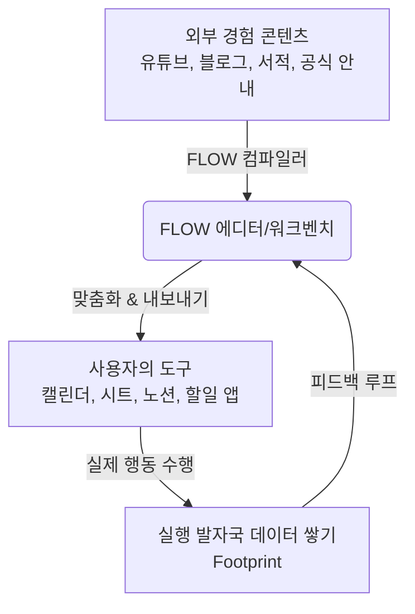

# FLOW 플랫폼 정의 및 아이덴티티 분석

> **"해본 사람 경험, 복붙해서 바로 시작."**
>인간의 모든 경험을 읽고 소비하는 것에서 나아가, 실제 삶 속에서 **즉시 실행 가능한 형태(Artifact)**로 컴파일하는 경험 실행 플랫폼, **FLOW**를 정의합니다.

---

## 1. FLOW의 핵심 포지셔닝: 무엇이 다르고 왜 필요한가?

기존의 지식 플랫폼이나 생산성 도구들은 정보를 보여주거나(소비), 백지 상태에서 시스템을 직접 구축해야 하는(관리) 양극단에 치우쳐 있었습니다. FLOW는 이 둘 사이를 연결하는 **경험의 실행 레이어(Execution Layer)**이자 **액션 컴파일러(Action Compiler)**로 포지셔닝합니다.



### 🎯 포지셔닝 대조 (What It Is vs What It Is Not)

| 플랫폼 구분 | FLOW는 이것이 **아닙니다** | FLOW는 바로 **이것**입니다 |
| :--- | :--- | :--- |
| **생산성 범주** | Notion 템플릿 갤러리나 단순 체크리스트 앱 | **실생활 루트 시스템 (Real-life Route System)**<br>특정 목적을 위한 최적의 타임라인과 구조화된 행동 경로를 제공합니다. |
| **정보 소비** | 육아/운동/재무 지식 블로그나 Reddit형 커뮤니티 | **실행형 경험 위키 (Execution Experience Wiki)**<br>소비 중심이 아닌 실제 사용자의 손을 움직이게 하는 액션 세트입니다. |
| **데이터 가치** | 단순 조회수나 좋아요를 모으는 서비스 | **실행 발자국(Footprint) 데이터 레이어**<br>사용자가 실제로 어떤 단계를 복사하고, 체크하고, 실행 과정에서 막혔는지에 대한 행동 데이터를 수집합니다. |
| **사용 방식** | FLOW 서비스 내에 갇혀 모든 관리를 강요하는 앱 | **수출/내보내기 우선(Export-First) 워크벤치**<br>사용자가 이미 능숙하게 사용하는 캘린더나 스프레드시트로 즉시 복사하여 외부에서 실행하도록 돕습니다. |

---

## 2. FLOW의 3대 비전 및 슬로건

*   **인사이드 비전 (Vision):** `인간의 모든 경험을 실행 가능한 형태로 기록한다.`
*   **사용자 슬로건 (User Copy):** `해본 사람 경험, 복붙해서 바로 시작.`
*   **제작자 슬로건 (Creator Copy):** `당신의 경험, 누구나 실행할 수 있게.`

---

## 3. 핵심 가치 제안 (Value Proposition)

일반적인 정보 탐색 과정에서 사용자는 엄청난 **인지적 부하(Cognitive Load)**를 겪습니다. 예를 들어, 운동 유튜버의 영상을 본 뒤 "나도 해봐야지"라고 생각하지만, 실제로 루틴을 짜고 캘린더에 적는 과정에서 포기하게 됩니다. 

FLOW는 이 과정의 마찰력을 혁신적으로 낮춰줍니다.

### ⚡ 정보 소비에서 행동 실행까지의 마찰력 제거

```text
[기존 정보 탐색 흐름 (High Friction)]
유튜브 시청 ➔ 핵심 필기 ➔ 일정 앱 열기 ➔ 날짜 계산 ➔ 일일이 타이핑 ➔ 실행 시도 ➔ 포기 (95% 이탈)

[FLOW 기반 흐름 (Zero Friction)]
유튜브 연동 Flow 열기 ➔ 시작일(Anchor) 입력 ➔ 4주 일정 캘린더 자동 생성 ➔ 내 캘린더로 내보내기 ➔ 즉시 시작
```

> [!IMPORTANT]
> **FLOW의 해자(Moat)는 콘텐츠 양이 아니라 '실행 데이터(Footprint)'에 있습니다.**
> 사용자들이 템플릿을 개인 도구로 가져간 행동, 실생활에서 이를 체크하며 남긴 보류/수정 흔적들은 향후 다른 사용자를 위한 템플릿 고도화 및 개인 맞춤형 AI 추천의 유일무이한 기반이 됩니다.

---

## 4. Stage 0 & 1의 전략적 방향성: "Export-First"

FLOW는 초기 단계에서 무거운 데이터베이스, 자체 계정 관리, 네이티브 앱 개발을 지양합니다. 사용자가 이 플랫폼의 가치를 검증하는 최초의 행동(First Flag)은 바로 **"내 도구로 가져가기(Export/Copy)"**입니다.

*   **Stage 0 (Static Demo & Concierge):** 초안 깃발 1~2개로 복사/내보내기/공유/체크 행동이 실제로 일어나는지 초정밀 검증.
*   **Stage 1 (Web MVP):** 공개 플랜 페이지, 개인화 앵커(Anchor) 입력 및 날짜 오프셋 계산, 로컬 브라우저 기반 체크 상태 유지, 그리고 클립보드 복사 및 파일 내보내기(ICS, XLSX) 기능 제공.

> [!TIP]
> **Stage 0/1 단계의 골든 패스(Golden Path):**
> `Flow 열기` ➔ `개인 기준일(Anchor) 입력` ➔ `산출물 워크벤치(Artifact Workbench) 확인` ➔ `내 도구로 가져가기(Export)` ➔ `현장 체크 및 피드백`
