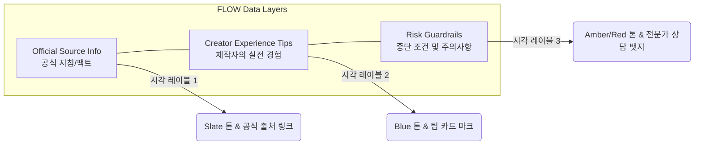

# FLOW UX/UI 가이드라인: 변환 워크벤치와 레이아웃 설계

> **"사용자 인터페이스가 단순히 예쁜 데모에 머물지 않고, 실제 복붙과 다운로드 행동을 끌어내기 위한 강력한 도구가 되도록 설계한다."**
> 이 문서는 FLOW 플랫폼의 4대 플랜 유형별 최적의 UX/UI 설계 원칙과 모바일 밀도(Density) 제어 기술, 그리고 보안/위험 구분을 위한 비주얼 디자인 요소를 규정합니다.

---

## 1. 핵심 개념: 변환 워크벤치 (Conversion Workbench)

FLOW의 핵심 화면은 일반적인 To-Do 앱처럼 생기지 않았습니다. 사용자의 입력을 받아 최종적인 휴대용 포맷으로 가공해주는 **"변환 작업대"**의 느낌을 주어야 합니다.

```text
+-------------------------------------------------------------+
|  [ 상단 타이틀 & 원본 출처 영역 ]                              |
+-------------------------------------------------------------+
|  [ 1. 상황 입력 영역 (Anchor Input Bar) ]                    |
|  * 앵커 날짜나 수치 입력란 (예: 이사일, 출산일)                  |
+-------------------------------------------------------------+
|  [ 2. 실행판 워크벤치 (Artifact Workbench) - 핵심 ]           |
|                                                             |
|  +---------------------------+ +--------------------------+ |
|  | 메인 산출물 영역 (Primary)   | | 서브 정보 / 기록 영역     | |
|  | (달력, 회차그리드, 비교표)    | | (체크리스트, 메모 카드)   | |
|  +---------------------------+ +--------------------------+ |
|                                                             |
|  * 엑셀/캘린더/복사 다운로드 버튼군 (Artifact-Near Exports)  |
+-------------------------------------------------------------+
|  [ 3. 사이드 가이드 레일 (Desktop Reference Rail) ]          |
|  * 공식 정보 출처, 위험 안내, 주의 배지                        |
+-------------------------------------------------------------+
```

---

## 2. 4대 플랜 구조 유형(Structure Types)별 UX/UI 설계

### ① D-Day 기반형: `timeline`
*   **대표 예시:** 이사 D-30 체크리스트, 결혼 준비, 자격증 시험 D-30
*   **핵심 로직:** `실제 실행일 = 기준일(Anchor) + 날짜 오프셋(dayOffset)`
*   **UX/UI 레이아웃 규칙:**
    *   **Desktop:** 좌측에 **월간 캘린더 그리드(Mini Month Calendar)**를 크게 배치하여 해야 할 일들이 실제 며칠에 배치되는지 시각화하고, 우측에 상세 **실행 리스트**를 배치합니다.
    *   **Mobile:** 캘린더 그리드가 세로로 너무 많은 면적을 차지하므로, 모바일에서는 실행 리스트를 우선 노출하고 캘린더 그리드는 탭이나 접이식 영역으로 축소합니다.
    *   **내보내기 특화:** `.ics(캘린더)` 및 `.xlsx(엑셀)` 파일 내보내기 버튼이 달력 카드 바로 아래/옆에 배치됩니다.

### ② 단계 기반형: `phase`
*   **대표 예시:** 5~6개월 아기 이유식 식단표, 연령별 발달 놀이
*   **핵심 로직:** `기준 생월차(baby_age_month) 또는 생년월일(baby_birth_date) 기준 매핑`
*   **UX/UI 레이아웃 규칙:**
    *   **안전 Boundary 우선:** 아기 건강, 알레르기와 같은 민감한 주제를 다루므로 최상단에 컴팩트하지만 확실한 **주의 및 전문가 상담 권고 카드(Disclaimers)**를 배치합니다.
    *   **기록의 편리성:** 단순 체크마크가 아니라 **"오늘 먹은 양 반응 기록표(Reaction Log)"**가 메인 산출물로 드러납니다.
    *   **Mobile:** 모바일 화면 진입 시 오늘 날짜에 해당하는 식단 슬롯(Today Slot)과 새 재료(New Ingredients) 카드, 그리고 **"시트로 반응 기록 받기"** CTA 버튼이 한 화면에 집중 배치되어 한 손으로 즉시 입력을 마칠 수 있도록 돕습니다.

### ③ 반복 실행형: `routine`
*   **대표 예시:** ThankyouBUBU 홈트 4주 챌린지, 피트블리 벌크업 식단 및 운동 분할 루틴
*   **핵심 로직:** `시작일 기준 요일 반복 및 회차별 진행률 계산`
*   **UX/UI 레이아웃 규칙:**
    *   **회차 그리드 (Session Grid):** 달력 날짜보다 **"1회차", "2회차", "3회차"와 같은 루틴 실행 상태**가 훨씬 직관적입니다. 바둑판(Grid) 모양의 회차 그리드가 화면 중앙에 자리 잡습니다.
    *   **Desktop:** `회차 그리드(Primary)`와 우측의 `회차 기록표(Secondary)` 및 `주간 서머리 레일`이 조화롭게 공존합니다.
    *   **Mobile (Today-First):** 전체 그리드는 복잡하므로 모바일에서는 **"오늘 진행할 루틴 세션 카드"**와 대형 **"기록하기/완료 체크" CTA**를 최상단에 배치합니다. 전체 그리드는 그 아래 배치됩니다.

### ④ 비정렬/순서 약화형: `checklist`
*   **대표 예시:** 신차 인수 점검, 중고차 구매 시 현장 점검, 여권 갱신 서류 준비
*   **핵심 로직:** `특정 시점에서의 다각도 비교 혹은 증거/체크 중심`
*   **UX/UI 레이아웃 규칙:**
    *   **비교표 & 보류 서명 (Comparison & Hold Memo):** 이 유형은 일반 체크리스트처럼 "완료"만 누르고 지나가지 않습니다. 인수 보류를 해야 하는 치명적인 결함이나, 차량 간 비교 메모가 가장 중요합니다.
    *   **Evidence-First Workbench:** 화면 내에 **"후보 비교표"**와 사진 및 서류 서명을 기록할 수 있는 **"인수 보류 증거 시트(Proof Workbench)"**를 메인으로 제공합니다.
    *   보류 개수를 한눈에 알 수 있는 **보류 카운터 뱃지**와 현장 결정을 위한 **보류 메모(Hold Memo)** 입력 창을 캘린더나 일정 목록보다 우선시하여 설계합니다.

---

## 3. 모바일 화면 밀도 제어 (Mobile Density Rules)

모바일 기기의 작은 뷰포트(Viewport)에서 과도한 체크리스트와 옵션의 나열은 사용자에게 큰 심리적 마찰력을 초래합니다. FLOW는 이를 방지하기 위한 정교한 밀도 제어 규칙을 갖습니다.

```text
[ 모바일 뷰포트 최적화 구조 ]
+------------------------------------+
|  Top Navigation / Flow Name        |
+------------------------------------+
|  Anchor Input (기준일 설정)         |
+------------------------------------+
|  ★ 핵심 산출물 요약 카드             |
|  - 오늘의 1개 Action & 필수 메모     |
+------------------------------------+
|  [자세히 보기] - 접이식 아코디언      |
|  (실행 기준, 이유, 주의사항 감춤)     |
+------------------------------------+
|  (스크롤 다운 시 노출되는 리스트)     |
|  - 2차 실행 리스트 (기본 접힘)       |
+------------------------------------+
|  [Sticky Bottom Sheet CTA]        |
|  "내 도구로 가져가기 (엑셀/캘린더)"  |
+------------------------------------+
```

### 📱 3대 모바일 UX 규칙
1.  **세부사항 감추기 (Progressive Disclosure):** 
    실행 정보의 왜(Why), 어떻게(How), 완료조건, 주의사항 등은 기본 노출하지 않고 `<details>` 아코디언 안에 배치하여, 사용자가 필요할 때만 `[자세히]`를 클릭해 볼 수 있게 합니다.
2.  **화면 스택 축소 (Section Collapse):**
    모바일 화면에서는 2차 실행 목록이나 부수적인 정보 카드는 기본적으로 접힌 상태(`collapsed`)로 렌더링하고, 데스크톱에서만 우측 가이드 뱃지로 전체 확장 노출합니다.
3.  **Sticky Bottom Sheet (가져가기 시트):**
    사용자가 화면의 어디를 스크롤하고 있더라도 화면 하단에 **"내 도구로 가져가기"** 바가 고정 노출됩니다. 이 버튼은 데스크톱의 여러 분산된 버튼들과 달리 원터치로 엑셀이나 캘린더 포맷을 바로 가져갈 수 있게 설계되었습니다.

---

## 4. 정보, 경험, 그리고 위험의 시각적 분리 (Source-Risk Separation)

사용자가 육아, 의료, 법률, 자동차 구매 등 민감하고 리스크가 큰 영역을 다룰 때, **공식 가이드라인**과 **개인의 주관적 팁**이 혼재되면 서비스 신뢰도가 추락하고 법적 책임의 우려가 생깁니다.

FLOW는 이를 디자인 시스템 차원에서 완벽히 분리합니다.



*   **공식 팩트 레이어 (Official Source Info):**
    *   **스타일:** 깔끔한 Slate/Gray 계열 톤.
    *   **UI 요소:** 공식 발급 기관 명칭, "Last Checked Date" 표시, 원본 법률/규정 바로가기 링크 제공.
*   **실전 경험 레이어 (Creator Experience):**
    *   **스타일:** 신뢰와 행동을 뜻하는 Blue/Indigo 계열 톤.
    *   **UI 요소:** "해본 사람의 팁" 뱃지, "내 도구 복사 시 텍스트에 포함" 옵션 제공.
*   **위험 예방 레이어 (Risk Guardrails / Caution):**
    *   **스타일:** 주의를 끄는 Amber/Orange/Red 계열 톤.
    *   **UI 요소:** 명확한 "중단/보류 기준(Stop/Hold Condition)", "전문가와 상의하세요" 경고 배지 배치.
