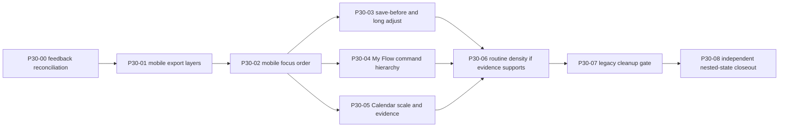

# P30 Evidence Gap Closure Plan

## Baseline And Ownership

- Planning baseline: `3c7b59e`
- App/runtime baseline reviewed by Codex: `afe834a`
- `afe834a..3c7b59e` changes only the Claude Design standalone HTML, so app source is equivalent.
- Start every implementation slice from a clean `origin/main` worktree.
- Preserve unrelated dirty files and do not combine them into a P30 commit.
- One slice per PR by default. P30-03~05 may run in separate worktrees after P30-02 is merged and deployed.

## Dependency Graph

## Execution Waves

### Wave 0 - Planning and evidence freeze

1. Reconcile Claude Design and Codex findings.
2. Freeze P29 contracts and out-of-scope items.
3. Record exact failing routes, nested states, viewports, screenshots, and selectors.
4. Approve only P30-01 for immediate implementation.

Exit gate:
- this spec package is reviewed;
- P30-01 impact files and rollback are understood;
- no app code has changed.

### Wave 1 - Interaction correctness

#### P30-01 mobile fixed-layer collision

Fix geometry and state ownership, not just padding. Export open state must explicitly determine whether the public save CTA is suppressed/repositioned and how My Flow reserves bottom-nav clearance.

Exit gate:
- DOMRect intersection `0` on both failing routes;
- export primary is reachable without an additional corrective scroll;
- closing export restores prior state/focus;
- 1024/1440 unchanged;
- production smoke green.

#### P30-02 mobile focus order

Separate visual fixed positioning from DOM reading order. Persistent navigation remains reachable but follows the current page main content in sequential keyboard navigation.

Exit gate:
- `/my` and `/calendar` focus sequence follows semantic document order;
- dialogs/sheets trap and return focus;
- 4-tab navigation remains unchanged;
- production smoke green.

### Wave 2 - Composition refinements

P30-03, P30-04, P30-05 can proceed in parallel after P30-02.

#### P30-03 save-before and long-flow adjustment

- Keep artifact-first preview.
- Collapse the decision area to one active primary path.
- Make title/date adjustment reachable before the 24-item include/exclude list.
- Keep all items keyboard reachable when the user explicitly opens item selection.
- Preserve save payload and personal overlay identity.

#### P30-04 My Flow command hierarchy

- Next action stays visible and dominant.
- Keep at most two contextual secondary commands visible.
- Move source/archive and low-frequency management into one accessible overflow.
- Keep export inside its contextual panel; do not add a new page.

#### P30-05 Calendar scale and evidence

- Add a deterministic, non-user-data fixture for undated placement QA.
- Collapse `다른 Flow` by default when query is empty; reveal matching rows during search.
- Verify 50+ options without horizontal chips.
- Use existing marker/color/count in month cells and preserve full identity in agenda/title/aria.

Wave 2 exit gate:
- each slice passes unit/targeted E2E/build/docs checks;
- current/proposed screenshots exist at 390 and 1024;
- P29 contract tests stay green;
- no schema, migration, or identity changes.

### Wave 3 - Conditional refinement and cleanup

#### P30-06 routine density

Implement only if direct browser evidence confirms that advanced settings are still difficult after the shared command grammar changes. Group existing fields into `언제` and `언제 끝`, keep the compact summary, and do not alter recurrence semantics.

#### P30-07 legacy composition cleanup

Before deletion:

1. enumerate every consumer of legacy/hybrid branches;
2. capture route matrix and visual snapshots;
3. prove reviewed production routes use the P29 path;
4. remove only dead composition code;
5. require visual/behavior diff `0` for stable routes.

If any unreviewed route still depends on the branch, record it and defer deletion.

### Wave 4 - Independent closeout

P30-08 recaptures the complete nested-state matrix against production. It does not rely on implementation screenshots as proof of production behavior.

Exit gate:
- P30 markers pass on production;
- P29 contract regression `0`;
- no overlap, overflow, unnamed focusable, console/page errors;
- current production SHA and deployment URL recorded;
- observed-user count explicitly `0`;
- owner chooses `ready_for_owner_observation_decision`, `revise`, or `rollback`.

## Expected Impact Files

The implementing agent must verify this inventory before editing.

| Slice | Likely files | Responsibility |
| --- | --- | --- |
| P30-01 | `components/flow/AppClient.tsx`, `components/flow/PlatformNav.tsx`, `components/flow/FlowExportPanel.tsx`, `app/globals.css`, P30 E2E | export-open layer state, bottom clearance, geometry assertions |
| P30-02 | `components/flow/PlatformNav.tsx`, app layout/AppClient composition, P30 E2E | DOM order, skip path, focus return |
| P30-03 | `components/flow/FlowSaveBeforeFrame.tsx`, `components/flow/AppClient.tsx`, shared adjustment primitives, P29/P30 E2E | decision surface and progressive adjustment |
| P30-04 | `components/flow/AppClient.tsx`, shared action/overflow primitive, P30 E2E | My Flow next-action hierarchy |
| P30-05 | `components/flow/CalendarFlowScopePicker.tsx`, `components/flow/AppClient.tsx`, Calendar fixture/helper, styles, P30 E2E | scope grouping, undated seed, compact identity |
| P30-06 | `components/flow/RoutineScheduleSummary.tsx`, existing routine editor composition, presentation tests | existing fields grouping and copy |
| P30-07 | `components/flow/FlowSaveBeforeFrame.tsx`, `SourceBackedFlowMapPage.tsx`, `AppClient.tsx`, route regression tests | dead branch cleanup only |
| P30-08 | review/capture scripts and `docs/content-audit/...` | independent production evidence |

## Rollback Boundaries

- P30-01: isolate export-open layer behavior; do not rewrite export panel or navigation IA.
- P30-02: preserve link destinations and visible fixed nav; change document/focus composition only.
- P30-03: keep P29 frame version or route opt-in until five-shape regression is green.
- P30-04: overflow is presentation state only; commands call existing handlers.
- P30-05: fixture is query/test gated; compact labels derive from current projection and do not persist aliases.
- P30-06: grouping/copy only; recurrence engine untouched.
- P30-07: one dedicated cleanup commit so it can be reverted independently.

## Change Control

- A finding outside the active slice is recorded in `tasks.md`; it is not implemented opportunistically.
- Any request for schema, migration, new artifact format, direct integration, or new tab stops the slice and requires a new product decision.
- Production screenshots are captured after deployment, not substituted by local screenshots.
- Previous evidence is labeled `prior_artifact`; current commands and browser runs get new timestamps and SHAs.
