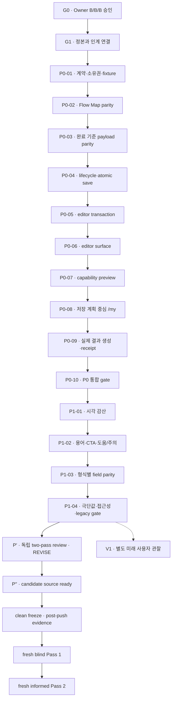

# P35 Round 2 B/B/B 전체 프로그램 단계별 개발 목표

**상태:** `P′ PASS2_REVISE / P′′ CANDIDATE_SOURCE_READY / FINAL_CANDIDATE_EVIDENCE_PENDING / FRESH_TWO_PASS_REVIEW_AUTHORIZED`

**승인일:** 2026-08-04 KST

**Owner 결정:** `Q1-B / Q2-B / Q3-B`

**검토 기준 P′ checkout:** `D:\flowme2605\flow-p35-production-mobile-p0`

**검토 기준 P′ branch / ref:** `codex/p35-round2-candidate-20260805` / `29cb03a65dd1037a3b813b7f43a5a095e4669dce`

**보정 P′′ checkout / branch:** `D:\flowme2605\flow-p35-round2-correction-pprime2` / `codex/p35-round2-correction-pprime2-20260805`

**현재 실행 단계:** P′에 대한 양쪽 Pass 2 `REVISE` 뒤 P′′ candidate source를 준비했다. Owner가 2026-08-06에 fresh candidate/evidence/two-pass review를 승인했으며, 현재 gate는 final scoped run, clean candidate freeze, post-push provenance, blind-only publication 순서다. Source 문서는 자기 자신이 속할 미래 SHA·BUILD_ID·epoch·최종 count를 주장하지 않는다. V1은 완료 조건이 아니다.

**Publish 권한:** `P′′ commit/push + sequence-gated blind/informed review publication` — PR·merge·Preview·Production은 권한 없음
**실제 관찰 사용자:** `0명`

**현재 closeout:** [Pass 2 교차 종합과 P′′ 로컬 보정 closeout](./pass2-cross-synthesis-and-pprime2-closeout.md)

## 1. 문서 목적과 사용법

이 문서는 BBB 보정 프로그램 전체를 개발팀이 **한 단계씩 목표로 삼아 실행**할 수 있게 만든 canonical 운영 문서다. 첫 개발 세션만 다루는 [P0-01 복붙 프롬프트](../../content-audit/2026-08-03-p35-fundamental-ux-round2-planning-synthesis/08-bbb-approved-developer-kickoff-prompt-ko.md)와 달리, 여기에는 `G0/G1 → P0-01~P0-10 → P1-01~P1-04 → P′ review → P′′ candidate source/freeze → fresh Pass 1/Pass 2`의 전체 목표와 단계별 종료 조건이 들어 있다. V1은 별도 미래 프로그램이다.

문서별 권위 영역은 다음과 같다.

1. [spec.md](./spec.md) — 제품·상태·scope·non-goal의 최종 계약
2. [qa.md](./qa.md) — PASS/FAIL 인수 기준과 증거 경계의 최종 계약
3. **이 문서** — 현재 단계, strict sequence, 단계별 목표, ledger, closeout의 운영 정본
4. [plan.md](./plan.md) — 순서와 PR 경계 요약
5. [상세 티켓](../../content-audit/2026-08-03-p35-fundamental-ux-round2-planning-synthesis/04-development-sequence-and-tickets-ko.md)과 [전체 QA 매트릭스](../../content-audit/2026-08-03-p35-fundamental-ux-round2-planning-synthesis/05-acceptance-and-qa-matrix-ko.md) — 후보 touchpoint·시나리오 참고

제품 범위는 `spec.md`, 검증 판정은 `qa.md`, 실행 단계는 이 문서를 우선한다. 같은 권위 영역에서 문서가 충돌하거나 source/base 손상·destructive migration·사용자 범위 확대가 걸리면 추측으로 해결하지 않고 구현을 멈춘다.

## 2. 최종 사용자 목표

전체 프로그램이 끝나면 사용자는 다음 흐름을 예측할 수 있어야 한다.

1. 공개 계획에서 원본 내용과 실제 만들 수 있는 결과를 먼저 확인한다.
2. 저장 전 수정은 공개 원본을 바꾸지 않는 session draft로 다룬다.
3. 저장하면 방금 저장한 계획 상세로 이동하고 저장 결과를 한 번 확인한다.
4. `내 계획`에서 저장 계획을 찾고, 수정하고, 실행하고, 자신의 도구로 결과를 옮긴다.
5. Item 실행 `완료`, 계획 `저장`, 공개 초안 `변경 반영`, 결과 `생성`을 서로 다른 행동으로 이해한다.
6. Calendar/체크리스트/Sheet/Memo 중 해당 콘텐츠에서 실제 가능한 결과만 보고, 제외·손실·위험을 사전에 확인한다.
7. 오류·취소·뒤로가기·중복 클릭이 발생해도 원본·개인 수정·실행 기록을 잃지 않는다.

## 3. 고정된 BBB 계약

| 결정 | 승인 내용 | 구현 경계 |
|---|---|---|
| Q1-B | 공개 결과가 미수정·eligible·local-only일 때만 저장 없이 한 번 사용 | 범위 선택·재생성·중복 관리·이력·원격 전송은 저장 계획 소유 |
| Q2-B | 일반 `/my`는 저장 계획 library shell | Today는 동일 execution state에서 파생한 compact 요약이며 별도 저장소가 아님 |
| Q3-B | 핵심 사용자 화면은 `계획 찾기 / 내 계획 / 계획 수정` 우선 | FLOW 브랜드·URL·내부 type·변수·`flow:*` storage key 유지 |

공통 계약:

- `source/base`, `public session draft`, `personal overlay`, `execution overlay`, `artifact/receipt`를 분리한다.
- `effective authoring snapshot`은 base + session/personal overlay를 읽는다.
- `effective execution snapshot`은 committed authoring snapshot + execution overlay를 읽는다.
- 저장 성공은 선택 계획 상세의 1회 배너이고, export receipt는 실제 생성 결과의 별도 기록이다.
- 결과는 `주 결과 1개 + 바로 가능한 보조 최대 2개 + 조건부 + 불가 이유`로 계산한다.
- 날짜 없는 Item에 가짜 날짜나 VEVENT를 만들지 않는다.
- Flow Map parity 수정과 legacy migration을 같은 단계에 넣지 않는다.
- Overlapping Flow user-data mutation은 같은 same-origin exclusive lock을 쓰고, lock 안에서 최신 raw를 다시 읽은 뒤 CAS/expected-post 소유권을 확인한다.
- Reuse는 completion·Map review·new run을 하나의 planned-key raw rollback transaction으로 처리하고, public copy create/overwrite는 lock 안에서 선택과 target raw를 재검증한다.
- Receipt는 canonical request fingerprint와 실제 전달한 UTF-8 bytes의 SHA-256·byte length·newline policy를 구분하고, schema-v2 saved identity는 부분 갱신에서도 보존하거나 fail-closed한다.
- 자동 QA·브라우저 검사·Owner 검토·Claude/Codex 검토는 실제 사용자 관찰이 아니다.

## 4. 전체 순서와 상태



| 순서 | 단계 | 목표 결과 | 현재 상태 |
|---:|---|---|---|
| 0 | G0 | B/B/B와 bounded scope 승인 | `PASS` |
| 1 | G1 | decision·spec·status·roadmap·handoff 연결 | `PASS` |
| 2 | P0-01 | 모든 consumer가 공유할 상태·결과 계약 | `PASS` |
| 3 | P0-02 | Flow Map 선택/적용/미리보기/저장 parity | `PASS` |
| 4 | P0-03 | 완료 기준 UI/payload parity | `PASS` |
| 5 | P0-04 | lifecycle reducer·atomic save·direct detail | `PASS` |
| 6 | P0-05 | 공통 editor transaction | **`PASS`** |
| 7 | P0-06 | 공개/저장 Plan·Item editor surface | **`PASS`** |
| 8 | P0-07 | capability preview·행동 소유권 | **`PASS`** |
| 9 | P0-08 | Q2-B 저장 계획 중심 `/my` | **`PASS`** |
| 10 | P0-09 | Q1-B quick local·saved transfer·receipt | **`PASS`** |
| 11 | P0-10 | hard fail 0·P0 통합 내부 gate | **`PASS`** |
| 12 | P1-01 | Item·Map·시작일 시각 감산 | **`PASS`** |
| 13 | P1-02 | Q3-B 용어·CTA·도움/주의 | **`PASS`** |
| 14 | P1-03 | 형식별 field parity | **`PASS`** |
| 15 | P1-04 | 극단값·접근성·legacy 내부 gate | **`PASS`** |
| 16 | P′ review | immutable candidate 독립 two-pass review | `PASS2_REVISE` |
| 17 | P′′ candidate source | bounded correction + final source contracts | `CANDIDATE_SOURCE_READY` |
| 18 | P′′ candidate freeze/evidence | clean push·single post-push build·S01~S23 | `FINAL_CANDIDATE_EVIDENCE_PENDING` |
| 19 | fresh Pass 1 / Pass 2 | blind 결과 동결 뒤 informed review | `AUTHORIZED_NOT_RUN` |
| 20 | V1 | 실제 참여자 제한 관찰 | `OUT_OF_SCOPE_CURRENT_PROGRAM · observed 0` |

P0-01부터 P1-04까지는 각 closeout으로 local internal PASS했고 P′는 양쪽 Pass 2 `REVISE`로 닫혔다. P′′ source에는 shared user-data lock, lock-then-fresh-reread/CAS, reuse raw transaction, public-copy CAS, exact transported-byte identity, schema-v2 identity preservation, exact candidate/review branch Vercel guard가 반영됐다. 이전 unit/workflow `1,095/1,095`, focused browser `7/7`, full Playwright `530/530`, build `18/18`과 BUILD_ID `O_FcSLodnCeJe3e2F32PC`는 final hardening 전 checkpoint이며 현재 candidate 증거가 아니다. Exact candidate SHA·BUILD_ID·epoch·최종 count와 S01~S23는 clean commit/push 뒤 provenance에 기록한다. 실제 browser zoom과 performance는 `NOT_ASSESSED`; PR·merge·Vercel Preview/Production은 승인되지 않았고 V1은 제외됐으며 observed users는 `0명`이다.

## 5. 전 단계 공통 운영 규칙

각 단계는 하나의 개발 세션과 하나의 검증 가능한 변경 단위로 다룬다.

1. 시작 전에 branch, HEAD, upstream, dirty path, Node 24.x, package scripts를 확인한다.
2. 이전 단계의 acceptance가 현재 branch에서도 green인지 먼저 확인한다.
3. 현재 단계의 실패 또는 빈 계약을 test/fixture/browser evidence로 먼저 재현한다.
4. 정상뿐 아니라 빈 상태·오류·취소·Back·중복·retry를 함께 정의한다.
5. 다음 단계의 UI나 data migration을 선행 구현하지 않는다.
6. 영향받은 공통 계약부터 고치고, 화면은 해당 단계에서만 연결한다.
7. targeted test 후 위험에 맞는 full test/build/docs/E2E/browser 검증을 실행한다.
8. `local edit / commit / push / PR / CI / merge / Preview / Production / observed-user`를 각각 기록한다.
9. 단계가 PASS여도 다음 단계를 자동 시작하지 않는다.

단계 상태는 `NOT_STARTED / READY_TO_START / IN_PROGRESS / PASS / FAIL / BLOCKED`만 사용한다. 필수 검증이 미실행이면 `PASS`로 닫지 않는다.

## 6. G0 — Owner 범위 승인

- **목표:** 제품 선택을 구현 중 추측하지 않도록 B/B/B와 bounded scope를 고정한다.
- **사용자 결과:** 공개 빠른 사용, `/my` 첫 구조, `Flow/계획` 용어의 방향이 하나로 정해진다.
- **선행 gate:** 없음.
- **상태:** `PASS` — 2026-08-04 승인.

### 작업

1. Q1-B, Q2-B, Q3-B의 의미와 non-goal을 기록한다.
2. 기존 2026-07-29 `/my` Todo-first 결정 중 plain `/my` 첫 콘텐츠 부분만 supersede한다.
3. Today/Todo는 compact derived execution summary로 유지한다.
4. 실제 사용자 관찰 수 `0`을 승인·시뮬레이션과 분리한다.

### 필수 산출물

- [Owner 승인 기록](../../content-audit/2026-08-03-p35-fundamental-ux-round2-planning-synthesis/02-p35-round2-owner-decisions-ko.md)
- [DECISIONS](../../DECISIONS.md)의 2026-08-04 superseding decision

### 완료 기준

- 세 선택이 모두 B이고 승인일·scope·재개방 조건이 명시됨
- `Flow` 브랜드·URL·storage rename이나 remote integration이 승인 범위에 포함되지 않음

### 검증

- Owner 기록·DECISIONS·active spec의 Q1~Q3 값을 대조한다.
- active 문서에 미해결 `TBD-Q1~Q3`나 경쟁 decision이 없는지 확인한다.
- `npm.cmd run docs:check`와 `git diff --check`를 실행한다.

### 제외·중지·다음 gate

앱 구현·storage migration·내부 identity rename·publish·UXR 판정은 제외한다. 승인 기록끼리 답이 다르면 G1로 가지 않는다. 현재는 일치하므로 G1로 진행했다.

## 7. G1 — 정본 승격과 개발 인계 연결

- **목표:** 하나의 active spec과 하나의 실행 순서를 모든 현재 상태 문서에서 가리키게 한다.
- **사용자 결과:** 기획안과 실제 개발 backlog가 섞이지 않고, 개발자는 어디서 시작할지 알 수 있다.
- **선행 gate:** G0 PASS.
- **상태:** `PASS`. 게시 상태는 별도 publish ledger에서 `local only / unpublished`로 기록한다.

### 작업

1. active spec 폴더에 제품 계약·계획·과제·QA·준비 상태를 둔다.
2. `DECISIONS`, `STATUS`, `ROADMAP`, `docs/specs/README.md`를 같은 scope로 연결한다.
3. 첫 개발 프롬프트와 전체 프로그램 문서를 연결한다.
4. 실제 route/component/data owner가 바뀌는 구현 PR에서만 `SERVICE_STRUCTURE.md`를 갱신하도록 경계를 둔다.
5. commit·push·PR·merge·deploy 권한을 승인과 분리한다.

### 필수 산출물

- active spec 하나, Owner 하나, 기준 ref 하나, 다음 단계 P0-01 하나
- 전체 프로그램 문서와 첫 개발 복붙 프롬프트

### 완료 기준

- 문서 링크와 docs check green
- Round 2는 local/unpublished이며 기존 P35가 production baseline
- 구현·배포·사용자 검증 완료 표현 없음

### 검증

- active spec·Owner 기록·STATUS·ROADMAP·spec index의 scope/ref/next step을 대조한다.
- `npm.cmd run docs:check`, `git diff --check`, `git status --short --branch`를 실행한다.

### 제외·중지·다음 gate

앱 구현, `SERVICE_STRUCTURE.md` 구현 완료 갱신, commit·push·PR·merge·배포는 제외한다. 현재 파일이 게시된 정본인 것처럼 표현하거나 기존 dirty path를 함께 stage해야 한다면 중지한다. G1 종료 당시에는 P0-01만 시작 가능했고, 이후 P0-01 PASS로 P0-02가 열렸다.

## 8. P0-01 — 결과 계약·행동 소유권·loss schema·fixture 고정

- **목표:** 이후 모든 화면과 artifact가 같은 Item ID·count·field contract를 쓰는 검증 기반을 만든다.
- **사용자 결과:** 이 단계에서 화면은 변하지 않지만, 이후 “7개를 골랐는데 8개가 저장됨” 같은 모순을 구조적으로 잡을 수 있다.
- **해결:** U01·U05·U07·U09, HF-01~03 공통 원인.
- **선행 gate:** G1 PASS.
- **변경 경계:** contract·fixture·tests. UI·route·save·`/my`·copy no-change.

### 작업 순서

1. 실제 코드와 storage에서 다음 흐름의 owner를 inventory한다.
   `source/base → public session draft 또는 personal overlay → effective authoring snapshot → execution overlay → effective execution snapshot → projection → artifact/receipt`
2. lifecycle × capability × scope별 primary action owner를 하나로 고정한다.
3. Calendar/Checklist/Sheet/Memo의 `preserved / transformed / omitted / held / unavailable` loss schema를 만든다.
4. 다음 stable-ID fixture를 만든다.
   - all-dated, all-undated, dated/undated mixed
   - memo-first, repeated routine
   - Map `save_all / choose_child / review_hold`
   - Map 7↔8 재현
   - completion criterion + memo + warning/resource + source
   - legacy saved copy, missing base
5. public preview, saved detail, Map, export가 읽는 snapshot 함수와 Item ID/count를 비교하는 contract test를 추가한다.
6. 후속 단계의 foundation 답을 기록한다.
   - nested saved Item commit 단위
   - save banner와 export receipt의 type/storage/수명
   - legacy Flow/Map schema·version·missing-base 목록
   - 기존 rollback/feature mechanism

### 필수 산출물

- code/storage consumer inventory
- action ownership matrix
- format별 loss schema
- stable-ID fixture와 expected projection
- consumer별 Item ID/count 비교 test
- `FND-S10-COMMIT / FND-RECEIPT / FND-LEGACY / FND-ROLLBACK / FND-CONSUMERS` 답

### 완료 기준

- 모든 fixture에 canonical ID와 expected eligible/held/unavailable 결과가 있다.
- 날짜 없는 Item은 Calendar eligible이 아니며 가짜 날짜가 없다.
- source/base, personal overlay, execution overlay, receipt가 섞이지 않는다.
- 기존 계약이 맞으면 production code를 억지로 바꾸지 않는다.
- UI·route·save·`/my`·copy diff가 없다.

### 검증

```powershell
npx.cmd tsx --test `
  lib/flow/effective-flow-snapshot.test.ts `
  lib/flow/effective-flow-export.test.ts `
  lib/flow/flow-experience-projection.test.ts `
  lib/flow/export-scope.test.ts `
  lib/flow/artifact-recommendation.test.ts `
  lib/flow/flow-map-action-contract.test.ts

npm.cmd run test:p35-p0
npm.cmd test
npm.cmd run build
npm.cmd run docs:check
git diff --check
```

### 제외·즉시 중지

- UI, route, save behavior, `/my`, Q1/Q2/Q3 화면, storage migration, OAuth를 구현하지 않는다.
- source/base mutation, destructive rewrite, dirty code 충돌, 다음 티켓 선행 구현이 필요하면 중지한다.

### 다음 gate

모든 foundation 답과 test가 green이고 UI no-change가 증명되면 P0-02를 연다.

## 9. P0-02 — Flow Map selected/applied/preview/save parity

- **목표:** Flow Map의 선택·적용·미리보기·저장이 같은 effective snapshot을 사용하게 한다.
- **사용자 결과:** “7개 적용” 뒤에도 8개가 보이거나 원래 제목이 남는 모순이 사라진다.
- **해결:** U05, HF-01.
- **선행 gate:** P0-01 PASS와 FND-CONSUMERS/FND-LEGACY 확인.
- **변경 경계:** Map parity만. 시각 감산과 migration 제외.

### 작업 순서

1. 7↔8 fixture로 현재 selected/applied/preview/saved IDs와 title 차이를 재현한다.
2. editor selection, action adapter, effective snapshot, save payload, persistence consumer를 추적한다.
3. count 숫자만 덮어쓰지 않고 공통 snapshot을 downstream consumer에 전달한다.
4. `save_all`, `choose_child`, `review_hold`, risk, conflict, source relation을 보존한다.
5. Cancel·Escape·Back·retry·partial write에서 원래 selection을 복구한다.

### 산출물

- before/after Item ID·title·count 비교표
- Map contract/fixture tests
- storage before/after와 reload 증거
- 390px·1440px 실제 경로 캡처

### 완료 기준

- selected IDs = applied IDs = preview IDs = saved IDs.
- title과 count가 CTA·preview·saved snapshot·persistence에서 같다.
- legacy fixture를 읽기만 해도 storage가 rewrite되지 않는다.
- partial write를 성공으로 표시하지 않는다.

### 검증

- `lib/flow/flow-map-action-contract.test.ts`
- `lib/flow/effective-flow-snapshot.test.ts`
- `tests/e2e/p35-p0-map-action-contract.spec.ts`
- S10 Map 경로, storage/payload assertion, 390×844·1440×1000

### 제외·중지·다음 gate

3칸 grid 삭제, `/flow-maps` 제거, schema migration은 제외한다. parity를 위해 legacy rewrite가 필요하면 중지한다. PASS 후 P0-03으로 간다.

## 10. P0-03 — Item 완료 기준 UI/checklist payload parity

- **목표:** 완료 기준에 대한 화면 약속과 실제 portable checklist 결과를 일치시킨다.
- **사용자 결과:** 사용자는 미리보기에서 본 완료 기준을 실제 체크리스트에서도 얻는다.
- **해결:** U04·U07, HF-02.
- **선행 gate:** P0-02 PASS, P0-01 loss schema green.
- **변경 경계:** Item checklist/list payload와 그 약속만.

### 작업 순서

1. 같은 fixture에서 UI 설명·preview·clipboard/file payload를 비교한다.
2. canonical completion criterion field와 empty/long/multiline 규칙을 확인한다.
3. checklist의 완료 기준·메모·warning/resource·source·execution completion을 각각 분리한다.
4. loss schema가 보존을 약속한 field는 deterministic하게 직렬화한다.
5. loss schema가 `preserved`로 약속했는데 현재 결과가 지원하지 않는 field를 발견하면 구현을 멈추고 active decision을 요청한다. 이 단계에서 개발자가 임의로 `transformed / omitted / unsupported`로 낮추거나 UI 약속만 바꾸지 않는다.

### 산출물

- completion criterion field contract
- empty/long/multiline/special-character golden fixture
- preview와 실제 결과의 field-by-field 비교
- 내부 Today/Todo lens와 portable checklist 분리 증거

### 완료 기준

- 완료 기준이 있는 Item은 preview와 payload에 동일하게 존재한다.
- 없는 Item에는 빈 라벨이 없다.
- 긴 한국어·줄바꿈·특수문자가 손상되지 않는다.
- 실행 완료 상태를 완료 기준 텍스트로 합치지 않는다.

### 검증

```powershell
npx.cmd tsx --test `
  lib/flow/my-flow-step-export.test.ts `
  lib/flow/my-flow-cross-flow-todo.test.ts `
  lib/flow/export-scope.test.ts
```

영향 clipboard/file E2E에서 실제 생성 텍스트도 비교한다.

### 제외·중지·다음 gate

전체 export UI 재설계와 remote Todo provider는 제외한다. source에 없는 완료 기준을 발명해야 하거나 승인된 `preserved` 의미를 바꿔야 한다면 중지하고 active decision을 요청한다. PASS 후 P0-04를 연다.

## 11. P0-04 — lifecycle reducer·atomic save·selected plan direct handoff

- **목표:** 공개 수정→저장→선택 계획 상세 이동을 하나의 안전한 lifecycle로 만든다.
- **사용자 결과:** 중복 사본 없이 방금 저장한 계획으로 바로 가고, 저장 실패에도 수정 내용을 잃지 않는다.
- **해결:** U01·U07·U08·U09, HF-03의 저장 경계.
- **선행 gate:** P0-02·P0-03 PASS와 FND-RECEIPT/FND-ROLLBACK 확인.
- **변경 경계:** state reducer, atomic save, post-save selected detail. 일반 `/my` 재설계 제외.

### 작업 순서

1. public base, session draft, personal overlay, execution overlay, save banner, export receipt를 별도 state로 표현한다.
2. stable source key + personal copy key + idempotency key로 save intent를 정의한다.
3. 같은 source의 기존 저장본을 발견하면 쓰기 전에 `덮어쓰기 / 사본 만들기 / 취소`를 명시적으로 선택하게 한다. 기본 선택이나 title·timestamp 기반 자동 병합은 금지한다.
4. 선택한 분기에 따라 base reference와 personal overlay를 atomic하게 저장한다. `취소`는 무변경이고, `사본 만들기`만 명시적인 새 personal identity를 만든다.
5. 성공 후 별도 save-only 결과 화면이 아니라 selected saved plan detail로 이동한다.
6. `저장됨 · N개 · 되돌리기` 배너를 한 번만 전달한다.
7. refresh·Back·double click·retry·같은 source 재진입에서 성공 결과를 복구한다.

### 산출물

- lifecycle transition table/reducer tests
- storage before/after와 partial-write injection
- idempotency/duplicate와 `덮어쓰기 / 사본 만들기 / 취소` 분기 tests
- save→selected detail route evidence
- 저장 배너와 export receipt 분리 증거

### 완료 기준

- 저장 사본은 한 개만 생기며 source/base는 불변이다.
- 기존 저장본이 있으면 `덮어쓰기 / 사본 만들기 / 취소` 선택 전에는 write가 0이고, 선택한 분기만 실행된다.
- `덮어쓰기`는 선택한 기존 personal identity만 갱신하고, `사본 만들기`는 사용자가 승인한 새 identity 하나만 만들며, `취소`는 기존 저장본과 draft를 모두 보존한다.
- 저장 실패에서 public draft와 기존 saved copy가 보존된다.
- browser Back이 저장을 다시 실행하지 않는다.
- transient 배너가 사라져도 저장 계획은 정상적으로 다시 열린다.

### 검증

- `lib/flow/post-save-receipt.test.ts`
- `lib/flow/post-save-decision-hub.test.ts`
- `tests/e2e/p35-r3-receipt-workspace-continuity.spec.ts`
- `tests/e2e/p35-r8-continuity.spec.ts`
- success/failure/reload/double-submit/storage-error와 existing-copy `overwrite/copy/cancel` 시나리오

### Rollback·제외·중지·다음 gate

flag off에서 기존 P35 post-save path와 storage bytes를 보존한다. 일반 `/my` IA(P0-08)와 editor surface(P0-06)는 제외한다. source/base mutation, destructive migration, selected identity 복구 불가, partial write 성공 처리가 필요하면 중지한다. PASS 후 P0-05를 연다.

## 12. P0-05 — 공통 editor transaction 기반

- **목표:** 공개/저장 Plan·Item이 같은 편집 상태와 닫기 규칙을 사용하게 한다.
- **사용자 결과:** 취소·뒤로가기·오류가 화면마다 다르게 동작하지 않고, 중첩 Item에서 돌아와도 상위 draft가 남는다.
- **해결:** U08·U09.
- **선행 gate:** P0-04 PASS와 FND-S10-COMMIT 확인.
- **변경 경계:** headless transaction/state adapter와 tests. 시각 surface 제외.

### 작업 순서

1. `context=public-draft | saved-overlay`, `level=plan | item` 입력 계약을 정의한다.
2. `clean / dirty-valid / dirty-invalid / submitting / success / recoverable-error` 정상 상태와 rollback 검증 실패 전용 `recovery-required` 중지 상태를 구현한다.
3. origin route/query/scroll/focus와 nested Item return point를 보존한다.
4. Cancel/X/backdrop/Escape/browser Back의 공통 event matrix를 만든다.
5. validation/runtime/storage 오류에서 draft와 first-error focus를 유지한다.
6. public commit은 session projection, saved commit은 personal overlay에만 effect를 보낸다.

### 산출물

- transaction reducer/adapter
- 네 context의 event parity table과 tests
- dirty guard·nested Back·focus/scroll restoration evidence
- public Apply와 saved Save side-effect 비교

### 완료 기준

- 같은 event matrix가 public Plan/Item, saved Plan/Item에 재사용된다.
- submitting 중 이중 commit이나 partial state가 없다.
- clean close는 가장 안쪽 transaction만 즉시 닫고 opener·focus·scroll로 복귀한다.
- dirty close는 `계속 수정 / 변경 버리기`를 명시하며, 계속 수정은 현 transaction과 draft를 유지하고 변경 버리기는 현 transaction의 변경만 폐기한다.
- nested Item Back·변경 버리기는 parent draft·origin route/query·focus·scroll을 보존한다.
- 검증 가능한 일반 오류는 exact rollback 뒤에만 반환되어 persisted state를 바꾸지 않는다. rollback 검증이 불완전하면 `recovery-required`로 잠그고 안전한 실패나 성공으로 처리하지 않는다.

### 검증

- reducer/state unit tests
- `tests/e2e/p26-quick-advanced-editor.spec.ts`
- `tests/e2e/p35-adjust-one-kind.spec.ts`
- clean/dirty/invalid/submitting/error × Cancel/X/Escape/Back/focus matrix

### Rollback·제외·중지·다음 gate

adapter flag off에서 기존 handler로 돌아갈 수 있어야 한다. 카피 전환, result preview, `/my` IA는 제외한다. public/saved commit target을 합치거나 execution overlay를 authoring transaction에 섞어야 하거나 P0-06 surface까지 동시에 구현해야 하면 중지한다. 실제 writer에서 rollback 검증 실패가 재현되면 `recovery-required`를 유지하고 P0-06 연결을 중지한다. PASS 후 P0-06을 연다.

## 13. P0-06 — 공개·저장 Plan/Item 공통 editor surface

- **목표:** P0-05 transaction을 실제로 조작하는 하나의 editor family에 연결한다.
- **사용자 결과:** 본문 아래에 갑자기 붙는 편집 영역 대신, 모바일과 wide에서 같은 순서·닫기·오류 규칙으로 수정한다.
- **해결:** U04·U08·U09.
- **선행 gate:** P0-05 PASS, nested Item commit 단위 고정, surface rollback 확인.
- **변경 경계:** 네 editor context의 surface와 adapter. lifecycle reducer 재설계 제외.

### Context 계약

| Context | 편집 대상 | Commit semantic role | 사용자 상태 semantic role |
|---|---|---|---|
| Public Plan | session draft의 Plan/Item 구성 | `apply-public-draft` | `unsaved-public-draft` |
| Public Item | parent session draft 안의 Item | `apply-item-to-parent-public-draft` | `pending-parent-apply` |
| Saved Plan | personal overlay | `save-personal-overlay` | `saved-personal-copy` |
| Saved Item | parent personal draft 안의 Item | `apply-item-to-parent-personal-draft` | `pending-saved-plan-save` |

위 role은 상태·효과를 고정하는 내부 의미다. P0-06에서는 현행 사용자 문구를 유지하고, `변경 반영 / 저장한 계획 / 저장` 등 목표 문구는 P1-02 copy inventory에서 승인·적용한다.

`완료`는 editor commit에 사용하지 않으며 Item 실행 상태에서만 사용한다.

### 작업 순서

1. 공개/저장 Plan·Item entry와 기존 하단 인라인 editor를 inventory한다.
2. 제목→기준일/모드→포함/순서→Item 제목→상세/메모→날짜→완료 기준→경고·출처 field order를 공유한다.
3. 모바일은 full-height sheet, wide는 right inspector/dialog로 구현하되 같은 schema와 events를 쓴다.
4. public Plan과 Item을 연결하고 Apply 전 source/base·persisted storage 불변을 확인한다.
5. saved Plan과 Item을 연결하고 최종 Save 전 personal overlay 불변을 확인한다.
6. Item Apply는 parent draft만 갱신하고 persisted state를 직접 쓰지 않는다.
7. validation/runtime/storage error에서 draft를 유지하고 첫 오류 focus와 retry를 제공한다.
8. Back·Escape·backdrop·닫기는 가장 안쪽 transaction부터 닫고 dirty guard를 적용한다.
9. 닫힌 뒤 정확한 opener와 scroll 위치로 복귀한다.
10. 중요한 출처·안전·영구 손실 정보는 icon-only로 숨기지 않는다.
11. 24·50 Item, 긴 한글, 390×844·1024·1440×1000에서 sticky action·keyboard·focus trap·scroll lock을 확인한다.

### 필수 산출물

- 공통 editor schema/context adapter
- mobile/wide editor surfaces
- context별 state/commit ownership 표
- dirty/error/Back/focus contract tests
- 네 context × 세 viewport 증거
- flag-off 기존 UI 비교

### 완료 기준

- main content와 하단 인라인 editor가 동시에 경쟁하지 않는다.
- 각 context의 primary commit action은 하나다.
- Public Apply는 session draft, Saved Save는 personal overlay만 한 번 갱신한다.
- editor commit이 source/base나 execution overlay를 바꾸지 않는다.
- mobile/wide의 payload·version·오류 결과가 같다.
- 암묵적 저장·폐기와 이중 write가 없다.
- clean close는 가장 안쪽 editor만 닫고, dirty close는 `계속 수정 / 변경 버리기`를 거친다.
- nested Item을 닫거나 변경을 버려도 parent draft·origin route/query·opener focus·scroll이 복구된다.
- 출처·안전·영구 손실 정보는 닫힌 icon-only 도움으로 사라지지 않는다.
- `완료`가 save/apply/close 의미로 쓰이지 않는다.
- 390px overflow·nav/CTA 가림·focus trap 이탈이 없다.

### 검증

- `tests/e2e/p26-quick-advanced-editor.spec.ts`
- `tests/e2e/p35-adjust-one-kind.spec.ts`
- public→Plan editor→Item editor→Plan→preview 경로
- library→saved Plan→Item→Plan→Save→detail 경로
- validation/runtime/storage error injection과 retry
- 390/1024/1440 keyboard-only·focus return·console/page/network

### Rollback·제외·중지

surface flag off에서 기존 editor UI와 기존 storage bytes를 사용한다. `/my` IA, capability result, Q3 전체 copy, Map migration, AI 재계획은 제외한다. nested owner 중복, Apply 전 persistence 변경, lifecycle/schema 동시 변경 필요, dirty draft 복구 불가가 발생하면 P0-05로 돌아간다.

### 다음 gate

네 context와 rollback이 green이면 P0-07의 시작 자격만 열린다. P0-07을 자동 시작하지 않는다.

## 14. P0-07 — capability 기반 결과 preview와 행동 소유권 UI

- **목표:** 현재 effective snapshot에서 실제 만들 수 있는 결과와 주 행동만 보여준다.
- **사용자 결과:** 빈 다섯 형식 대신 받을 결과의 내용·개수·조건을 보고, 현재 가장 먼저 할 행동을 하나로 이해한다.
- **해결:** U01·U07·U09, HF-03의 UI 소유권.
- **선행 gate:** P0-01 loss/action contract, P0-02·03 parity, P0-06 surface PASS.
- **변경 경계:** view model·preview·action hierarchy. 실제 artifact/receipt 생성은 P0-09.

### 작업 순서

1. Calendar/ICS, Checklist, Sheet, Memo의 eligibility와 loss schema를 하나의 projection contract에서 읽는다.
2. 각 결과를 `primary / available / conditional / unavailable`로 결정하는 순수 view model을 만든다.
3. primary는 하나, 바로 가능한 보조는 최대 두 개로 제한한다.
4. conditional에는 필요한 입력·입력 후 예상 개수·editor 진입을 보여준다.
5. unavailable은 정상 결과처럼 클릭되지 않게 하고 필요한 경우 이유와 대안을 펼친다.
6. 형식명 카드가 아니라 실제 title·date·order·memo·completion criterion content preview를 보인다.
7. preview snapshot kind·Item IDs·count를 P0-09가 재사용할 contract로 전달한다.
8. 공개 상세에는 `save-to-personal-plan` semantic action을 primary, `edit-public-draft`를 secondary로 고정한다. P1-02 전에는 현행 사용자 문구를 유지하고, Q3-B 목표 토큰 `내 계획에 저장`은 copy inventory에만 기록한다.
9. 저장 상세는 `execute-saved-result` primary 하나와 `edit-saved-plan`, `transfer-to-own-tool` secondary role을 계층화한다. P1-02 전에는 현행 사용자 문구를 유지하고 `수정 / 내 도구로 옮기기` 목표 토큰은 inventory에만 기록한다.
10. Flow·Item·Map 각 깊이에서 같은 효과의 CTA가 동급으로 반복되지 않게 한다.
11. Q1-B eligibility guard와 reason code를 연결하되 P0-09 전에는 quick 실행 CTA를 렌더링하지 않는다.

### 필수 산출물

- capability result view model
- eligibility/loss adapter
- action owner matrix
- 실제 content preview component
- conditional/unavailable disclosure
- Q1-B guard 연결부와 default-off flag
- fixture별 분류/count golden

### 완료 기준

- context별 primary result와 primary action은 각각 하나다.
- available은 최대 두 개이고 고정 5탭이 없다.
- 날짜 없는 fixture에서 Calendar 0개가 성공 결과로 보이지 않는다.
- preview는 placeholder가 아니라 같은 projection payload를 쓴다.
- public/saved 결과의 상태·범위·receipt 차이가 보인다.
- artifact·receipt·network·history write는 아직 발생하지 않는다.
- Q1 quick CTA는 아직 보이지 않는다.

### 검증

- `lib/flow/artifact-recommendation.test.ts`
- `lib/flow/flow-experience-projection.test.ts`
- `tests/e2e/p35-public-result-first.spec.ts`
- `tests/e2e/p35-r10-shape-honesty.spec.ts`
- dated/undated/mixed/routine/memo/partial support golden
- primary DOM count, conditional edit round-trip, action-owner assertion
- 390px first viewport와 keyboard/screen-reader relation

### Rollback·제외·중지

capability UI flag off에서 기존 result panel로 복귀하고 Q1 quick flag는 off를 유지한다. file/clipboard 생성, receipt, remote provider, `/my` IA, Q3 전역 copy는 제외한다. UI와 generator가 다른 eligibility를 계산하거나 가짜 날짜·여러 primary CTA가 필요하면 중지한다.

### 다음 gate

view model·action ownership·rollback이 green이면 P0-08을 연다.

## 15. P0-08 — Q2-B 저장 계획 library 중심 `/my`

- **목표:** 일반 `/my`를 저장 계획의 안정적인 회수 shell로 만든다.
- **사용자 결과:** 저장 계획 위치가 항상 예측 가능하고, Today가 있으면 짧게 보되 library를 가리지 않으며, 저장 직후에는 해당 계획을 바로 본다.
- **해결:** U03·U07·U08.
- **선행 gate:** P0-04 direct detail, P0-06 saved editor, P0-07 action ownership PASS, Q2 rollback 확인.
- **변경 경계:** `/my` shell·0/1/5/20·selected detail. Calendar/execution engine 재작성 제외.

### IA 계약

```text
compact Today — 오늘 항목이 있을 때만 파생 요약
→ saved plan library — 최근/활성은 동일 library의 정렬·lens
→ selected saved plan detail
```

### 작업 순서

1. current P35 `/my`의 route·storage·0/1/5/20·no-today·completed·archived 기준을 고정한다.
2. Q2 전용 flag 뒤에 새 shell을 만든다.
3. Today selector는 committed authoring snapshot + execution overlay만 읽고 write target을 갖지 않는다.
4. Today 0이면 heading/card도 렌더링하지 않는다.
5. 최근/활성은 같은 saved identity의 lens이며 중복 record나 별도 store를 만들지 않는다.
6. 0개는 discovery semantic action 하나, 1개는 search 없이 진입, 5개는 안정 목록, 20개는 최소 검색·상태 필터를 제공한다. P1-02 전에는 discovery의 현행 문구를 유지하고 Q3-B 목표 토큰 `계획 찾기`는 아직 적용하지 않는다.
7. execution 완료와 library 보관 상태를 분리한다.
8. save deep-link는 selected detail과 1회 배너를 열며 reload에서 배너를 반복하지 않는다.
9. library→plan→Item→Back에서 query·filter·scroll·owning plan을 복구한다.
10. flag on/off storage checksum과 legacy read-only 동작을 비교한다.

### 필수 산출물

- Q2 `/my` shell/flag
- Today derived selector
- saved library selector와 stable ordering
- 0/1/5/20 상태 규칙
- selected detail·Back 복구 계약
- flag-off storage/capture diff

### 완료 기준

- saved library가 canonical 회수 surface다.
- Today는 파생 결과이며 별도 storage가 없다.
- 같은 계획을 Today/recent/library에서 다른 identity로 만들지 않는다.
- 0/1/5/20 규칙과 no-today가 계약대로다.
- save banner는 한 번이며 실제 저장 count와 같다.
- library→plan→Item→Back에서 같은 owning plan과 query·filter·scroll 위치로 복귀한다.
- flag off에서 current P35 UI·route·storage bytes가 같다.
- legacy read만으로 write하지 않는다.

### 검증

- `lib/flow/my-flow-local-ia.test.ts`
- `lib/flow/my-flow-first-entry.test.ts`
- `lib/flow/my-flow-focused-workspace.test.ts`
- `tests/e2e/p35-r12-cross-flow-todo-experiment.spec.ts`
- `tests/e2e/p35-my-flow-library-workspace.spec.ts`
- `tests/e2e/p35-my-flow-safe-split.spec.ts`
- 0/1 dated/1 undated/5/20, Today/no-today, completed/archived
- save→detail→banner→reload, query/filter/scroll→detail→Back
- flag on/off screenshot·DOM·route·storage checksum

### Rollback·제외·중지

Q2 flag만 끄고 migration·key rename·write-on-read를 하지 않는다. Today primary workspace, Calendar engine, 고급 필터, project hierarchy, 협업, Q3 전체 copy는 제외한다. 별도 Today store나 duplicate identity, flag-off migration, 반복 save banner가 필요하면 중지한다.

### 다음 gate

IA·Back·storage rollback이 green으로 확인되어 P0-08을 PASS로 닫고 P0-09를 열었다. 근거는 [P0-08 closeout](./p0-08-closeout.md)에 고정한다.

## 16. P0-09 — Q1-B quick local result·saved transfer·export receipt

- **목표:** saved plan이 권위 있는 transfer를 소유하고, clean·eligible·local-only 공개 결과만 저장 없는 예외로 제공한다.
- **사용자 결과:** 실행 전 무엇을 몇 개 어떤 형식으로 만들지 알고, 실패해도 계획을 잃지 않으며, 공개 quick 결과가 저장되지 않음을 이해한다.
- **해결:** U01·U07·U09, HF-03 종료.
- **선행 gate:** P0-01 loss/receipt, P0-04 save, P0-07 capability, P0-08 navigation PASS.
- **변경 경계:** 기존 local file/clipboard generator와 receipt. OAuth·remote·sync 제외.

### 두 결과 경로

| 경로 | Source | 범위 변경 | 기록 | 저장 상태 |
|---|---|---|---|---|
| Saved transfer | saved effective snapshot | 확인 단계에서 허용 | persistent export receipt | plan/overlay 불변 |
| Public quick | clean public effective snapshot | 불가 | session-only 결과 확인 | `FlowMe에 저장되지 않음` |

저장 1회 배너는 두 결과 receipt와 다른 수명이다.

### 작업 순서

1. format별 snapshot kind·version/hash·scope·IDs·count·omitted를 P0-01 계약에서 읽는다.
2. saved confirmation에 format·destination·count·loss·one-way·duplicate 위험을 표시한다.
3. saved transfer는 preview/confirm request를 immutable하게 generator와 persistent export receipt까지 전달한다. public quick은 같은 snapshot을 artifact와 session-only 결과 확인까지만 전달한다.
4. clipboard/ICS/TSV/Memo 기존 local generator를 연결한다.
5. 실제 side effect 성공 뒤에만 success receipt를 기록한다.
6. artifact 성공·receipt 저장 실패를 partial-local state로 분리해 무조건 재생성하지 않는다.
7. clipboard denial·blob fail·receipt storage fail·pending lock·double click·retry를 구분한다.
8. 실패에서 personal/execution overlay와 saved version을 바꾸지 않는다.
9. saved transfer receipt에 snapshot kind, version/hash, scope, format, destination, Item IDs/count, omitted, one-way, outcome을 기록한다.
10. Q1-B guard를 렌더링과 handler 양쪽에서 재검사한다.
11. dirty public draft에서는 quick을 즉시 숨기고 saved path로 전환한다.
12. quick에는 scope 선택·history·remote·background retry를 넣지 않는다.
13. quick 성공은 session-only이고 persistent transfer history에 쓰지 않는다.
14. 날짜 없음·routine loss·중복·일방향 정보를 실행 전에 inline으로 보인다.
15. 공개 상세의 quick 진입은 `save-to-personal-plan` 주 행동을 밀어내지 않는 contextual secondary 하나다. quick branch 안에서는 `파일 만들기/복사하기`만 primary이고 저장 경로는 recovery secondary다.

### 필수 산출물

- immutable transfer request
- Q1-B guard/reason codes
- saved confirmation/result/receipt
- quick session-only feedback
- failure injection fixtures
- saved artifact/persistent receipt golden과 public quick artifact/session-confirmation parity

### 완료 기준

- Saved transfer는 preview = confirm = artifact = persistent export receipt의 snapshot version/hash·Item IDs/count가 같다.
- Public quick은 preview = artifact = session-only 결과 확인의 Item IDs/count가 같고 persistent export receipt/history write는 0이다.
- 날짜 없는 Item의 VEVENT는 0이다.
- artifact 성공 전 success receipt가 없다.
- partial-local 상태를 전체 실패/전체 성공으로 위장하지 않는다.
- 실패·취소·retry에서 plan/overlay가 불변이다.
- quick은 다섯 eligibility 조건을 모두 만족할 때만 보인다.
- dirty 상태, remote 필요, history 필요에는 quick이 없다.
- quick history/network/saved-plan write는 0이다.
- public detail에서 save primary와 quick entry가 두 개의 primary로 경쟁하지 않는다.
- quick 진입 행동 바로 옆에 `FlowMe에 저장되지 않음`과 저장 경로가 보인다.
- save banner와 export receipt가 합쳐지지 않는다.

### 검증

- `lib/flow/effective-flow-export.test.ts`
- `lib/flow/export-scope.test.ts`
- `lib/flow/my-flow-step-export.test.ts`
- `tests/e2e/p26-unified-export.spec.ts`
- `tests/e2e/p35-export-scope-first.spec.ts`
- actual artifact parser/content inspection
- clipboard/blob/storage failure, retry, pending, double click
- clean→quick visible, dirty→hidden, session-only no-write/network assertion
- saved detail→confirm→artifact→receipt→reopen

### Rollback·제외·중지

Q1 quick flag와 saved transfer surface flag를 독립적으로 끈다. OAuth·remote send·sync·background queue·collaboration·public quick history는 제외한다. 동일 snapshot을 재사용할 수 없거나 receipt 수명이 미정, plan mutation, remote 필요, dirty quick 실행이 발생하면 중지한다.

### 다음 gate

count parity·failure recovery·독립 rollback이 green이면 P0-10을 연다.

## 17. P0-10 — P0 통합 회귀와 내부 gate

- **목표:** P0-02~09를 연결했을 때 기존 P35·storage·legacy 계약을 깨지 않았는지 확인한다.
- **사용자 결과:** 공개 확인→수정→저장→선택 계획→실행→결과 생성 전체가 손실 없이 이어진다.
- **선행 gate:** P0-02~09 각각 targeted acceptance/rollback PASS.
- **변경 경계:** test/evidence correction만. 새 기능 금지.

### 작업 순서

1. 각 단계의 acceptance·exact commands·known limitations·flags를 하나의 ledger로 모은다.
2. S01~S13을 실행하고 P0 대상은 PASS/FAIL, P1 전용 미구현은 `TBD`로 남긴다.
3. HF-01 Map parity, HF-02 완료 기준 parity, HF-03 primary owner를 재검사한다.
4. public→editor→Apply→save→selected detail→Item→saved transfer→persistent receipt 경로와 clean public→quick artifact→session-only 확인 경로를 각각 실행한다.
5. library query/filter→plan→Item→Back과 Map 세 mode/recovery를 실행한다.
6. dated/undated/mixed/routine/memo/partial, 0/1/5/20 plans, 1/8/24/50 Items, 긴 한글, malformed/legacy를 실행한다.
7. success/empty/pending/validation/runtime/storage/cancel/retry/duplicate/Back/Escape를 검사한다.
8. 390×844·1024·1440×1000에서 overflow·sticky collision·focus·keyboard·scroll을 검사한다.
9. flag-off current P35 route/storage bytes와 legacy read-only checksum을 비교한다.
10. Codex runtime/data/state와 Claude visual/IA/copy를 서로 독립 검토한다.
11. 실패는 P0-10에서 덧대지 않고 P0-02~09 owner 단계로 돌려보낸 뒤 전체 gate를 재실행한다.

### 실패 routing

| 실패 | 돌아갈 단계 |
|---|---|
| Map IDs/count/title | P0-02 |
| 완료 기준 preview/payload | P0-03 |
| save lifecycle/direct handoff | P0-04 |
| editor transaction/state | P0-05 |
| editor surface/Back/focus | P0-06 |
| capability/action ownership | P0-07 |
| `/my` IA/rollback | P0-08 |
| quick/artifact/receipt | P0-09 |

### 필수 산출물

- P0 acceptance ledger와 HF-01~03 판정
- S01~S13 실행표
- exact E2E manifest/outputs
- route·viewport·fixture matrix
- payload/storage/artifact/receipt diff
- flag rollback 표
- 독립 검토와 known limitations
- publish/observed-user 상태

### 최소 검증

```powershell
npm.cmd run test:p35-p0
npm.cmd test
npm.cmd run build
npm.cmd run test:e2e -- --workers=4
npm.cmd run docs:check
git diff --check
```

각 티켓이 기록한 targeted Playwright specs는 먼저 `--workers=1`로 실행한다.

### 완료 기준

- HF-01~03이 모두 PASS다.
- saved transfer의 preview/confirm/artifact/persistent receipt와 public quick의 preview/artifact/session-only 확인이 각 경로의 IDs·count·version/hash 계약과 일치한다.
- 정상·빈 상태·오류·취소·Back·double click·retry가 정의대로다.
- P35 regression과 legacy identity/personal/execution이 green이다.
- read-only legacy open의 storage rewrite는 0이다.
- 세 viewport overflow/overlap/focus 오류와 원인 미확인 console/page/network 오류가 0이다.
- 각 slice를 독립 rollback할 수 있다.
- P0-10 종료 당시 아직 미구현이던 P1 항목과 관찰 사용자 `0`을 완료로 표현하지 않는다.

planning 자료의 과거 `76/100` 점수는 현재 검증 판정 정본인 [qa.md](./qa.md)에 승인된 gate가 아니다. 동일 rubric과 threshold를 별도 승인하기 전에는 참고 신호로만 기록하고 P0-10 PASS/FAIL 기준에 조용히 재도입하지 않는다.

### 제외·중지·다음 gate

P1 작업, 사용자 관찰, publish 자동 승인, remote 기능은 제외한다. hard fail 잔존, critical test skip, ID/count 불일치, flag-off storage drift, destructive rollback, 통합 단계의 새 기능 필요가 있으면 FAIL이다. 모두 green일 때만 P1-01을 연다.

## 18. P1-01 — Item·Flow Map·시작일 시각 감산

- **목표:** 데이터·경고·행동 판단 정보는 보존하면서 반복 surface·heading·helper text를 줄인다.
- **사용자 결과:** Item, Map, 시작일 화면에서 같은 정보를 여러 번 읽지 않고 바로 행동한다.
- **해결:** U04·U05·U06.
- **선행 gate:** P0-10 내부 gate PASS.
- **변경 경계:** 시각 감산만. state/storage/Map migration 제외.

### 작업 순서

1. Item 상세의 독립 파란 배경을 주변 hierarchy와 통일한다.
2. `실행할 일` 중복 heading을 제거한다.
3. `할 일 수정`을 `수정`으로 줄이고 `완료`는 Item 실행 주 행동으로 유지한다.
4. Flow Map 3칸 grid를 제거하되 `선택 N / 전체 M`은 CTA 근처 한 줄로 남긴다.
5. 시작일 선택 직후 같은 값을 반복하는 input echo를 제거한다.
6. 제거 전후 component·copy·정보 inventory를 비교한다.
7. 경고·출처·완료 기준·선택 수가 감산 과정에서 사라지지 않는지 확인한다.

### 필수 산출물

- 삭제/유지/이동 inventory
- mobile/wide before/implemented 캡처
- accessibility tree와 DOM action/card/heading count
- Map parity와 date-intent 회귀 결과

### 완료 기준

- 중요 count·경고·출처·완료 기준 손실은 0이다.
- Map selected/applied/preview/saved parity가 유지된다.
- 같은 시작일 값의 불필요한 반복은 0이다.
- `완료`는 Item 실행 외 의미로 새로 쓰이지 않는다.
- 감산 후 primary action이 더 분명하고 추가 설명 카드가 생기지 않는다.

### 검증

- P0-02 Map regression과 P0-03 Item payload regression
- date-intent 관련 unit/E2E
- 390×844·1024·1440×1000
- keyboard/focus/accessibility tree
- overflow·console·page·failed request

### Rollback·제외·중지

시각 변경만 독립 rollback한다. 새 디자인 시스템, Map migration, 저장·execution engine 변경은 제외한다. 감산 때문에 안전 정보·선택 수가 사라지거나 HF-01/02가 재발하면 중지한다.

### 다음 gate

P1-01 closeout PASS 후 P1-02를 연다.

## 19. P1-02 — Q3-B 용어·CTA·도움/주의 단계 적용

- **상태:** `PASS — LOCAL INTERNAL`, 2026-08-05 KST. 근거는 [P1-02 closeout](./p1-02-closeout.md)에 고정한다.
- **목표:** 사용자 화면에서는 `계획`과 결과 동사를 우선하되 안정적인 내부 identity를 유지한다.
- **사용자 결과:** 버튼 이름만 보고 변경 반영·저장·완료·결과 생성을 구분하며, 도움을 열지 않아도 중요한 위험을 찾는다.
- **해결:** U02·U07·U09·U10.
- **선행 gate:** P1-01 PASS, Q3-B, FND-ROLLBACK.
- **변경 경계:** navigation→CTA→editor→detail→empty/accessibility copy. 브랜드·URL·type rename 제외.

### 작업 순서

1. route/surface별 현재 copy·accessible name·empty state를 inventory한다.
2. `계획 찾기 / 내 계획 / 계획 수정 / 내 계획에 저장`을 핵심 surface에 순서대로 적용한다.
3. `완료`를 실행 상태 외 맥락에서 제거하고 `변경 반영 / 저장 / 닫기 / 생성`으로 구분한다.
4. helper text를 `삭제 / 개념 도움 / 조건 disclosure / 안전 경고` 네 등급으로 분류한다.
5. 개념 도움은 점진 공개하되 안전·중복·비가역·외부 전송 영향은 inline으로 유지한다.
6. `?`/`!` 아이콘에 accessible name·keyboard path·focus return·error announcement를 제공한다.
7. route별 copy assertion으로 전역 문자열 치환을 방지한다.
8. Q3 flag off에서 기존 사용자 copy만 복구하고 URL·storage bytes가 변하지 않는지 확인한다.

### 필수 산출물

- route/surface별 before→approved→implemented copy 표
- 허용/금지 copy assertion
- help/disclosure 등급표
- keyboard/screen-reader 결과
- Q3 rollback diff

### 완료 기준

- 같은 효과는 같은 동사, 다른 효과는 다른 동사를 쓴다.
- 안전·중복·비가역 영향은 inline으로 남는다.
- URL·type·변수명·`flow:*` key 변경은 0이다.
- FLOW 브랜드는 유지되고 전역 문자열 치환이 없다.
- icon-only help도 keyboard와 screen reader로 사용할 수 있다.
- 실제 사용자 관찰 없이 `계획` 용어가 이해됐다고 판정하지 않는다.

### 검증

- `lib/flow/user-surface-guardrails.test.ts`
- route별 CTA/copy snapshot 또는 static assertion
- P0 editor/result/My IA/export E2E 회귀
- long Korean·screen reader·keyboard·focus return
- 390/1024/1440 viewport

### Rollback·제외·중지

Q3 copy flag만 되돌리며 내부 identity는 건드리지 않는다. 브랜드 리뉴얼, route/type/storage rename, 사용자 이해도 PASS 주장은 제외한다. Text Authoring/creator의 별도 editor route는 이 프로그램의 copy 적용 범위가 아니다. copy 때문에 internal identity 변경이 필요하거나 안전 경고가 닫힌 도움 안으로 이동하면 중지한다.

### 다음 gate

P1-02 PASS 후 P1-03을 연다.

## 20. P1-03 — 형식별 field parity와 실제 artifact 보강

- **상태:** `PASS — LOCAL INTERNAL GATE`, 2026-08-05 KST. 근거: [closeout](./p1-03-closeout.md), [format/field parity](./p1-03-format-field-parity.md).
- **목표:** saved transfer의 preview·확인·artifact·persistent export receipt와 public quick의 preview·artifact·session-only 확인이 각자 동일한 데이터와 손실 선언을 사용하게 한다.
- **사용자 결과:** 형식이 달라도 제목·날짜·순서·완료 기준·메모·출처가 약속한 방식으로 보존되거나 손실 이유가 사전에 보인다.
- **해결:** U07과 P0-01 loss schema의 실제 결과 검증.
- **선행 gate:** P1-02 PASS, P0-01 loss schema와 P0-09 receipt PASS.
- **변경 경계:** 기존 Calendar/Checklist/Sheet/Memo 결과. 새 형식·remote provider 제외.

### 작업 순서

1. ICS의 날짜·시간대·반복·설명·출처와 undated exclusion을 검증한다.
2. Sheet/TSV의 stable columns·long text·newline·escaping을 검증한다.
3. Memo의 heading·source·warning/resource·순서를 검증한다.
4. Checklist의 완료 기준·메모·순서와 execution completion 분리를 검증한다.
5. held/unsupported Item의 count와 이유를 saved preview·confirmation·persistent receipt에 연결하고, public quick에는 같은 내용을 session-only 확인으로 전달한다.
6. fixture별 `preserved / transformed / omitted` 결과를 실제 파일 parser round-trip과 비교한다.
7. saved transfer의 preview/confirm/artifact/persistent receipt와 public quick의 preview/artifact/session-only 확인을 분리해 Item IDs/count/version/hash를 자동 비교한다.
8. 생성 artifact 안의 잔여 사용자-facing Flow 라벨을 `계획` 계약과 맞추되 format payload와 parser round-trip을 함께 검증한다.

### 필수 산출물

- format/field parity matrix
- 실제 생성 artifact와 parser round-trip 결과
- golden fixture와 loss-schema delta
- omitted/held/unavailable 결과표

### 완료 기준

- Saved transfer는 preview count = confirm count = artifact count = persistent receipt count이고, 같은 Item ID 집합·version/hash를 쓴다.
- Public quick은 preview count = artifact count = session-only 확인 count이고, persistent receipt/history write는 0이다.
- preserved/transformed/omitted가 field-by-field 일치한다.
- 날짜 없는 Item의 VEVENT는 0이다.
- 지원하지 않는 형식·필드를 성공으로 표시하거나 source에 없는 값을 보충하지 않는다.

### 검증

- `lib/flow/effective-flow-export.test.ts`
- `lib/flow/export-scope.test.ts`
- `lib/flow/my-flow-step-export.test.ts`
- `lib/flow/projection-identity.test.ts`
- ICS/TSV/text parser round-trip와 golden
- actual artifact/receipt 직접 검사

### Rollback·제외·중지

format별 변경을 독립 rollback한다. 다섯 번째 user format, remote provider, source에 없는 날짜·행동·필드 발명은 제외한다. parity를 위해 destructive schema 변경이나 값 발명이 필요하면 중지한다.

### 다음 gate

P1-03 PASS 후 P1-04를 연다.

## 21. P1-04 — 극단값·접근성·legacy 최종 내부 gate

- **상태:** `PASS — LOCAL INTERNAL GATE`, 2026-08-05 KST. 근거: [P1-04 closeout](./p1-04-closeout.md).
- **목표:** 승인 UX가 큰 데이터·긴 문장·접근성·legacy 상태에서도 안전하게 작동함을 내부적으로 증명한다.
- **사용자 결과:** 오래된 저장본과 다양한 콘텐츠 크기에서도 데이터 손실·중복 저장·조작 불가가 없다.
- **선행 gate:** P1-01~03 PASS.
- **변경 경계:** regression/evidence. legacy migration·새 기능 제외.

### 작업 순서

1. 저장 계획 0/1/5/20과 Item 1/8/24/50을 실행한다.
2. 긴 한국어 제목·메모·완료 기준, emoji·특수문자를 실행한다.
3. dated/undated/mixed, timezone/DST 후보, repeat, overdue, archived/completed를 실행한다.
4. keyboard only, screen reader name/relation, focus trap/return, reduced motion을 확인한다.
5. 390×844·1024·1440×1000·zoom 200%를 확인한다.
6. legacy saved Flow/Map/source-backed/missing-base/malformed record를 read-only로 연다.
7. storage before/after byte diff, duplicate save/export, artifact parity를 확인한다.
8. 전체 test/build/E2E/docs/diff와 P35 회귀를 실행한다.
9. 실패는 해당 owner 단계로 돌려보내고 P1-04에 새 기능을 추가하지 않는다.

### 필수 산출물

- extreme-value/viewport/accessibility/legacy matrix
- viewport captures와 diagnostics
- storage before/after byte diff
- 전체 명령 output와 E2E manifest
- known limitations와 rollback 결과
- internal gate closeout

### 완료 기준

- clipping·overlap·horizontal overflow는 0이다.
- silent storage rewrite와 duplicate save/export는 0이다.
- legacy identity·personal·execution 값 손실은 0이다.
- HF-01~03과 기존 P35 regression이 green이다.
- critical skip과 원인 미확인 console/page/network 오류가 없다.
- 자동 QA·정적 검토를 UXR로 표현하지 않으며 observed users는 여전히 0이다.

### 검증

```powershell
npm.cmd run test:p35-p0
npm.cmd test
npm.cmd run build
npm.cmd run test:e2e -- --workers=4
npm.cmd run docs:check
git diff --check
```

browser matrix와 실제 artifact/storage 검사를 별도로 기록한다. 성능 threshold는 이 단계 시작 전에 수치와 측정법을 승인하거나 `NOT_ASSESSED`로 남긴다. 수치 없이 `성능 통과`라고 쓰지 않는다.

최종 candidate-preflight 증거는 full E2E `529/529 PASS`(workers `4`, retries `0`, `26.0m`), direct `6/6 PASS`, unit `1,086/1,086 PASS`, Next `15.5.21` build pages `18/18`, pre-freeze BUILD_ID `vAb8e5TudUXvxEyowetMU`다. 실제 browser zoom과 performance는 `NOT_ASSESSED`로 남기며, `720×500` viewport는 좁은 화면 reflow proxy이지 200% zoom 측정이 아니다.

### Rollback·제외·중지

실패 slice만 독립 rollback한다. legacy migration과 발견한 새 기능 구현은 제외한다. 데이터 손실·destructive rewrite·기존 P35 회귀·다른 단계 수정 필요가 있으면 FAIL로 닫고 owner 단계로 돌린다.

### 다음 gate

P1-04 PASS는 내부 구현 gate 완료일 뿐이다. V1은 Owner 결정으로 현재 프로그램 완료 조건에서 제외한다.

## 22. V1 — 제한 사용자 관찰

- **목표:** 처음 보는 실제 참여자가 상태·행동·결과를 어떻게 예측하고 어디에서 실패하는지 관찰한다.
- **단계 성격:** 구현 단계가 아닌 별도 human evidence gate.
- **선행 gate:** P1-04 PASS, Owner 실행 승인, protocol·fixture·동의·개인정보·기록 양식 준비.
- **현재 상태:** `OUT_OF_SCOPE_CURRENT_PROGRAM`, observed users `0`. 미래 별도 프로그램에서 Owner가 다시 열 때만 아래 절차를 사용한다.

### 관찰 과업

1. 공개 계획과 자신의 저장 계획을 구분해 설명한다.
2. 결과 preview를 보고 자연스러운 형식을 선택한다.
3. `변경 반영`과 `내 계획에 저장`을 구분한다.
4. 저장 직후 방금 저장한 계획과 다음 행동을 찾는다.
5. Item `완료`와 계획 `저장`을 구분한다.
6. 결과 생성 전 범위·형식·개수·손실·위험을 설명한다.
7. `계획`과 FLOW가 무엇을 뜻하는지 자기 말로 설명한다.
8. 오류·뒤로가기·중복 클릭 뒤 복구 행동을 수행한다.

### 필수 산출물

- protocol·participant criteria·동의/개인정보 경계
- session별 원기록
- 과업 성공·도움 요청·오클릭·되돌리기·발화 분리표
- completed/usable/excluded 실제 인원 ledger
- 발견 severity와 Owner의 `keep / bounded correction / 추가 관찰` 결정

### 완료·증거 기준

- 계획한 5명은 목표치일 뿐 실제 실적이 아니다.
- 실제 완료한 usable session만 observed-user 수에 포함한다.
- 자동화, Owner review, Codex, Claude, screenshot은 참여자로 집계하지 않는다.
- session log·제외 사유·집계를 원근거로 재계산할 수 있다.
- 5명에서도 근본 혼동이 남으면 20명 확대 전에 bounded correction을 결정한다.

### 제외·즉시 중지

관찰 중 즉석 구현, 20/50명 자동 확대, 사용성 결과로 코드 무결성 주장, 참여자 수 부풀리기를 하지 않는다. 동의/개인정보 문제, protocol drift, critical product failure, 기록 누락이 있으면 해당 세션을 중지하고 유효성 판정을 남긴다.

### 다음 gate

Owner가 실제 evidence를 보고 `keep / bounded correction / 추가 관찰` 중 하나를 별도로 승인한다. release·배포·표본 확대를 자동 실행하지 않는다.

## 23. 단계별 증거 ledger

### 23.1 Step ledger

| Step | 선행 단계 | 상태 | 시작 ref/time | 종료 ref/time | Acceptance 근거 | 다음 단계 승인 |
|---|---|---|---|---|---|---|
| G0 | 없음 | PASS | `91fb66a` 기준 검토 / 2026-08-04 | local docs / 2026-08-04 | Owner record·DECISIONS | G1 완료 |
| G1 | G0 | PASS | `91fb66a` / 2026-08-04 | local docs / 2026-08-04 | active spec·docs check | P0-01만 승인 |
| P0-01 | G1 | PASS | `91fb66a` 기반 local / 2026-08-04 | local closeout / 2026-08-04 | [P0-01 closeout](./p0-01-closeout.md) | P0-02 열림 |
| P0-02 | P0-01 | PASS | `91fb66a` 기반 local / 2026-08-04 | local closeout / 2026-08-04 | [P0-02 closeout](./p0-02-closeout.md) | P0-03 열림 |
| P0-03 | P0-02 | PASS | `91fb66a` 기반 local / 2026-08-04 | local closeout / 2026-08-04 | [P0-03 closeout](./p0-03-closeout.md) | P0-04 열림 |
| P0-04 | P0-03 | PASS | `91fb66a` 기반 local / 2026-08-04 | local closeout / 2026-08-04 | [P0-04 closeout](./p0-04-closeout.md) | P0-05 열림 |
| P0-05 | P0-04 | PASS | `91fb66a` 기반 local / 2026-08-04 | local closeout / 2026-08-04 | [P0-05 closeout](./p0-05-closeout.md) | P0-06 열림 |
| P0-06 | P0-05 | PASS | `91fb66a` 기반 local / 2026-08-04 | local closeout / 2026-08-04 | [P0-06 closeout](./p0-06-closeout.md) | P0-07 시작 자격 부여 |
| P0-07 | P0-06 | PASS | `d5f6937` 기반 local / 2026-08-04 | local closeout / 2026-08-04 | [P0-07 closeout](./p0-07-closeout.md) | P0-08 열림 |
| P0-08 | P0-07 | PASS | `d5f6937` 기반 local / 2026-08-04 | local closeout / 2026-08-04 | [P0-08 closeout](./p0-08-closeout.md) | P0-09 열림 |
| P0-09 | P0-08 | PASS | `d5f6937` 기반 local / 2026-08-04 | local closeout / 2026-08-04 | [P0-09 closeout](./p0-09-closeout.md) | P0-10 열림 |
| P0-10 | P0-09 | PASS | `d5f6937` 기반 local / 2026-08-05 | local closeout / 2026-08-05 | [P0-10 closeout](./p0-10-closeout.md) | P1-01 열림 |
| P1-01 | P0-10 | PASS | `d5f6937` 기반 local / 2026-08-05 | local closeout / 2026-08-05 | [P1-01 closeout](./p1-01-closeout.md) | P1-02 열림 |
| P1-02 | P1-01 | PASS | `d5f6937` 기반 local / 2026-08-05 | local closeout / 2026-08-05 | [P1-02 closeout](./p1-02-closeout.md) · independent source audit blocker 0 | P1-03 열림 |
| P1-03 | P1-02 | PASS | `d5f6937` 기반 local / 2026-08-05 | local closeout / 2026-08-05 | [P1-03 closeout](./p1-03-closeout.md) · [format/field parity](./p1-03-format-field-parity.md) | P1-04 열림 |
| P1-04 | P1-03 | PASS | `d5f6937` 기반 local / 2026-08-05 | local closeout / 2026-08-05 | [P1-04 closeout](./p1-04-closeout.md) | P′ freeze/review로 이동 |
| P′ review | P1-04 | PASS2_REVISE | `29cb03a` immutable candidate | sealed Pass 2 / 2026-08-05 | Codex·Claude Design 양쪽 `REVISE` | P′ 불변·별도 P′′ correction |
| P′′ candidate source | P′ review | CANDIDATE_SOURCE_READY | P′ parent 기반 local / 2026-08-06 | source contract only | [P′′ closeout](./pass2-cross-synthesis-and-pprime2-closeout.md) | final scoped run·clean freeze만 승인 |
| P′′ candidate freeze/evidence | source ready | FINAL_CANDIDATE_EVIDENCE_PENDING | — | — | post-push provenance 소유 | clean commit/push 뒤 시작 |
| fresh Pass 1 / Pass 2 | candidate-bound evidence | AUTHORIZED_NOT_RUN | — | — | blind freeze → informed review | Pass 1 두 결과 동결 전 Pass 2 금지 |
| V1 | 미래 별도 Owner 승인 | OUT_OF_SCOPE_CURRENT_PROGRAM | — | — | observed `0` | 현재 프로그램 완료 조건 아님 |

구현 단계는 자기 행만 갱신하고 상태를 `NOT_STARTED / READY_TO_START / IN_PROGRESS / PASS / FAIL / BLOCKED` 중 하나로 기록한다. Candidate/review 행은 `PASS2_REVISE / CANDIDATE_SOURCE_READY / FINAL_CANDIDATE_EVIDENCE_PENDING / AUTHORIZED_NOT_RUN / OUT_OF_SCOPE_CURRENT_PROGRAM`을 별도로 사용한다. 어떤 상태도 commit/push나 review publication 상태와 합치지 않는다.

### 23.2 Verification ledger

| Step | 필수 check group | Result | Ref/time | Evidence path/result | 증명 범위 | 미증명 범위 |
|---|---|---|---|---|---|---|
| G0 | decision cross-check·docs·diff | PASS | local / 2026-08-04 | Owner record·DECISIONS | 승인 일치 | 앱 동작·사용자 이해 |
| G1 | docs links·diff·status | PASS | local / 2026-08-04 | 14 required·3,841 links; diff exit 0 | 문서·링크 | 앱 동작·사용자 이해 |
| P0-01 | contract six tests·P35 P0·unit·build·docs | PASS | local / 2026-08-04 | [62/62·49/49·597/597·build·docs·diff](./p0-01-closeout.md#8-검증) | contract·fixture·foundation·UI no-diff | 실제 사용자 이해·runtime Map parity |
| P0-02 | Map contract·snapshot·Map E2E·storage | PASS | local / 2026-08-04 | [38/38·53/53·597/597·build·E2E 5/5·screenshots·docs·diff](./p0-02-closeout.md#8-검증) | HF-01·save failure recovery·legacy read-only | 실제 사용자 이해·시각 감산 |
| P0-03 | checklist/export tests·artifact compare | PASS | local / 2026-08-04 | [38/38·53/53·601/601·build·E2E 2/2](./p0-03-closeout.md#7-검증) | HF-02·UI/clipboard/file·privacy | 실제 사용자 이해·전체 format receipt parity |
| P0-04 | lifecycle/receipt·continuity E2E·failure | PASS | local / 2026-08-04 | [62/62·53/53·pretest 106/106·test 603/603·build 18/18·E2E 20/20+6/6](./p0-04-closeout.md#8-검증) | identity·atomic save·journal v3 draft/CAS recovery·direct detail·legacy bytes | 실제 사용자 이해·전체 capability owner |
| P0-05 | transaction event matrix·state tests | PASS | 138/138 targeted; P35 191/191; full 603/603; build 18/18; E2E 9/9 | [P0-05 closeout](./p0-05-closeout.md) | 2026-08-04 | headless editor; rollback 불완전 잠금 포함 |
| P0-06 | four-context editor E2E·viewport·focus | PASS | local / 2026-08-04 | [P0-06 closeout](./p0-06-closeout.md): P35 P0 226/226, full unit/workflow 935/935, build PASS, focused E2E 19/19, screenshots 13, docs/diff PASS | 공개·저장 Plan/Item 공통 surface, transaction·storage rollback, 390/1024/1440 focus·overflow | 실제 사용자 이해, P0-07 preview, P0-08 IA |
| P0-07 | capability golden·action owner·DOM | PASS | local / 2026-08-04 | [P0-07 closeout](./p0-07-closeout.md): targeted 41/41·15/15, P35 P0 254/254, full unit/workflow 963/963, build PASS, focused E2E 15/15, screenshots 10 | manifest-backed preview, public/saved action owner, no-write selection, flag rollback, 390/1024/1440 | 실제 사용자 이해, immutable artifact/receipt, `/my` IA |
| P0-08 | My IA tests·0/1/5/20·flag/storage | PASS | local / 2026-08-04 | [P0-08 closeout](./p0-08-closeout.md): storage 62/62, P35 P0 286/286, full unit/workflow 1006/1006, build 18/18, focused E2E 11/11, regressions 15/15, evidence 7/7·PNG 7장 | saved-plan library, derived Today, route·Back·focus, archive reload, save banner 24, exact flag-off no-write, 390/1024/1440 | 실제 사용자 이해, artifact·receipt, Q3 copy |
| P0-09 | export golden·artifact·failure·quick guard | PASS | local / 2026-08-04 | [P0-09 closeout](./p0-09-closeout.md): core 32/32, P35 P0 319/319, full unit/workflow 1040/1040, build 18/18, focused result E2E 18/18, affected regressions 12/12, backup 3/3, evidence 6/6·PNG 9장 | immutable request, actual local artifact, persistent saved receipt, session-only quick result, partial/retry, archive·backup·delete cleanup, independent flags | 실제 사용자 이해, remote provider 전송, P0 전체 통합 gate |
| P0-10 | HF-01~03·S01~13·full unit/build/E2E | PASS | local / 2026-08-05 | [P0-10 closeout](./p0-10-closeout.md): P35 P0 322/322, full unit/workflow 1043/1043, build 18/18, full E2E 504/504, integration 12/12 | P0 integration·three viewports·rollback·storage·artifact/receipt |
| P1-01 | visual subtraction·Map/date regression | PASS | local / 2026-08-05 | [P1-01 closeout](./p1-01-closeout.md): focused 15/15, P1 before 4/4, after 4/4, affected E2E 20/20, full unit/workflow 1043/1043, build 18/18, PNG 18장 | Item/Map/date visual reduction·3 viewports·warning/count/storage rollback | 실제 사용자 이해·Q3 copy |
| P1-02 | copy guard·a11y·viewport | PASS | local / 2026-08-05 | [P1-02 closeout](./p1-02-closeout.md): independent source audit blocker 0, focused integrated 67/67, P35 P0 345/345, full unit/workflow 1070/1070, build 18/18, Q3 default 12/12, rollback 11 PASS+1 intentional SKIP, P1 visual+Q3 17/17, affected P0 39/39, PNG 24장 | core owned Q3 routes·metadata·rollback·3 viewports | 실제 사용자 이해; Text Authoring/creator 별도 route; artifact labels는 P1-03 |
| P1-03 | format golden·parser round-trip | PASS | local / 2026-08-05 | [P1-03 closeout](./p1-03-closeout.md) · [format/field parity](./p1-03-format-field-parity.md) | 18열 Sheet, Checklist/Memo timezone·repeat, visible omission reason, Calendar semantic equality, pre-lineage v1 read-only | 실제 사용자 이해 |
| P1-04 | extremes·a11y·legacy·full gate | PASS | local / 2026-08-05 | [P1-04 closeout](./p1-04-closeout.md): full E2E 529/529, workers 4, retries 0, 26.0m; direct 6/6; unit 1,086/1,086; build 18/18, pre-freeze BUILD_ID `vAb8e5TudUXvxEyowetMU` | internal implementation gate; public zero-write; `720×500` reflow proxy | actual zoom·performance `NOT_ASSESSED`; 실제 사용자 이해 |
| P′ review | sealed Codex·Claude Design two-pass | REVISE | immutable `29cb03a` / 2026-08-05 | sealed review packages | P′ 판정 | P′′ 판정으로 승계 불가 |
| P′′ candidate source | shared lock·fresh reread/CAS·reuse raw transaction·public-copy CAS·exact bytes·schema-v2·Vercel guard | FINAL_RUN_PENDING | local source / 2026-08-06 | [P′′ closeout](./pass2-cross-synthesis-and-pprime2-closeout.md) · [decision](../../DECISIONS.md) | source contract presence and intended ownership | clean candidate SHA·BUILD_ID·epoch·final count·S01~S23·fresh review |
| V1 | session logs·usable count·synthesis | OUT_OF_SCOPE_CURRENT_PROGRAM | — | completed `0` | — | 미래 별도 사용자 관찰 프로그램 |

구현 검증 결과는 `PASS / FAIL / SKIP / NOT_RUN`으로 구분한다. Review verdict의 `REVISE`와 candidate lifecycle의 `FINAL_RUN_PENDING`은 검증 PASS가 아니며 별도 열에서만 쓴다. 과거 실행 결과를 현재 ref의 PASS로 재사용하지 않는다.

### 23.3 Publish ledger

| Step | Local edit | Commit SHA | Push | PR | CI | Merge | Preview | Production | Time/evidence |
|---|---|---|---|---|---|---|---|---|---|
| G0 | docs only | 없음 | 안 함 | 안 함 | 미실행 | 안 함 | 안 함 | 안 함 | 2026-08-04 local |
| G1 | docs only | 없음 | 안 함 | 안 함 | 미실행 | 안 함 | 안 함 | 안 함 | 2026-08-04 local |
| P0-01 | contract·fixture·tests·docs | 없음 | 안 함 | 안 함 | 미실행 | 안 함 | 안 함 | 안 함 | 2026-08-04 local |
| P0-02 | Map snapshot·transaction·runtime·tests·docs | 없음 | 안 함 | 안 함 | 미실행 | 안 함 | 안 함 | 안 함 | 2026-08-04 local PASS |
| P0-03 | criterion contract·runtime·tests·docs | 없음 | 안 함 | 안 함 | 미실행 | 안 함 | 안 함 | 안 함 | 2026-08-04 local PASS |
| P0-04 | lifecycle/storage/UI/tests/docs | 없음 | 안 함 | 안 함 | 미실행 | 안 함 | 안 함 | 안 함 | 2026-08-04 local PASS |
| P0-05 | transaction/state adapter·tests | 없음 | 안 함 | 안 함 | 통과 | 안 함 | 안 함 | 안 함 | 2026-08-04 local PASS; 게시·관찰 사용자 0 |
| P0-06 | editor surface·adapter·tests·docs | 없음 | 안 함 | 안 함 | 미실행 | 안 함 | 안 함 | 안 함 | 2026-08-04 local PASS; 미게시·관찰 사용자 0 |
| P0-07 | capability VM·preview·runtime·tests·docs | 없음 | 안 함 | 안 함 | 미실행 | 안 함 | 안 함 | 안 함 | 2026-08-04 local PASS; 미게시·관찰 사용자 0 |
| P0-08 | `/my` library IA·route·read-only storage·tests·docs | 없음 | 안 함 | 안 함 | 미실행 | 안 함 | 안 함 | 안 함 | 2026-08-04 local PASS; 미게시·관찰 사용자 0 |
| P0-09 | quick/artifact/receipt·failure recovery·tests·docs | 없음 | 안 함 | 안 함 | 미실행 | 안 함 | 안 함 | 안 함 | 2026-08-04 local PASS; publish 권한 없음·관찰 사용자 0 |
| P0-10 | P0 통합 gate·tests·docs | 없음 | 안 함 | 안 함 | 미실행 | 안 함 | 안 함 | 안 함 | 2026-08-05 local PASS; publish 권한 없음·관찰 사용자 0 |
| P1-01 | visual subtraction·tests·evidence·docs | 없음 | 안 함 | 안 함 | 미실행 | 안 함 | 안 함 | 안 함 | 2026-08-05 local PASS; publish 권한 없음·관찰 사용자 0 |
| P1-02 | copy·disclosure·guard·tests·evidence·docs | 없음 | 안 함 | 안 함 | 미실행 | 안 함 | 안 함 | 안 함 | 2026-08-05 local PASS; publish 권한 없음·관찰 사용자 0 |
| P1-03 | format/artifact parity·tests·docs | 없음 | 안 함 | 안 함 | 미실행 | 안 함 | 안 함 | 안 함 | 2026-08-05 local PASS; publish 권한 없음·관찰 사용자 0 |
| P1-04 | final regression·evidence·docs | 없음 | 안 함 | 안 함 | 미실행 | 안 함 | 안 함 | 안 함 | 2026-08-05 local PASS; internal implementation gate only·관찰 사용자 0 |
| P′ freeze / two-pass review | candidate·review evidence | `29cb03a` | 완료 | 안 함 | 미실행 | 안 함 | 안 함 | 안 함 | Codex·Claude Design Pass 2 `REVISE`; P′ 불변 |
| P′′ bounded correction checkpoint | runtime·transaction·tests·docs | 없음 | 안 함 | 안 함 | 미실행 | 안 함 | 안 함 | 안 함 | pre-final-hardening historical checkpoint: unit/workflow 1,095/1,095; full Playwright 530/530; build 18/18; BUILD_ID `O_FcSLodnCeJe3e2F32PC` |
| P′′ candidate source | shared lock·CAS·reuse/public-copy transaction·transport/schema guard·docs | 없음 | 안 함 | 안 함 | 미실행 | 안 함 | 안 함 | 안 함 | `CANDIDATE_SOURCE_READY`; final run pending·관찰 사용자 0 |
| P′′ candidate freeze/evidence | clean commit·push·single post-push build·S01~S23 | post-push provenance 소유 | 안 함 | 안 함 | 미실행 | 안 함 | 안 함 | 안 함 | `FINAL_CANDIDATE_EVIDENCE_PENDING`; source 문서에 미래 SHA/BUILD_ID/epoch/count 기록 금지 |
| fresh Pass 1 | blind review publication·independent outputs | blind A/B/C 소유 | 안 함 | 안 함 | 미실행 | 안 함 | 안 함 | 안 함 | 승인됨·미실행; 두 결과를 별도 동결 |
| fresh Pass 2 | informed review publication·independent outputs | informed publication 소유 | 안 함 | 안 함 | 미실행 | 안 함 | 안 함 | 안 함 | 승인됨·미실행; 두 Pass 1 동결 전 시작 금지 |
| V1 | NOT_STARTED · Owner 승인 필요 | 없음 | 안 함 | 안 함 | 미실행 | 안 함 | 안 함 | 안 함 | observed users 0 |

### 23.4 Observed-user ledger

| Planned | Completed | Usable | Excluded | Decision |
|---:|---:|---:|---:|---|
| 별도 승인 전 `0` | `0` | `0` | `0` | `NOT_STARTED` |

## 24. 각 단계 closeout 템플릿

```md
## [STEP-ID] Closeout

- 판정: PASS / FAIL / BLOCKED
- 사용자 결과:
- 시작 ref/time — branch / HEAD / upstream / KST:
- 종료 ref/time — branch / HEAD / upstream / KST:
- 시작 시 기존 dirty path:
- 이번 단계 소유 파일:
- 실제 변경:
- 보존한 불변식:
- 정상 / empty / pending / 오류 / 취소 / Back / 중복 / retry:
- Acceptance 판정:

  | Criterion ID/문장 | PASS / FAIL / NOT_RUN | Evidence path/result |
  |---|---|---|
  | ... | ... | ... |

- 실행한 검증과 exact 결과:
- 검증 산출물 경로 — log / screenshot / payload / storage / artifact:
- 실패 / skip / 미실행:
- browser / payload / storage / artifact 증거:
- rollback과 실제 확인 결과:
- 현행 동작 문서 갱신 여부와 경로:
- known limitations:
- BLOCKED 담당자 / 차단 사유 / 재개 조건:
- local edit / commit / push / PR / CI / merge / Preview / Production:
- observed-user sessions:
- 다음 gate:
```

완료 증거는 실제 구현 후 해당 티켓 closeout 또는 `docs/pr-history/`에 기록한다. 구현 전 completion artifact를 미리 만들지 않는다.

## 25. 전체 프로그램 공통 non-goal

- source/base 직접 수정
- destructive storage migration 또는 write-on-read cleanup
- FLOW 브랜드·URL·내부 type·변수·`flow:*` key rename
- 모든 콘텐츠에 고정 5형식 강제
- 날짜 없는 Item에 가짜 날짜 생성
- OAuth·remote provider·양방향 sync·background retry·collaboration
- Flow Map parity와 legacy migration 동시 수행
- Text Authoring/creator publishing 재설계
- URL supply-request queue mutation ordering, legacy-off write/no-write 감사, rapid batch-submit policy, creator/text-authoring mutation ownership을 P′′에 추가
- 자동 QA·시뮬레이션·Owner 검토를 observed-user validation으로 표현
- 이 문서를 근거로 commit·push·PR·merge·deploy 권한을 자동 확대

## 26. 프로그램 즉시 중지 조건

다음 중 하나가 생기면 현재 단계에서 멈추고 `근거 / 충돌 계약 / 사용자 영향 / 가장 작은 권장 결정`을 보고한다.

- B/B/B 또는 active spec과 상충하는 새 요구
- source/base mutation이나 destructive migration 없이는 구현 불가
- legacy record 자동 rewrite 필요
- stable identity·personal overlay·execution overlay 손실 위험
- remote/OAuth/sync 필요
- 현재 단계와 다른 P0/P1을 함께 구현해야 acceptance 통과
- 대상 코드가 다른 작업의 dirty change와 겹쳐 소유권 불명
- rollback이 storage migration을 요구
- 필수 검증을 실행할 수 없는데 PASS 보고가 요구됨
- 자동/정적 검토를 실제 사용자 검증으로 보고하려는 시도
